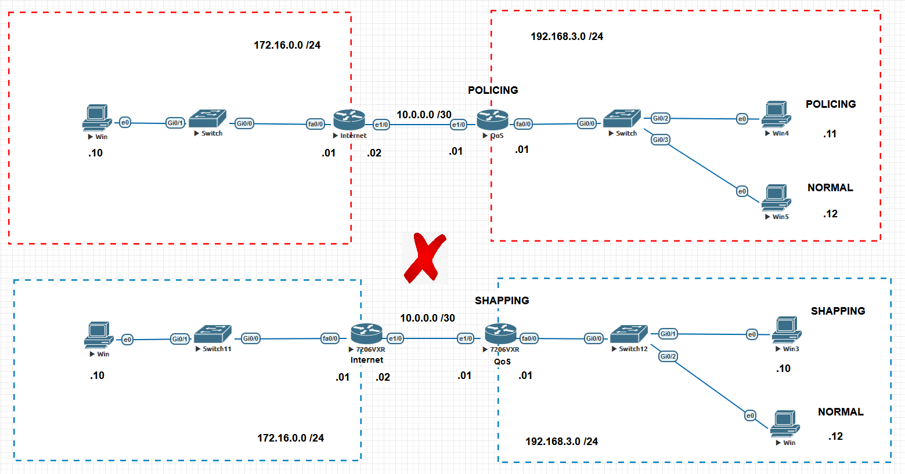
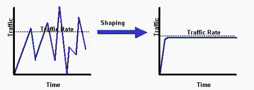

# Cisco

Este tópico faz parte do ítem **1.5 Interpret wired and wireless QoS configurations** do blueprint do exame.   

Sabe-se que a lurgura de banda é a quantidade de dados que você pode transferir em uma rede em um determinado período de tempo. Já o trougputh, é a taxa em que os dados são transmitidos. Geralmente essa taxa é medida em megabits por segundos (Mbps) ou em Gigabits por segundos (Gbps). Mas esse é um recurso muito importante dentro de uma rede e está ligado diretamente á capcidade dos equipamentos tais como roteadores, switches, etc. Então é importante que esse recurso seja utilizado de uma forma responsável para que esse recurso não se esgote rapidamente.   

Vamos imaginar o seguinte cenário:   

    

Neste cenário, a rede 192.168.3.0/24 representa a rede de uma pequena empresa uma mesmo uma rede doméstica. A rede 172.16.0.0/24 representa um servidor ou mesmo a Internet. Agora imagine que todos quisem acessar a Internet ao mesmo tempo e que o usuário com o 192.168.3.11 resolvesse ver um video, baixar arquivos, escutar músicas e jogar online tudo ao mesmo tempo. O que aconteceria com o tráfego para os outros usuários ?   
Bem se nada for feito, esse usuário "guluso" irá acabar com toda a largura de banda disponível para todos. Esse tipo de situação pode gerar diversos problemas que vão desde escassez de largura de banda, a dificuldades em se realizar um telefonema que usa voz sobre ip, instabilidade em jogos online e por ai vai.   
Pensando nisso, podemos então limitar o uso de banda desse usuário, uma vez que seu ip é conhecido.  
Primeiro é interessante salientar que existe duas técnicas que fazem parte do recurso QoS (Quality Of Service) : Policing e Shapping. Ambas as técnicas visam modelar o fluxo de dados a partir de uma taxa definida, a CIR (Committed Info Rate), ou seja, define-se uma taxa de transmissão de dados e a técnica faz com que a taxa fique próxima da taxa definida. Observe o gráfico da técnica Policing.    

   

Esse técnica costuma ser mais agressiva pois o que ela faz é assim: defini-se a taxa de transmissão limite e o tráfego que ultrapassa esse limite ele é descartado. Isso mesmo, é descartado o tráfego excedente. Mas então isso que ocorrerá perca de dados ?   
Para que isso não ocorra, o algorítmo remarca o excesso e tem que fazer a retransmissão desse tráfego descartado.   

Agora observe o gráfico a seguir que representa a técnica de shapping.   

   

Já no shapping, todo o tráfego que execede a taxa configurada é colocado em uma espécie de buffer (fila) e depois agenda a transmissão desse tráfego excedente ao longo do tempo até tudo ser transmitido. Então percebe-se que o shapping tem uma vantegem de ter menos retransmissões. Porém, cabe aqui ressaltar que essa técnica traz duas desvantagens: a primeira é que ela aumenta a latÊncia pois os pacotes são colocados em fila e, a segunda é que isso faz com que se utilize mais memória e CPU para o processamento dessas filas.   

**OBS:** Fonte dos Gráficos : Cisco Systems   

Para a utilização dessas técnicas, são nessários 3 passos : 
1. classificação do tráfego (class-map) 
2. definição da política (police-map)
3. aplicação das políticas nas interfaces (Essas podem ser de entrada ou saída)  

**OBS:** a recomendação é que a técnica de Policing seja sempre aplicada na interface de entrada do tráfego e o Shapping na interface de saída do tráfego.   

**ENTÃO VAMOS COMEÇAR NOSSAS CONFIGURAÇÔES**   

**Exemplo de POLICING**   
Então vamos acessar o roteador QoS da parte superior marcada em vermelho. Vamos seguir os 3 passos citados anteriormente. Como aqui só queremos limitar a utilização de banda para um host de Ip conhecido, vamos utilizar um access-list para poder classicar o tráfego.   

**1. Classificação do tráfego (class-map)**   

   

01. Qos(Config)# ip access-list extended POLICING
02. QoS(config-ext-nacl)# permit ip any host 192.168.3.11
03. QoS(config-ext-nacl)# permit ip host 192.168.3.11 any
04. Qos(config-ext-nacl)# exit

**2. Definição da política (police-map)**   

   

01. QoS(Config)# class-map match all POLICING
02. QoS(config-cmap)# match access-group name POLICING
03. QoS(config-cmap)# exit   
04. QoS(config)# policy-map QoS
05. QoS(config-pmap)# class POLICING
06. **QoS(config-pmap-c)# police rate 1000000 bps**
07. QoS(config-pmap-c-police)# end    

Aqui cabe ressaltar que utilizamos o comando class-map match **all**, mas poderiamos ter utilizado a palavra **any** . A diferença é quando utilizamos o **match-all**, o pacote tem que necessáriamente atender a todos os requisitos especificados na etapa de classificação. Agora se utlizarmos **match-any**, se o pacote atender a um ou mais dos requisitos, ele será classificado    
Também vale ressaltar que na linha 06 da configuração, escolhemos uma taxa de 1000000 bps ou 1Mbps. Ou seja, agora o usuário estara limitado a uma taxa de transmissão de somente 1 megabit por segundo.   

**3. Aplicação das políticas nas interfaces**   

Agora nesse ponto temos que escolher a interface que queremos aplicar a limitação de banda. A interface escolhida foi a FastEthernet0/0 no sentido de entrada.   

   

01. QoS(Config)# interface FastEthernet0/0
02. QoS(Config-if)# service-policy input QoS   

**Testes e comandos úteis**   

Bom nesse ponto, estamos com tudo pronto para realizarmos nossos testes. Para isso, irei utilizar o Jperf que é uma implementação gráfica do Iperf. Este é um aplicativo de medição e stress de largura de banda que pode ser obtido em (https://iperf.fr/)    
Agora vamos acessar o computador de ip 172.16.0.10 do lado do roteador Internet e vamos iniciar a aplicação. O Iperf possui vários parâmetros porém aqui somente irei iniciar como servidor neste host.   
   

Note que no campo Iperf Command, fica escrito o comando que é utilizado na versão texto do aplicativo.   
Logo após irei ligar o aplicativo nos hosts do lado do roteador QoS. Agora iremos iniciar no modo cliente e temos que informar o endereço do servidor que é **172.16.0.10** no campo Server Address. Também no campo transmite irei utilizar **10000** que é a quantidade de pacotes por segundo que devem ser enviados ao servidor. OBS: devemos nos atentar agora que o host 192.168.0.11 está limitado a 1Mbps.   

   

Olhando os resultados podemos perceber que alimitação de banda foi aplicada.   
    