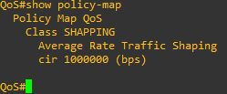

# 02 - QoS - Limite de Banda - Shapping

Este tópico faz parte do item **1.5 Interpret wired and wireless QoS configurations** do blueprint do exame.   

No artigo anterior eu demonstrei como limitar o uso de banda de um host de Ip conhecido através da técnica de policing. Agora vou utilizar o mesmo cenário porém demonstrado como utilizar a técnica de Shaping que é menos agressiva a princípio pois ela enfileira os pacotes que ultrapassam a taxa limite especificada ao invés de descartar o excesso. O host que iremos limitar tem o Ip **192.168.3.11**   

   

Como todo o contexto já foi feito no artigo anterior, aqui vou começar logo com as configurações.   

Para a utilização dessas técnicas, são necessários 3 passos : 
1. classificação do tráfego (class-map) 
2. definição da política (police-map)
3. aplicação das políticas nas interfaces (Essas podem ser de entrada ou saída)  

**OBS:** a recomendação é que a técnica de Policing seja sempre aplicada na interface de entrada do tráfego e o Shapping na interface de saída do tráfego.   

**ENTÃO VAMOS COMEÇAR NOSSAS CONFIGURAÇÔES**   

**Exemplo de SHAPPING**   

Então vamos acessar o roteador QoS da parte superior marcada em vermelho. Vamos seguir os 3 passos citados anteriormente. Como aqui só queremos limitar a utilização de banda para um host de Ip conhecido, vamos utilizar um access-list para poder classicar o tráfego.   

**1. Classificação do tráfego (class-map)**   

   

01. Qos(Config)# ip access-list extended SHAPPING
02. QoS(config-ext-nacl)# permit ip any host 192.168.3.11
03. QoS(config-ext-nacl)# permit ip host 192.168.3.11 any
04. Qos(config-ext-nacl)# exit

**2. Definição da política (police-map)**   

   

01. QoS(Config)# class-map match all SHAPPING
02. QoS(config-cmap)# match access-group name SHAPPING
03. QoS(config-cmap)# exit   
04. QoS(config)# policy-map QoS
05. QoS(config-pmap)# class SHAPPING
06. **QoS(config-pmap-c)# police rate 1000000 bps**
07. QoS(config-pmap-c-police)# end    

Aqui cabe ressaltar que utilizamos o comando class-map match **all**, mas poderíamos ter utilizado a palavra **any** . A diferença é quando utilizamos o **match-all**, o pacote tem que necessariamente atender a todos os requisitos especificados na etapa de classificação. Agora se utilizarmos **match-any**, se o pacote atender a um ou mais dos requisitos, ele será classificado    
Também vale ressaltar que na linha 06 da configuração, escolhemos uma taxa de 1000000 bps ou 1Mbps. Ou seja, agora o usuário estará limitado a uma taxa de transmissão de somente 1 megabit por segundo.   

**3. Aplicação das políticas nas interfaces**   

Agora nesse ponto temos que escolher a interface que queremos aplicar a limitação de banda. A interface escolhida foi a Ethernet1/0 no sentido de saída.   

   

01. QoS(Config)# interface FastEthernet0/0
02. QoS(Config-if)# service-policy input QoS   

**Testes e comandos úteis**   

Bom nesse ponto, estamos com tudo pronto para realizarmos nossos testes. Para isso, irei utilizar o Jperf que é uma implementação gráfica do Iperf. Este é um aplicativo de medição e stress de largura de banda que pode ser obtido em (https://iperf.fr/)    
Agora vamos acessar o computador de ip 172.16.0.10 do lado do roteador Internet e vamos iniciar a aplicação. O Iperf possui vários parâmetros porém aqui somente irei iniciar como servidor neste host.   
   

Note que no campo Iperf Command, fica escrito o comando que é utilizado na versão texto do aplicativo.   
Logo após irei ligar o aplicativo nos hosts do lado do roteador QoS. Agora iremos iniciar no modo cliente e temos que informar o endereço do servidor que é **172.16.0.10** no campo Server Address. Também no campo transmite irei utilizar **10000** que é a quantidade de pacotes por segundo que devem ser enviados ao servidor. OBS: devemos nos atentar agora que o host 192.168.0.11 está limitado a 1Mbps.   

   

Olhando os resultados podemos perceber que a limitação de banda foi aplicada.   
    

O gráfico da parte superior representa o host limitado e o gráfico da parte inferior representa o host sem limitação.   

Mas então não existem maneiras de verificação no próprio equipamento ? Sim. Temos alguns comandos que podemos executar para verificar os resultados.   
O primeiro comando a ser executo é **show policy-map**. Porém se somente executarmos o comando assim, o equipamento vai exibir todas as políticas que estão configuradas. Então devemos executar o comando informando a interface a se analisar, **show policy-map interface f0/0**   

   

Com esse comando é possível se ver todos os incrementos na politica aplicada na interface. Também é possível se observar quantos pacotes ultrapassaram a taxa especificada e a ação a ser tomada, que no caso é descartar os pacotes que ultrapassam essa taxa.   

O segundo comando que podemos executar é **show interface f0/0**   

   

Nesse comando, é interessante se atentar ao campo **Queing Strategy** que indica qual é a estratégia de enfileiramento aplicada na interface. Podemos notar que aqui está como **Fifo (First In / First Out)** que é o padrão para todas as interfaces. Ou seja, o primeiro pacote que entra é o primeiro que sai. Esse comportamento se mantém assim pois aqui somente limitamos a largura de banda de um host até essa interface. Se tivéssemos escolhido algum outro algoritmo de enfileiramento ele apareceria aqui.   

**OBS: Os arquivos com as configurações dos equipamentos presentes no laboratório se encontram na pasta arquivos.**   
**OBS2: Aqui eu utilizei o EVE-NG para o laboratório. Deixei uma cópia do arquivo chamado Polcing_Shapping.zip dentro da pasta arquivos.**