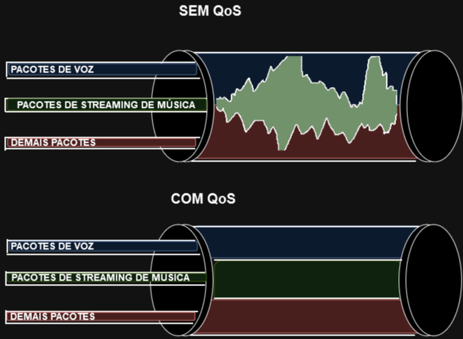

# 01 - Auto QoS

Este tópico faz parte do ítem **1.5 Interpret wired and wireless QoS configurations** do blueprint do exame.   

No inicio quando foram criadas as redes, o tráfego de vídeo, voz e dados possuíam um circuito dedicado para cada tipo de tráfego. 

   

Mas isso era caro e complicado de se manter. Só as grandes Indústrias e empresas conseguiam ter um tipo de rede com todos esses aspectos. Conforme as redes foram evoluindo, novas tecnologias foram surgindo e com isso os circuitos dedicados começaram a serem menos utilizadas. Então vamos analisar o seguinte cenário:   

<table>
   <tr align=center>
         
   </tr>
</table>
Agora a complexidade e os custos diminuem conforme as tecnologias se unem. Porém podemos perceber que agora, todos os diferentes tipos de tráfegos que antes tinham seu circuito dedicado agora passam através do mesmo meio. Com isso, novos desafios aparecem. Agora podemos ter problemas de atraso, jitter, perca de pacotes e até mesmo de escassez de largura de banda se nada for feito.   
Com isso em mente, os fabricantes desenvolram a tecnologia de QoS (Quality Of Service). Ela tem por característica melhorar a experiência do usuário. Então basicamente ele classifica o tráfego e faz uma marcação, seja em camada 2 ou camada 3 e logo em seguida se cria uma política para dizer o que fazer com o tráfego. O passo final é aplicar essa política em alguma interfae.   

   
Mas como existe uma quantidade muito extensa de tipos de tráfegos, foram desenvolvidos diversos algorítmos e abordagens para se tratar esses fluxos. E, portanto, para tentar diminuir a complexidade e automatizar os processos, a Cisco desenvolveu o AutoQoS.   
