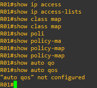

# 03 - Auto QoS

Este tópico faz parte do ítem **1.5 Interpret wired and wireless QoS configurations** do blueprint do exame.   

No inicio quando foram criadas as redes, o tráfego de vídeo, voz e dados possuíam um circuito dedicado para cada tipo de tráfego. 

   

Mas isso era caro e complicado de se manter. Só as grandes Indústrias e empresas conseguiam ter um tipo de rede com todos esses aspectos. Conforme as redes foram evoluindo, novas tecnologias foram surgindo e com isso os circuitos dedicados começaram a serem menos utilizadas. Então vamos analisar o seguinte cenário:   

   
   
Agora a complexidade e os custos diminuem conforme as tecnologias se unem. Porém podemos perceber que todos os diferentes tipos de tráfegos que antes tinham seu circuito dedicado, agora passam através do mesmo meio. Com isso, novos desafios aparecem. Com isso podemos ter problemas de atraso, jitter, perca de pacotes e até mesmo de escassez de largura de banda se nada for feito.   
Com isso em mente, os fabricantes desenvolveram a tecnologia de QoS (Quality Of Service) que serve para marcar diferentes níveis de prioridade para diferentes tipos de tráfego e realizar o tratamento especial dos diferentes tipos de tráfegos. Ela tem por característica melhorar a experiência do usuário. Então os mecanimos em que o QoS se apoia são : classificação e marcação, policing e shapping. gerenciamento e prevenção de congestionamento.   

Podemos observar como funciona o fluxo de dados com e sem a aplicação de QoS.

   

Tráfego de voz, vídeo e tráfego crítico ao negócio sempre devem ser priorizados reservando largura de banda suficiente para atender aos requisitos do negócio. O restante do tráfego deve ser alocado no que restar da banda. Quando ocorrem os problemas citados anteriormente, uma solução possível para o problema é aumentar a largura de banda disponível, mas nem sempre isso é possivel e barato. Então, a outra solução é a adoção dos mecanismos de QoS.   
Mas isso pode não ser uma tarefa tão fácil assim de se implementar. Como existem diversos tipos de fluxo de dados, foram adotados alguns modelos e algorítmos para se utilizar dentro de QoS e para isso, é necessário se ter gente especializada para se realizar as devidas configurações. A recomendação é que se configure QoS em cada equipamento que faz parte da rede para se garantir a marcação e a priorização dos diferentes tipos de fluxo de dados na rede toda.   
Tendo em mente esse tipo de situação, a Cisco e a maioria dos fabricantes do mercado implementaram o recurso de **Auto QoS**, ou seja, o QoS de forma automática. Então basicamente ele classifica o tráfego e faz uma marcação, seja em camada 2 ou camada 3 e logo em seguida se cria uma política para dizer o que fazer com o tráfego.   

**OBS:** cada fabricante tem sua implementação própria do Auto Qos e pode se comportar de forma difrente uma da outra.   

Aqui irei demonstrar uma simples ativação do recurso para termos uma ideia do que é possível acontecer no equipamento com esse tipo de recurso.   

Observe o cenário:   

   

Como esse é um cenário bem básico, irei acessa o roteador R3. Então podemos observar que não temos nada de QoS configurado nele.   

   

Então podemos notar que no equipamento não temos nenhum tipo de mecanismo de QoS ativado. Então vamos agora configurar o QoS na interface Ethernet 0/0.   

   

A princípio pode parecer que não aconteceu nada, mas não se engane. Esse comando é poderoso. Vamos analisar o que realmente aconteceu.   
Vamos executar o comando **show class map** e observar a saida.   

.png)   

Aqui podemos notar que foram criadas 2 classes : AutoQoS-VoIP-RTP-Trust e AutoQoS-VoIP-Control-Trust. A terceira que aparece é classe default sempre presente para o restante da banda. Essas duas classes servem para a marcação dos diferentes tipos de trafego.    
