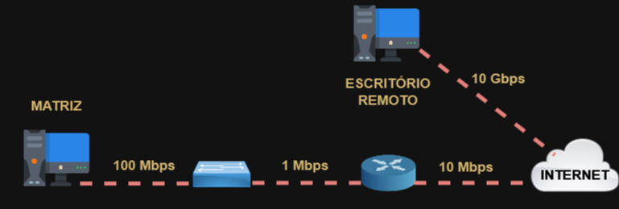
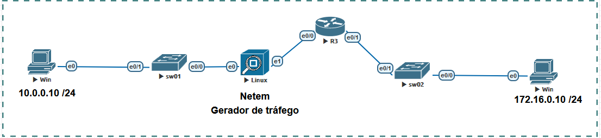

# 04 - Problemas

Este tópico faz parte do ítem **1.5 Interpret wired and wireless QoS configurations** do blueprint do exame.   

No artigo anterior, eu contextualizei um pouco sobre o surgimento das redes e como surgiram os seus problemas. Então quando se fala em aplicar QoS é por conta de uma real necessidade.   
Quando pacotes trafegam pela Internet, eles utilizam um modelo chamado de Best Effort, ou melhor esforço, ou seja, nenhum tipo de trafego vai receber algum tipo de tratamento ou priorização. Então nos momentode congestionamento de uma rede, esses pacotes vão ficar a mercê da capacidade de processamento dos roteadores e da disponibilidade da largura de banda do link local. Então como visto anteriormente, podem ocorrer diversos problemas tais como latência, jitter, escassez de banda e até mesmo perca de pacotes.   
Mas o quer dizer essa monte de nomes esquisitos e o que realmente isso afeta dentro de uma rede ? Bom, vou tentar explicar aqui. Então vamos lá.   

**01. LATÊNCIA**   

Latência pode-se dizer que é o sinônimo de atraso, pois é o tempo que um pacote leva para sair de um ponto ao outro e é medido em ms. Por exemplo, vamos imaginar que um usuário dentro da rede está jogando online. Então quando ele solicita que um pacote saia da rede e chegue no servidor do jogo, essa é a latencia. Vamos supor que seja de 20 ms  

**02. JITTER**   

Jitter é muito parecido com a Latência mas ele é mais importante quando se trata de aplicções em tempo real como voz e vídeo por exemplo. O Jitter é variação do atraso e também é medido em milessegundos. Vamos retomar o exemplo anterior do jogo online onde a latência tinha sido de 20 ms. Agora imagine que um segundo pacote saia da rede com uma latência de 50 Ms  
Então: **jitter = 50 ms - 20 ms = 30 ms**   

A recomendação é que o *jitter não ultrapasse os 30 ms* pois com mais de 30 ms  começamos a ter uma degradação na qualidade do sinal.   

**03. PERCA DE PACOTES**   

Quando os pacotes atingem um tamanho maior que o seu tamanho máximo de transmissão, ele precisa ser fragmentado e depois enviado fragmento a fragmento através do meio de transmissão. Acontece que o equipamento que recebe esses pacotes possuie uma fila, um buffer, de armazenamento desses pacotes. E ai esse buffer tem um limite. Depois que os pacotes chegam nesse buffer, eles precisam ser ordenados e encaminhados para dentro do equipamento. Se esse buffer atingir seu limite e estiver cheio, isso faz com alguns pacotes sejam perdidos e com isso, o mesmo pacote precisa ser retransmitido até que consiga chegar ao seu destino.

**04. ESCASSEZ DE LARGURA DE BANDA**   

Largura de banda é a capacidade de transmissão dentro de um meio e é medida em bits po segundo. A largura de banda disponível entre a origem e o destino é *igual a cpacidade do link com menor largura de banda* . Vamos ver um exemplo:   

   

Nesse caso se a matriz quizesse conversar com o escritório, teríamos uma largura de banda disponível de 1 Mbps. Por mais que o plano de Intrente fosse maior e temos um link de 10 Mbps com a Internet, a largura de banda disponível sempre será a menor no circuito todo.   

### Problemas   

Então os principais problemas sentidos seriam fala fora de sincronia em um vídeo, voz metalizada em uma ligação, eco em uma ligação, travamentos de aplicativos, lentidão, pixelização de vídeos, etc. Esses são os sintomas que os usuários na sua maioria irão relatar. É aqui que podemos notar a importância de se aplicar algum mecanismo de QoS.   

Agora vamos observar o cenário. Aqui eu estou aproveitando o mesmo cenário anterior, do tópico 03 - Auto QoS. Porém entre o switch 01 e o roteador 03 eu adicionei o *NETem*, que é uma aplicação Linux que foi desenvolvida para gerar alguns tipos de tráfego na rede. Aqui foi utilizada a versão para o emulador Gns3 e convertida para o Eve-Ng. Link para download  https://gns3.com/marketplace/appliances/netem .   

   

Então vou realizar um simples Ping no Windows. Essa é uma ferramenta que utiliza o protocolo ICMP e, inicialmente ele envia um pacto Echo Request para um destino e, se encontrar esse destino recebe um pacote Echo Reply, que é a resposta. A principio, nenhum mecanismo de QoS foi configurado.   

