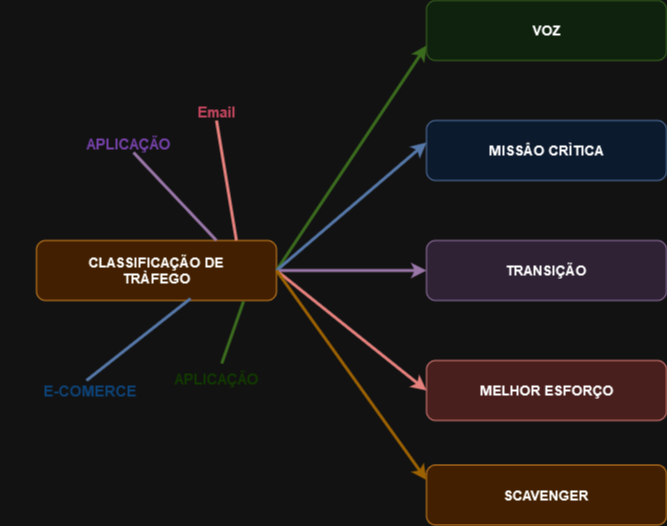

# 05 - Modelos e mecanismos QoS

Este tópico faz parte do ítem **1.5 Interpret wired and wireless QoS configurations** do blueprint do exame.   

Bom, até aqui eu demonstrei um caso de limitação de banda com o uso de 2 técnicas e expliquei os problemas existentes por falta da aplicação dos mecanismos de QoS. Mas existem 3 modelos de QoS. Vamos analisá-los:   

| MODELO                                                                                 | SIGNIFICADO                                                                                  |
| -------------------------------------------------------------------------------------- | -------------------------------------------------------------------------------------------- |
| MELHOR ESFORÇO                                                                         | É o modelo padrão utilizado para todos os tipos de tráfegos que não necessitam de tratamento.|
| SERVIÇOS INTEGRADOS (IntServ)                                                          | É a reserva de banda feita fim-a-fim. Para isso utiliza o protocolo RSVP (Resource Reservation Protocol)                                                        |
| DIFERENCIAÇÃO DE SERVIÇOS (DiffServ)                                                   | É feito por saltos, e a rede identifica as classes que requerem tratamento diferenciado. Os pacotes são marcados e classificados individualemnte e depois é aplicada uma política de decisão em cada um dos tráfegos    |

| INTSERV                                                                                | DIFFSERV                                                                                     |
|----------------------------------------------------------------------------------------|----------------------------------------------------------------------------------------------|
| Desenvolvido para aplicações em tempo real como voz e vídeo                            | Não utiliza protocolo de sinalização                                                         |
| Utiliza recursos (como largura de banda) fim-a-fim e utiliza o protocolo RSVP          | É altamente escalável e por esse motivo é mais preferido                                     |
| Qualquer largura de banda reservada e não utilizad é desperdiçada                      | Funciona por slatos (PBH - Per Hop Basis), então tem que ser configurado em cada equipamento |
| Não escala muito bem em redes grandes                                                  | Divide o tráfego IP em classes e realiza a marcação baseado nos requerimentos de negócio     |
| Para realizar o QoS fim-a-fim, necessita rodar em todos os nós, iclusive nos endpoints | Cada classe pode ser marcadacom um tipo diferente de nível de serviço                        |

## CLASSIFICAÇÃO E MARCAÇÃO

Bom agora que entendemos as diferenças entre os modelos de QoS, temos que entender que o tráfego Ip precisa ser marcado e classificado para que depois se possa aplicar uma política em cima dessa classificação e marcação, ou seja, para que possamos escolher o que vai acontecer com o tráfego. Então cada dispositivo primeiro identifica o tipo de tráfego para após, marcá-lo. Depois de calssificado, o dispositivo vai colorir cada tipo de tráfego para assim fazer a sua marcação e com isso conseguir separar cada tráfego por classes.   

   

# CLASSIFICAÇÃO   

Depois que o pacote IP é classificado, ele pode ser marcado / remarcado, enfileirado, policiado (Policing), formatado (Shapping) ou qualquer uma das combinações.   

|  DESCRITO DE TRÁFEGO                                                            |  DESCRIÇÃO                                                                                        |
| ------------------------------------------------------------------------------- | --------------------------------------------------------------------------------------------------|
| INTERNO                                                                         | Grupos de Qos (Tem Significado Local para o roteador)                                             |
| ------------------------------------------------------------------------------- | --------------------------------------------------------------------------------------------------|
| LAYER 1                                                                         | Interface física, sub interface ou rota                                                           |
| ------------------------------------------------------------------------------- | --------------------------------------------------------------------------------------------------|
| LAYER 2                                                                         | MAC Addres e bits 802.1 Q / P, Classe de Serviços (COS)                                           |
| ------------------------------------------------------------------------------- | --------------------------------------------------------------------------------------------------|
| LAYER 2.5                                                                       | Bits MPLS Experimental (ExP)                                                                      |
| ------------------------------------------------------------------------------- | --------------------------------------------------------------------------------------------------|
| LAYER 3                                                                         | Differentiated Services Code Points (DSCP), IP Precedence (IPP) e endereço IP de origem / destino |
| ------------------------------------------------------------------------------- | --------------------------------------------------------------------------------------------------|
| LAYER 4                                                                         | Portas TCP ou UDP                                                                                 |
| ------------------------------------------------------------------------------- | --------------------------------------------------------------------------------------------------|
| LAYER 7                                                                         | Nexte Generation Network Based Application Recognition (NBAR2)                                    |

dsfsdfsd