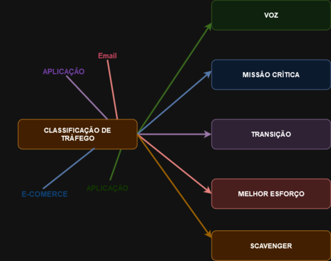
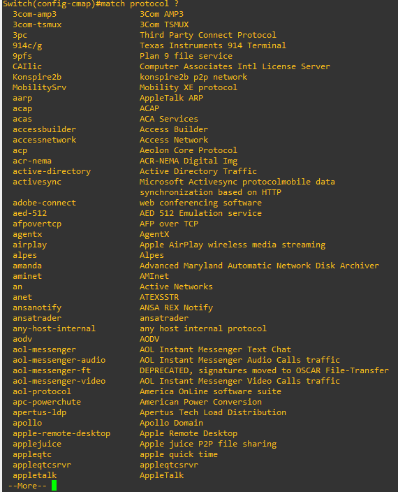

# 06 - Marcação em Layer 2

Este tópico faz parte do ítem **1.5 Interpret wired and wireless QoS configurations** do blueprint do exame.   

Agora que mostrei os mecanismos de QoS disponíveis, está na hora de falarmos um pouco mais sobre marcação. Como QoS é um assunto muito extenso, estou tentando contextualizar um pouco da teoria e mesclar com exemplos práticos para tentar elucidar melhor as coisas. Então vou tentar vamos olhar um pouco sobre a marcação em layer 2.   

   

| DESCRITOR DE TRÁFEGO                  | DESCRIÇÃO                                                                                                    |
|---------------------------------------|------------------------------------------------------------------------------------------------------------- |
| INTERNO                               | Grupos de Qos (Tem Significado Local para o roteador)                                                        |
| LAYER 1                               | Interface física, sub interface ou rota                                                                      |
| LAYER 2                               | MAC Addres e bits 802.1 Q / P, Classe de Serviços (COS)                                                      |
| LAYER 2.5                             | Bits MPLS Experimental (ExP)                                                                                 |
| LAYER 3                               | Differentiated Services Code Points (DSCP), IP Precedence (IPP) e endereço IP de origem / destino            |
| LAYER 4                               | Portas TCP ou UDP                                                                                            |
| LAYER 7                               | Next Generation Network Based Application Recognition (NBAR2)                                                |

O *NBAR 2.0* é o mecanismo que a CISCO implementou para realizar a inspeção profunda de pacotes desde a camada 3 até a camada 7. Ele também verifica portas TCP/UDP estáticas ou dinâmicas e também consegue verificar sub interfaces. Ele trabalha em 2 modos: 

* __Descoberta de Protocolos :__ nesse modo, o NBAR identifica automáticamente os protocolos que passam através de uma interface, identifica quais estão ativos e habilita estatísticas em modo real.
* __Modular QoS CLI (MQC) :__ o MQC é uma interface de linha de comando que permite definir classes de tráfego, criar e configurar classes de tráfego e, em seguida, anexar essas políticas nas interfaces. Com isso, os diferentes tráfegos são colocados em diferentes categorias o que permite se criar diferentes políticas de tráfego de rede, uma para cada tráfego, por exemplo.

Exemplo de Protocolos suportados pelo NBAR

 

## MARCAÇÃO

Depois de classificados, os fluxos precisam ser marcados. Esse é um mecânismo de QoS que colore um pacote / frame alterando um campo do cabeçalho com um discritor. Isso faz com que os diferentes tipos de pacotes / frames sejam diferenciados para poderem depois serem remarcados, enfileirados ou passar pelos mecanismos de evitar congestionamento.

| DESCRITOR DE TRÁFEGO                  | DESCRIÇÃO                                                                                                    |
|---------------------------------------|------------------------------------------------------------------------------------------------------------- |
| INTERNO                               | Grupos de Qos                                                                                                |
| LAYER 2                               | Bits 802.1 Q / P (COS - Class of service)                                                                    |
| LAYER 2.5                             | Bits MPLS Experimentais (EXP)                                                                                |
| LAYER 3                               | DSCP - Differentiated Services Code Points e IPP - IP Precedence                                             |

Deixo aqui dois documentos retirados do site da Cisco com exemplos de configuração do NBAR   
   
   
