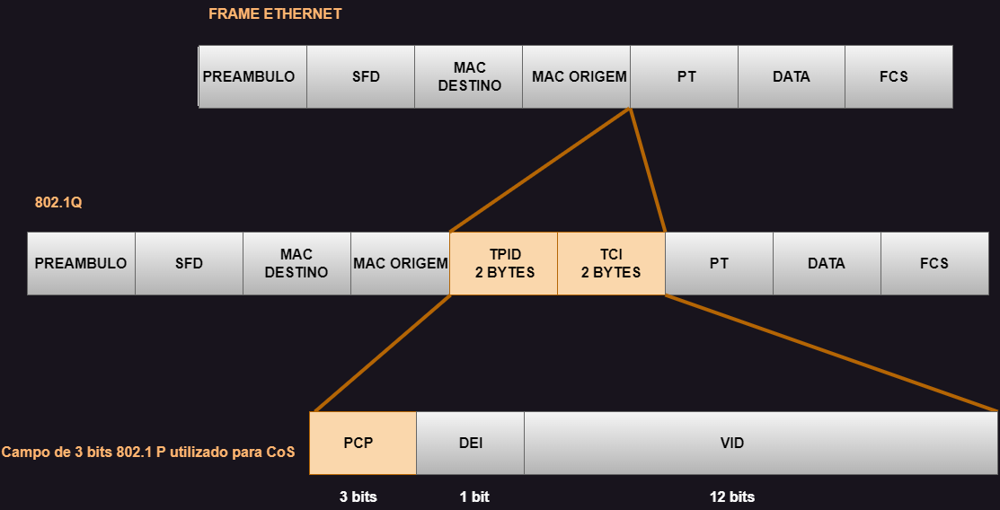

# 06 - Marcação em Layer 2

Este tópico faz parte do ítem **1.5 Interpret wired and wireless QoS configurations** do blueprint do exame.   

Agora que mostrei os mecanismos de QoS disponíveis, está na hora de falarmos um pouco mais sobre marcação. Como QoS é um assunto muito extenso, estou tentando contextualizar um pouco da teoria e mesclar com exemplos práticos para tentar elucidar melhor as coisas. Então vamos olhar um pouco sobre a marcação em layer 2.   
Ela é chamada de **CoS (Class of Service)** e ela utiliza alguns campos do quadro Ethernet 802.1Q, que é um padrão IEE onde são especificadas as Vlans. Nesse tipo de quadro temos dois campos: **TPID (Tag Protocol Identifier)** e **TCI (Tag Control Information)** que são inseridos nesse frame Ethernet no campo de endereço de origem.   

   

* O valor do **TPID** é um campo de 16 bits com o valor **0x8100** que identifica como sendo um gardo 802.1Q tageado.
* O campo **TCI** possui 16 bits e é formado por 3 campos:
    * **Priority Code Point (PCP)** com 3 bits
    * **Drop Eligible Indicator (DEI)** com 1 bit
    * **Vlan Identificator (Vlan ID)** com 12 bits 

**OBS:** As especificações do campo de 3 bits PCP (chamados também de User Priority) são definidas pela IEE 802.1p . Esse campo serve para marcar os pacotes como sendo de COS e isso permite que um fram layer 2 possa ter alocado em 8 níveis diferentes  indo de 0 a 7, onde 0 é o nível mais baixo e 7 o mais alto.

| PCP VALUE | ACRONIMO | TRAFFIC TYPE |
| :-------: | :------: | :----------- |
|   0       |   BK     | BACKGROUND   |
|   1       |   BE     | BEST EFFORT  |
|   2       |   EE     | EXCELLENT EFFORT |
|   3       |   CA     | CRITICAL APPLICATION |
|   4       |   VI     | VIDEO WITH < 100ms LATENCY AND JITTER |
|   5       |   VO     | VOICE WITH < 100ms LATENCY AND JITTER | 
|   6       |   IC     | INTERNEWORK CONTROL |
|   7       |   NC     | NETWORK CONTROL |

## EXEMPLO PRÁTICO DE USO DA MARCAÇÃO ##

| COS | APPLICATION      | BITS |
| :--:| :--------------- | :--: |
| 7   | RESERVED         | 111  |
| 6   | ROUTING          | 110  |
| 5   | VOICE            | 101  | 
| 4   | VIDEO            | 100  |
| 3   | CALL SIGNALLING  | 011  |
| 2   | CRITICAL DATA    | 010  |
| 1   | BULK DATA        | 001  |
| 0   | BEST EFFORT DATA | 000  |