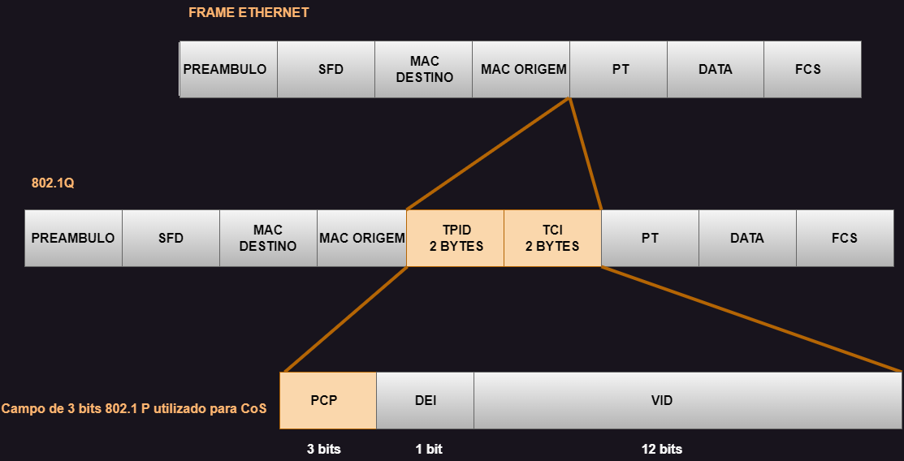

# 07 - Marcação em Layer 3

Este tópico faz parte do ítem **1.5 Interpret wired and wireless QoS configurations** do blueprint do exame.   

Agora que já vimos a marcação de camada 2, vamos falar um pouco sobre a marcação de camada 3. Ela provê uma marcação mais persistente pois é fim-a-fim. Então no pacote IP é inserido um campo de 8 bits chamado de **TOS (Type Of Service)** onde somente 3 bits são utilizado para IPP (IP Precedence) e marcação sendo que o resto não é utilizado. Novamente os valores IPP vão de 0 a 7 sendo que os valores 6 e 7 são reservados para uso interno da rede.   
Depois de um tempo, o padrão foi atualizado e o campo IP Precedence foi substituido para ToSIpv4 e Traffic Class Ipv6 com um campo DSCP (Diffeserv Code Point). Então aqui mantiveram os mesmos 8 bits e deixaram ele compatível com o IP Precedence.   

   

| COS | APPLICATION      | BITS |
| :--:| :--------------- | :--: |
| 7   | RESERVED         | 111  |
| 6   | ROUTING          | 110  |
| 5   | VOICE            | 101  | 
| 4   | VIDEO            | 100  |
| 3   | CALL SIGNALLING  | 011  |
| 2   | CRITICAL DATA    | 010  |
| 1   | BULK DATA        | 001  |
| 0   | BEST EFFORT DATA | 000  |

* Uma desvantagem de se utilizar o CoS é que os frames perdem a marcação CoS quando eles atravessam links que não são 802.1Q ou quando são layer 3. Por esta razão os pacotes deve ser marcados com marcações mais altas.
* O campo **DEI (DROP ELIGIBLE INDICATOR)** possui -**1bit**- que pode ser usado de forma independente ou em conjunto com o PCP para indicar que os frames estão elegíveis para descarte nos tempos de congestionamento. O valor padrão é **0**, ou seja, desligado e quando é **1** está ligado.