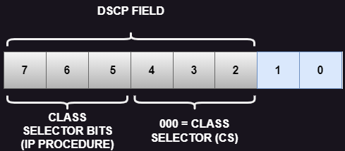

# 07 - Marcação em Layer 3

Este tópico faz parte do ítem **1.5 Interpret wired and wireless QoS configurations** do blueprint do exame.   

Agora que já vimos a marcação de camada 2, vamos falar um pouco sobre a marcação de camada 3. Ela provê uma marcação mais persistente pois é fim-a-fim. Então no pacote IP é inserido um campo de 8 bits chamado de **TOS (Type Of Service)** onde somente 3 bits são utilizado para IPP (IP Precedence) e marcação sendo que o resto não é utilizado. Novamente os valores IPP vão de 0 a 7 sendo que os valores 6 e 7 são reservados para uso interno da rede.   
O campo ToS também poderia ser utilizado como um campo DS (Differentiated Services).   
Depois de um tempo, o padrão foi atualizado e o campo IP Precedence foi substituido para ToSIpv4 e Traffic Class Ipv6. Já o campo DS passou a ser o campo DSCP (Diffeserv Code Point. Então aqui mantiveram os mesmos 8 bits e deixaram ele compatível com o IP Precedence.   

   

## DSCP PER HOP BEHEAVIORS

O campo Diffserv serve para marcar os pacotes de acordo com a sia classificação em **Diffserv Behaivior Aggregates (BAS)** . Um Diffserve BA é uma coleção de pacotes com o mesmo valor de Diffserv cruzando um link em uma direção particular. **Per Hop Beheavior (PHB)** é o comportamento externo observado (tratamento de encaminhamento) plicado ao nó Diffserv compatível com a coleção de pacotes com o mesmo valor de diffserv cruzando um link em uma direção.   
O **PHB** adianta, atrasa ou descarta uma coleção de pacotes através de um ou muitos mecanismos de QoS através do **per-hop-basis**, baseado no valor DSCP. A Diffserv BA pode marcar diversas aplicações com o mesmo DSCP.   
Existe 4 PHBS que são: 
* **Class Selector (CS) PHB:** os 3 primeiros bits do campo DSCP são utilizados como bits CS. Os CS Bits tornam o DSCP compatíveis com o IP Precedence porque ele utilizam os mesmo 3 bits para determinar a classe
* **Default Forwarding (DF) PHB:** usado para o serviço de best effort
* **Assured Forwarding (AF) PHB:** utilizado para o serviço de garantia de banda
* **Expedited Forwarding (EF) PHB:** usado para o serviço de low-delay

## CLASS SELECTOR PHB

O Class Selector (CS) PHB foi desenvolvido na rfc 2474 e torna o campo ToS obsoleto introduzindo o novo campo DiffServ, e o Class Selector (CS PHB) foi criado para trazer compatibilidade com o IP PRECEDENCE.   
Os 3 últimos bits do DSCP (bits 2 a 4), quando configurados em 0, identificam o Class Selector PHB, os bits de 5 a 7 do Class Selector são os que setam o IP Precedence. Os bits 2 e 4 são ignorados por equipamentos mais antigos que só classificam através de IP Precedence.   
Existem 8 classes, indo de cs0 a cs7, o que corresponde exatamente com os 8 valores possíves do IP Precedence.

   