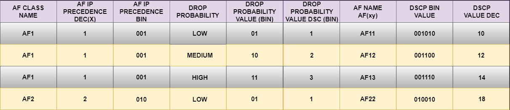

# 07 - Marcação em Layer 3

Este tópico faz parte do ítem **1.5 Interpret wired and wireless QoS configurations** do blueprint do exame.   

Agora que já vimos a marcação de camada 2, vamos falar um pouco sobre a marcação de camada 3. Ela provê uma marcação mais persistente pois é fim-a-fim. Então no pacote IP é inserido um campo de 8 bits chamado de **TOS (Type Of Service)** onde somente 3 bits são utilizado para IPP (IP Precedence) e marcação sendo que o resto não é utilizado. Novamente os valores IPP vão de 0 a 7 sendo que os valores 6 e 7 são reservados para uso interno da rede.   
O campo ToS também poderia ser utilizado como um campo DS (Differentiated Services).   
Depois de um tempo, o padrão foi atualizado e o campo IP Precedence foi substituido para ToSIpv4 e Traffic Class Ipv6. Já o campo DS passou a ser o campo DSCP (Diffeserv Code Point. Então aqui mantiveram os mesmos 8 bits e deixaram ele compatível com o IP Precedence.   

   

## DSCP PER HOP BEHEAVIORS

O campo Diffserv serve para marcar os pacotes de acordo com a sia classificação em **Diffserv Behaivior Aggregates (BAS)** . Um Diffserve BA é uma coleção de pacotes com o mesmo valor de Diffserv cruzando um link em uma direção particular. **Per Hop Beheavior (PHB)** é o comportamento externo observado (tratamento de encaminhamento) plicado ao nó Diffserv compatível com a coleção de pacotes com o mesmo valor de diffserv cruzando um link em uma direção.   
O **PHB** adianta, atrasa ou descarta uma coleção de pacotes através de um ou muitos mecanismos de QoS através do **per-hop-basis**, baseado no valor DSCP. A Diffserv BA pode marcar diversas aplicações com o mesmo DSCP.   
Existe 4 PHBS que são: 
* **Class Selector (CS) PHB:** os 3 primeiros bits do campo DSCP são utilizados como bits CS. Os CS Bits tornam o DSCP compatíveis com o IP Precedence porque ele utilizam os mesmo 3 bits para determinar a classe
* **Default Forwarding (DF) PHB:** usado para o serviço de best effort
* **Assured Forwarding (AF) PHB:** utilizado para o serviço de garantia de banda
* **Expedited Forwarding (EF) PHB:** usado para o serviço de low-delay

## CLASS SELECTOR PHB

O Class Selector (CS) PHB foi desenvolvido na rfc 2474 e torna o campo ToS obsoleto introduzindo o novo campo DiffServ, e o Class Selector (CS PHB) foi criado para trazer compatibilidade com o IP PRECEDENCE.   
Os 3 últimos bits do DSCP (bits 2 a 4), quando configurados em 0, identificam o Class Selector PHB, os bits de 5 a 7 do Class Selector são os que setam o IP Precedence. Os bits 2 e 4 são ignorados por equipamentos mais antigos que só classificam através de IP Precedence.   
Existem 8 classes, indo de cs0 a cs7, o que corresponde exatamente com os 8 valores possíves do IP Precedence.

   

## DEFAULT FORWARDING (DF) PHB

O Default Forwarding (DF) PHB e o Class Selector 0 (CS0) tem o comportamento de best effort e usam o valor 000000 no campo DS.   
O Default Best-Effort Forwarding também é aplicado a pacotes que não podem ser classificados por um mecanismo QoS como enfileiramento, shapping ou policing.   
Isso normalmente ocorre quando a política QoS no nó não está completa ou quando os valores estão fora da faixa definida para o CS, AF e EF PHBs.   

   

Essa é uma classe para aplicações padrão que não possuem nemhuma prioridade.   

## ASSURED FORWARDING (AF) PHB

O AF PHB garante uma certa quantidade de banda para uma classe AF e permite acesso a uma banda extra caso esteja disponível.   
Os pacotes que necessitam do AF PHB devem ser marcados com o valor binário de **_aaadd0_**, onde ***aaa** é o valor binário da classe AF (bits de 5 a 7), e **dd** (bits de 2 a 4) é a probabilidade de descarte onde o bit 2 não é utilizado e sempre é setado em 0. 

   

Existem 4 padrões definidos nas classes AF: **AF1, AF2, AF3 e AF4** .   
O número da classe AF não representa precedência. AF4 não tem nenhum tratamento especial sobre AF1. Cada classe é tratada de forma independente.   
A tabela a seguir ilustra como cada classe AF é assinalada a um IP Precedence (sob um valor binário de uma classe AF) e ele tem 3 valores possíveis de descarte baixo, médio e alto.   
O nome **AF (AFxy)** é composto de um valor IP AF Precedence de descarte **(y)** em decimal.   
Por exemplo, AF41 é a combinação do IP Precedence 4 e a probabilidade de descarte 1   
Para converter rapidamente um nome AF em um valor decimal DSCP, use a fórmula **__8x+2y__**. Por exemplo, o valor DSCP para AF41 é **8(4) + 2(1) = 34**

   

## ASSURE FORWARDING (AF) AND WRED

Uma implementação AF deve detectar responder a congestionamentos a longo prazo dentro de cada classe descartando pacotes usando um algorítmo de prevenção de congestionamento como o **WRED (WEIGTHED RANDON EARLY DETECTION)**.   
O WRED utiliza o valor AF de probabilidade de descarte em cada classe - onde 1 é o valor mais baixo possível e 3 o maior - para determinar quais pacotes devem ser descartados por primeiro nos momentos de congestionamento.   
Ele també deve ser capaz de tratar os congestionamentos a curto prazo resultantes de rajadas em que cada classe é colocada em uma fila separada, utilizando um algorítmo de enfileiramento como o **CBWFQ (CLASS-BASED WEIGTHED FAIR QUEING)**. As especificações do AF não definem o uso de nenhum algorítmo em particular para se utilizar enfileiramento e prevenção de congestionamento, mas ele especifica alguns requerimentos e propriedades para o uso de tais algorítmos.   

## EXPEDITED FORWARDING (EF) PHB

O EF PHB pode ser utilizado para entregar pouca perda, pouco atraso, pouco jitter, garantir largura de banda e serviço fim - a - fim.   
O EF PHB garante largura de banda garantindo uma taxa mínima de saída e prevê o menor atraso possível implementando o enfileiramento de baixa latência.   
Ele também previne a escassez de outras aplicações ou classes que não estão utilizando EF PHB através de políticas de tráfego EF quando o congestionamento ocorre.   
Os pacotes que requerem EF devem ser marcados com os valos DSCP binário **101110 (46 em decimal)**. Os bits de 5 a 7 (101) do valor EF DSCP deixam o EF PHB compatíveis com IP PRECENCE.   
Utilizado para tráfego de voz e serviços em tempo real. Ele previne que fique sem largura de banda.

## SCAVENGER CLASS

É utilizado para aplicações que fazem um consumo exagerado de banda e tem prioridade menor que o best effort.   
São aplicações que trazem pouca ou nenhuma contribuição para o negócio e geralmente são aplicações voltadas para entretenimento. Exemplos:
* Aplicações peer-to-peer (como os Torrents)
* Jogos
* Aplicações de vídeo (Youtube, Netflix, etc)
Essas aplicações normalmente são muito limitadas ou bloqueadas por completo.   
Uma peculiaridade da classe Scavenger  é que ela foi desenvolvida para ter prioridade menor que o best-effort.   
O tráfego best-effort utiliza um DF PHB com um valor DSCP de **000000 (CS0)**. Como não existem valores negativos de DSCP decidiu-se utilizar CS1 para tráfego scavenger. Isso está definido na **RFC 4594**

## SUMÁRIO DO DSCP

