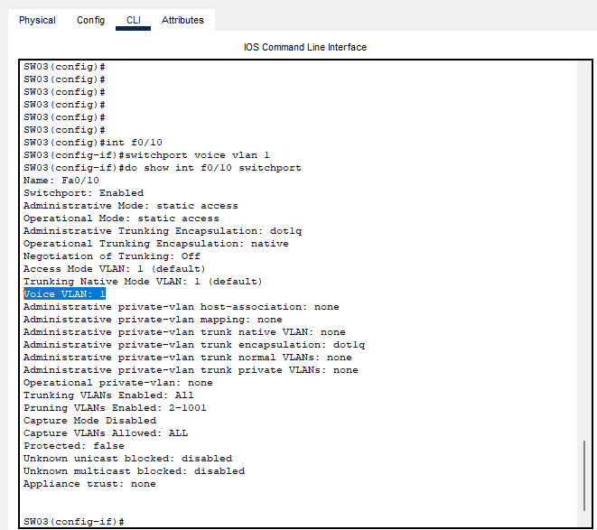
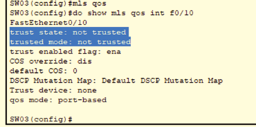
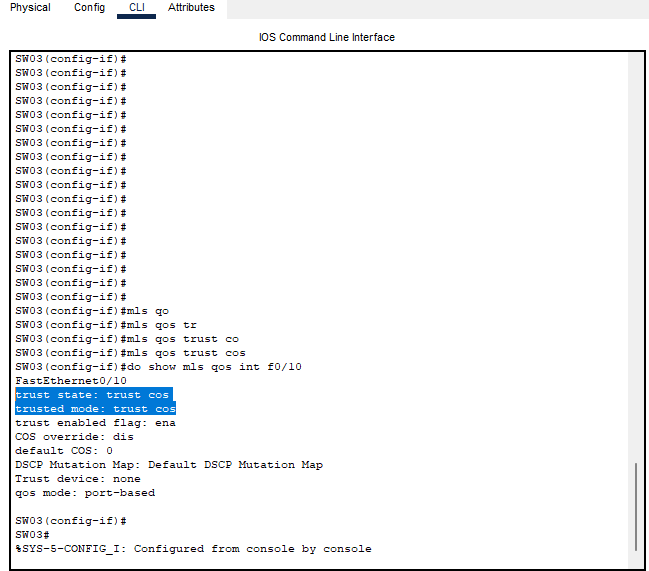
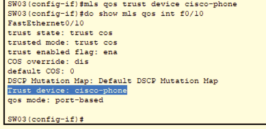
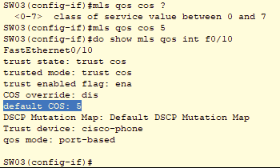
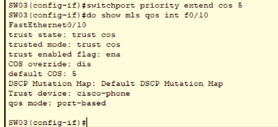

# 08 - LIMITE DE CONFIÂNÇA

Este tópico faz parte do ítem **1.5 Interpret wired and wireless QoS configurations** do blueprint do exame.   

Vamos imaginar o cenário ilustrado. Imagine que o tráfego que entra na rede, está na camada de acesso, onde os hosts estão ligados. Então qual é o comportamento dos switches quanto ao tráfego que entra ? Bom quando um quadro vai atravessar os switches, pode ser confiável ou não. Então, o comportamento padrão dos switches é não confiar nos endpoints e ai, mesmo que o trafego entrante esteja com uma marcação COS e DSCP adequadas, o switch remarca esse tráfego para 0 antes de enviar o frame para dentro do switch.   
Sendo assim, o tráfego não é priorizado e fica marcado como best effort utilizado a lógica do algorítmo FIFO (First IN First Out), o primeiro que entra é o primeiro que sai. Mas e se desjámos alterar esse comportamento ? Vamos imaginar que no nosso cenário queremos confiar no tráfego do telefone ip, no sw03 e no sw04 e no sw05 não. Ou seja, o limite fica sendo a parte em rosa.  
A primeira coisa a se verificar é se no switch onde temos o telefone ip, se realmente possui uma vlan de voz. Aqui, nesse exemplo eu estarei utilizando a vlan padrão que é a VLAN 1. Então vamos acessar o switch 01 e verificar essa configuração.   

Agora vamos configurar a Vlan de voz na porta f0/10 do switch SW01 para qua porta identifique esse tráfego será o do telefone IP.   

Uma vez que configuramos a porta f0/10 para aceitar o trafego do telefone IP e colocá-lo em uma vlna de voz, agora pode ativar o QoS em modo global. Para, podemos digitar: **sw03(config)# mls qos** . Com isso estamos ativando o QoS em modo global. Em seguida, vamos exibir como está configurado o QoS na interface F0/10, pois ela está no padrão do momento ativação do QoS em modo global.   

Perceba que ele vem como não confiável. Como queremos que o switch confie em marcações em camada 2, marcação COS, temos que alterar esse comportamento. Então vamos digitar os comando a seguir:   

Agora, nesse ponto na interface F0/10, o switch confia em marcações COS, ou seja todo o quadro que chegar marcado como COS, ele não precisa mais analisar e remarcar. Ele aceita a mracção COS que entra na interface e passa para dentro do switch.   
Mas e nesse caso que temos um telefone ip conectado ao switch ? Bom, primeiro temos que entender que se conectarmos um telefone IP, como foi feito no exemplo, o switch não vai entender que esse equipamento é confiável e simplesmente ao receber os quadros dele, vai analisar e remara como o padrão que é **COS 0** e não é isso que queremos. Por essa razão, temos que extender o limite de confiança para o telefone também.   

Bom então, agora temos um switch que confia em marcações de cos e que confia em telefones IP Cisco. Porém, como é o recomendado, existe a marcção 5 do CoS que é para telefonia IP. Então vamos configurar a interface para acitar essa marcação.   

E mais uma vez, precisamos extender a marcação COS 5 para o telefone IP, para que o switch entenda que a marcação deva ser **COS 5** e não **0**.   

Como podemos ver, agora o switch03 confia na marcação COS5 e em Telephone IP Cisco e vai entender direito esse tipo de marcação. Agora devemos replicar as configurações de QOS para os switches 04 e 02 nas portas F0/10 e com isso vamos ter o nosso limite de confiança.   

| TIPO            | DECIMAL | BINARIO | APLICAÇÂO                          |
|---------------- |:------: | :-----: |----------------------------------- |
| ROUTINE         | 0       |  000    | BEST EFFORD FORWARDING             |
| PRIORITY        | 1       |  001    | MEDIUM PRIORITY FORWARDING         |
| IMMEDIATE       | 2       |  010    | HIGH PRIORITY FORWARDING           |
| FLASH           | 3       |  011    | VOIP CALL SIGNALLING FORWARDING    |
| FLASH-OVERRIDE  | 4       |  100    | VIDEO CONFERENCING FORWARDING      |
| CRITICAL        | 5       |  101    | VOIP FORWARDING                    |
| INTERNET        | 6       |  110    | INTER-NETWORK CONTROL RESERVED     |
| NETWORK CONTROL | 7       |  111    | NETWORK-CONTROL (RESERVED)         |

**OBS:** Os telefones IP por padrão marcam o tráfego de voz com o valor de DSCP 46(EF) e COS5, enquanto que o tráfego  de um endpoint, tráfego de dados, é remarcado com 0 para COS e 0 para DSCP.   

**OBS:** Para esse laboratório eu tilizei o cisco packet tracer. Quem quiser reproduzir o mesmo, deixo os arquivos para download.  
.pkt)   
_(Gabarito).pkt)