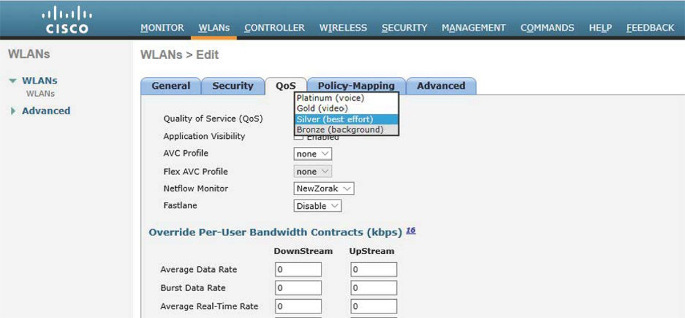

# 09 - EXEMPLO DE QOS WIRELLESS

Este tópico faz parte do ítem **1.5 Interpret wired and wireless QoS configurations** do blueprint do exame.   

Uma rede sem fio pode ser configurada para utilizar QoS. Por exemplo, uma Wirelles Lan Controller (WLC) pode estar no limite de uma rede cabeada e a rede sem fio, então esse seria o local ideal para configurar os limites de confiança.   
Os tráfegos de entrada e saída da WLC podem ser classificados e marcados e isso pode ser tratado de forma apropriada conforme é transmitido atráves do ar e dentro da rede cabeada.   
O QoS Wirelles pode somente utilizar 4 categorias para classificação / marcação. Note que os nomes das categorias estão em palavras humanas, o que corresponde a valores **802.1p e DSCP**   

| CATEGORIA QoS | TIPO DE TRÁFEGO      | 802.1 p TAG | VALOR DSCP |
| ------------- | -------------------- | :---------: | ---------- |
| PLATINUM      | VOZ                  | 5           | 46 (EF)    |
| GOLD          | VIDEO                | 4           | 34 (AF41)  |
| SILVER        | BEST EFFORT (PADRÃO) | 0           | 0          |
| BRONZE        | BACKGROUND           | 1           | 10 (AF11)  |

Quando uma WLAN é criada, por padrão o QoS vem no padrão SILVER ou BEST EFFORT.    

Deixo aqui um artigo completo do site da Cisco onde existe um exemplo de QoS em controladoras Wirelles e Aps.

<https://www.cisco.com/c/pt_br/support/docs/wireless-mobility/wireless-lan-wlan/81831-qos-wlc-lap.html>