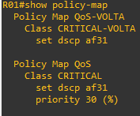

# 10 - EXEMPLO PRÁTICO DE QoS

Agora vamos imaginar o seguinte cenário:   

Aqui irei simular uma pequena empresa que se conecta a sua central passando pela Internet, representada aqui pelo roteador ISP. Então aqui teremos 3 fluxos de tráfego: o trafego HTTP, o tráfego TFTP e o tráfego do SSH. Como aqui somente é um exemplo, vamos dizer que o tráfego HTTP é critico para a empresa e queremos dar prioridade maior para esse tipo de tráfego. Em seguida, vamos dar uma prioridade menor ao tráfego FTP e por fim, a menor prioridade será dada ao tráfego SSH.   
Aqui temos que seguir alguns passos para realizara aconfiguração do QoS que são:
1. Criar um **CLASS MAP** - Selecionar o tráfego importante
2. Criar uma **Policy MAP** - Definir o que fazer com o tráfego
3. Aplicara política em uma interface.
Então a recomendação aqui é que o QoS seja configurado em cada equipamento em que o fluxo fora trafegar.   
Primeiro irei realizar a captura dos pacotes de redes em alguns pontos para podermos analisar como estão os pacotes. Para isso, irei utilizar a ferramenta wireshark de código aberto que é um sniffer de pacotes. Então irei posicionar o Wireshark na interface G0/0 do roteador ISP e nesse momento irei realizar um acesso HTTP, TFTP e um PIMG (ICMP) do host 192.168.10.10 .   

<table>
    <tr >
        <td width="30%"> </img> </td>
        <td width="30%"> </img> </td> 
        <td width="30%"> </img> </td>
    </tr>
</table>

**OBS:** clique na imagem para aumentar e depois em voltar para retornar ao texto   

Observe que o campo que interessa nessa análise é o **DIFFSERV** que no nosso caso está marcado como **COS0**, ou seja, ele não recebeu marcação alguma, está no padrão. Esse comportamento é o padrão para todo tipo de tráfego e nesse caso, será aplicado o algorítmo **FIFO (FIRST IN / FIRST OUT)**, ou seja, o primeiro que entra é o primeiro que sai.   
Agora deixo duas tabelas com algumas recomendações de marcação e classificação para podermos dar sequência ao nosso exemplo.   

   
   

Então agora vamos acessar o roteador **R01** e seguir o primeiro dos 3 passos citados acima. Aqui vou começar criando uma access-list para selecionar o tráfego interessante.   

|      |  COMANDOS                                                                        |
| :--: | -------------------------------------------------------------------------------- | 
| 01   | R01(config)# ip access-list extended CRITICAL                                    |
| 02   | R01(config-ext-nacl)#permit tcp 192.168.10.0 0.0.0.255 host 192.168.20.10 eq www |

Nessa acl eu estou dizendo que permito o tráfego da rede 192.168.10.0 /24 para o host 192.168.20.10 na porta 80 (palavra www). Agora precisamos que algo dê um match com essa regra para que depois possamos escolher o que fazer com isso. Então agora vou criar um **CLASS-MAP**.   

|      |  COMANDOS                                                                        |
| :--: | -------------------------------------------------------------------------------- | 
| 01   | R01(config)#class-map match-any CRITICAL                                         |
| 02   | R01(config-cmap)#match access-group name CRITICAL                                |

Pronto, aqui selecionamos noss tráfego interessante. Cabe aqui ressaltar que eu usei a palavra **match-any** ao invés de **match-all**. Imagine que tivéssemos dois ou mais critérios de seleção que não somente a access-list. Se usarmos o **match-all** o nosso CLASS-MAP tem que necessáriamente atender a todos os critérios. Já quando utilizamos **match-any**, a lógica passa a ser: **"Atenda ou um ou outro critério".   
Então vamos ao passo **2. Criar uma **Policy MAP** - Definir o que fazer com o tráfego**   

|      |  COMANDOS                                                                        |
| :--: | -------------------------------------------------------------------------------- | 
| 01   | R01(config)#policy-map QoS                                                       |
| 02   | R01(config-pmap)#class CRITICAL                                                  |
| 03   | R01(config-pmap-c)#set dscp af31                                                 |

Agora o que nos resta é aplicar a política em uma interface para que essa possa começar a valer. Então vou escolher a Interface G0/0 no sentido de input   

|      |  COMANDOS                                                                        |
| :--: | -------------------------------------------------------------------------------- | 
| 01   | R01(config)#int g0/0                                                             |
| 02   | R01(config-if)#service-policy input QoS                                          |

Então percebam que agora, quando o tráfego http sai do roteador R01 e vai em direção ao servidor HTTP, ele é marcado com **DSCP AF31**, ou seja, como um tráfego critico. Como estamos dando um match nos baseando em acls, temos que ter em mente que essa marcação permaneçerá somente nesse sentido do tráfego. Mas e como fica o tráfego de volta ? Vamos analisar uma captura do wireshark que foi realizada na interface **G0/0** do roteado **R01**.

<table>
    <tr >
        <td width="50%"> </img> </td>
        <td width="50%"> </img> </td> 
    </tr>
</table>

Então aqui iremos realizar a marcação com o trafego contrário. Para isso iremos crirar uma nova access-list que nomeei como **CRITICAL-VOLTA**

|      |  COMANDOS                                                                             |
| :--: | ------------------------------------------------------------------------------------- | 
| 01   | R01(config)# ip access-list extended CRITICAL-VOLTA                                   |
| 02   | R01(config-ext-nacl)#permit tcp host 192.168.20.10 192.168.10.0 0.0.0.255 established |

Por questões de organização optei aqui por crir uma class-map chamada de **CRITICAL-VOLTA**   

|      |  COMANDOS                                                                        |
| :--: | -------------------------------------------------------------------------------- | 
| 01   | R01(config)#class-map match-any CRITICAL                                         |
| 02   | R01(config-cmap)#match access-group name CRITICAL                                |

E logo em seguida crio outra policy-map chamada de **QoS-VOLTA**   

|      |  COMANDOS                                                                        |
| :--: | -------------------------------------------------------------------------------- | 
| 01   | R01(config)#policy-map QoS-VOLTA                                                 |
| 02   | R01(config-pmap)#class CRITICAL                                                  |
| 03   | R01(config-pmap-c)#set dscp af31                                                 |

E finalmente aplico a política na interface G0/1 no sentido de saída da interface.   

|      |  COMANDOS                                                                        |
| :--: | -------------------------------------------------------------------------------- | 
| 01   | R01(config)#int g0/1                                                             |
| 02   | R01(config-if)#service-policy output QoS-VOLTA                                   |

Agora vamos analisar uma captura do Whireshark na interface G0/0 do roteador **R01** para verificarmos como ficou agora.

<table>
    <tr >
        <td width="50%"> </img> </td>
        <td width="50%"> </img> </td> 
    </tr>
</table>

Todo o restante dos tráfegos que não são classificados, caem em uma classe chamada de class-default. Como aqui estou utilizando o modelo **DiffServ**, AF31 tem o seguinte significado: o número 3 é referente a prioridade da classe e o número 1 é referente a possíbilidade de descarte do pacote. Em outras palvras e seguindo a tabela anterior, é um tráfego CRITICO.

| Descarte | Classe 1 | Classe 2 | Classe 3 | Classe 4 | Expresso |
| :------: | :------: | :------: | :------: | :------: | :------: |
| Baixo    |   AF11   |   AF21   |   AF31   |   AF41   |          |
| Médio    |   AF12   |   AF22   |   AF32   |   AF42   |    EF    |
| Alto     |   AF13   |   AF23   |   AF33   |   AF43   |          |

Aqui vou abrir um parêntesis. Como as interfaces são Gigabits, então elas são 1.000 Mbps ou 100.000.0 bps. Com isso vamos ajustar as largura de banda das interfaces com o comando **bandwith**   

|      |  COMANDOS  INTERFACE G0/1          |  COMANDOS  INTERFACE G0/1          |
| :--: | ---------------------------------- | ---------------------------------- |
| 01   | R01(config)#int g0/0               | R01(config)#int g0/1               |
| 02   | R01(config-if)#bandwith 10000000   | R01(config-if)#bandwith 10000000   |

Bom, até aqui somente marcamos nosso tráfego tanto de ida, como de volta. Vamos voltar na nossa **police-map QoS** e acessar a classe **CRITICAL**. Agora vamos analisar as opções que temos aqui:

   

É aqui que vamos escolher se iremos utilizar o modelo de police ou shapper, a quantidade de banda que iremos reservar, aprioridade do tráfego, etc. Então aqui vou escolher o modelo de policer garantindo banda para o trafego selecionado, no caso o tráfego CRITICO (HTTP).

|      |  COMANDOS                                                                        |
| :--: | -------------------------------------------------------------------------------- | 
| 01   | R01(config)#policy-map QoS                                                       |
| 02   | R01(config-pmap)#class CRITICAL                                                  |
| 03   | R01(config-pmap-c)#police cir percente 30                                        |
| 04   | R01(config-pmap-c-police)#conform-action transmit                                |
| 05   | R01(config-pmap-c-police)#exceed-action drop                                     |
| 06   | R01(config-pmap-c-police)#violate-action drop                                    |

Aqui configuramos o policer para ter uma CIR (Commited Information Rate), ou seja, a taxa de tráfego monitorada em 30% que é medida em bits por segundo. O que estiver em conformidade com essa taxa a ação é de transmitir. Já o que excerder ou violar será descartado (DROP).   
Agora para completar essa parte do nosso exemplo, vamos executar os mesmos passos na calsse CRITICAL-VOLTA da policy QoS-VOLTA.

|      |  COMANDOS                                                                        |
| :--: | -------------------------------------------------------------------------------- | 
| 01   | R01(config)#policy-map QoS-VOLTA                                                 |
| 02   | R01(config-pmap)#class CRITICAL-VOLTA                                            |
| 03   | R01(config-pmap-c)#police cir percente 30                                        |
| 04   | R01(config-pmap-c-police)#conform-action transmit                                |
| 05   | R01(config-pmap-c-police)#exceed-action drop                                     |
| 06   | R01(config-pmap-c-police)#violate-action drop                                    |

Então vamos verificar como ficaram nossas políticas.   

   

Agora, como dissemos anteriormente que na nossa **class-map** utlizamos a lógica **match-any** que é para atender ou um ou outro critério. Então aqui vou adicionar mais um critério em ambas as class-maps. Imagine que queremos dar um match também em pacotes que vierem marcados como af31. Então devemos executra os comandos:   

|      |  COMANDOS  CLASS-MAP CRITICAL      |  COMANDOS CLASS-MAP CRITICAL-VOLTA   |
| :--: | ---------------------------------- | ------------------------------------ |
| 01   | R01(config)#class-map CRITICAL     | R01(config)#class-map CRITICAL-VOLTA |
| 02   | R01(config-cmap)#match dscp af31   | R01(config-cmap)#match dscp af31     |

Deixo aqui dois arquivos. O primeiro contendo as configurações iniciais de roteaemneto chama de .zip) e outro com as configurações realizadas em R01 chamado .zip). Estes arquivos podem ser importados no EVE-NG. **OBS:** favor se atentar as interfaces pois devido a imagem utilizadas, elas sempre iniciam desligadas, mesmo salvando a configuração para estarem ligadas.   
Também deixei o arquivo  contendo todas as configurações de R01.   
Por fim, deixei uma pasta chamada  com os arquivos de captura que realizei para que possem ser importados no wireshark e depois feita a análise dos mesmos.