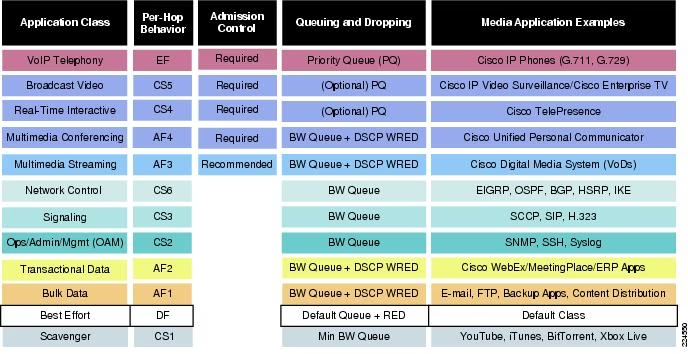
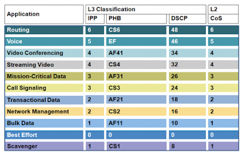

# 10 - EXEMPLO PRÁTICO DE QoS

Agora vamos imaginar o seguinte cenário:   

Aqui irei simular uma pequena empresa que se conecta a sua central passando pela Internet, representada aqui pelo roteador ISP. Então aqui teremos 3 fluxos de tráfego: o trafego HTTP, o tráfego TFTP e o tráfego do ICMP. Como esse somente é um exemplo, vamos dizer que o tráfego HTTP é critico para a empresa e queremos dar prioridade maior para esse tipo de tráfego. Em seguida, vamos dar uma prioridade menor ao tráfego FTP e por fim, a menor prioridade será dada ao tráfego ICMP.   
Aqui temos que seguir alguns passos para realizara aconfiguração do QoS que são:
1. Criar um **CLASS MAP** - Selecionar o tráfego importante
2. Criar uma **Policy MAP** - Definir o que fazer com o tráfego
3. Aplicara política em uma interface.
Então a recomendação aqui é que o QoS seja configurado em cada equipamento em que o fluxo fora trafegar.   
Primeiro irei realizar a captura dos pacotes de redes em alguns pontos para podermos analisar como estão os pacotes. Para isso, irei utilizar a ferramenta wireshark de código aberto que é um sniffer de pacotes. Então irei posicionar o Wireshark na interface G0/0 do roteador ISP e nesse momento irei realizar um acesso HTTP, TFTP e um PIMG (ICMP) do host 192.168.10.10 .   

<table>
    <tr >
        <td width="30%"> </img> </td>
        <td width="30%"> </img> </td> 
        <td width="30%"> </img> </td>
    </tr>
</table>

**OBS:** clique na imagem para aumentar e depois em voltar para retornar ao texto   

Observe que o campo que interessa nessa análise é o **DIFFSERV** que no nosso caso está marcado como **COS0**, ou seja, ele não recebeu marcação alguma, está no padrão. Esse comportamento é o padrão para todo tipo de tráfego e nesse caso, será aplicado o algorítmo **FIFO (FIRST IN / FIRST OUT)**, ou seja, o primeiro que entra é o primeiro que sai.   
Agora deixa duas tabelas com algumas recomendações de marcação e classificação para podermos dar sequência ao nosso exemplo.   

   
   

Então agora vamos acessar o roteador **R01** e seguir o primeiro dos 3 passos citados acima. Aqui vou começar criando uma access-list para selecionar o tráfego interessante.   

|      |  COMANDOS                                                                        |
| :--: | -------------------------------------------------------------------------------- | 
| 01   | R01(config)# ip access-list extended CRITICAL                                    |
| 02   | R01(config-ext-nacl)#permit tcp 192.168.10.0 0.0.0.255 host 192.168.20.10 eq www |

Nessa acl eu estou dizendo que permito o tráfego da rede 192.168.10.0 /24 para o host 192.168.20.10 na porta 80 (palavra www). Agora precisamos que algo dê um match com essa regra para que depois possamos escolher o que fazer com isso. Então agora vou criar um **CLASS-MAP**.   

|      |  COMANDOS                                                                        |
| :--: | -------------------------------------------------------------------------------- | 
| 01   | R01(config)#class-map match-any CRITICAL                                         |
| 02   | R01(config-cmap)#match access-group name CRITICAL                                |

Pronto, aqui selecionamos noss tráfego interessante. Cabe aqui ressaltar que eu usei a palavra **match-any** ao invés de **match-all**. Imagine que tivéssemos dois ou mais critérios de seleção que não somente a access-list. Se usarmos o **match-all** o nosso CLASS-MAP tem que necessáriamente atender a todos os critérios. Já quando utilizamos **match-any**, a lógica passa a ser: **"Atenda ou um ou outro critério".   
Então vamos ao passo **2. Criar uma **Policy MAP** - Definir o que fazer com o tráfego**   

|      |  COMANDOS                                                                        |
| :--: | -------------------------------------------------------------------------------- | 
| 01   | R01(config)#policy-map CRITICAL                                                  |
| 02   | R01(config-pmap)#class CRITICAL                                                  |
| 03   | R01(config-pmap-c)#set dscp af31                                                 |
| 04   | R01(config-pmap-c)#set cos 3                                                     |