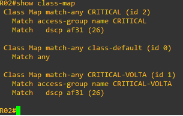

# 11 - EXEMPLO PRÁTICO DE QoS 02
 
Aqui vamos utilizar o mesmo cenário do exemplo anterior:   

Então no exemplo anterior configuramos o modelo de policer com marcação dscp no roteado **R01**. Agora vamos configurar o roteador **R02** que está posicionado após ao ISP. Dessa vez vamos escolher o modelo **shapper**. 

Então vou avançar mais rápido pois as configurações são parecidas. Agora vamos acessar o roteador **R02** e seguir o primeiro dos 3 passos citados ateriormente.   
1. Criar um **CLASS MAP** - Selecionar o tráfego importante
2. Criar uma **Policy MAP** - Definir o que fazer com o tráfego
3. Aplicara política em uma interface.

Então novamente vou começar criando as access-lists, tanto de ida e de volta,  para selecionar o tráfego interessante.   

|      |  COMANDOS                                                                             |
| :--: | ------------------------------------------------------------------------------------- | 
| 01   | R02(config)# ip access-list extended CRITICAL                                         |
| 02   | R02(config-ext-nacl)#permit tcp 192.168.10.0 0.0.0.255 host 192.168.20.10 eq www      |
| 03   | R02(config-ext-nacl)#exit                                                                      |
| 04   | R02(config)# ip access-list extended CRITICAL-VOLTA                                   |
| 05   | R02(config-ext-nacl)#permit tcp host 192.168.20.10 192.168.10.0 0.0.0.255 established |
| 06   | R02(config-ext-nacl)#exit                                                                      |

Na acl **CRITICAL** eu estou dizendo que permito o tráfego da rede 192.168.10.0 /24 para o host 192.168.20.10 na porta 80 (palavra www) para o tráfego de ida. Depois eu crio a segunda acl chamada **CRITICAL-VOLTA** onde digo que permito o trafego da rede 192.168.10.0 /24 que foi estabelecido com o servidor 192.168.20.10, ou seja, o tráfego http de volta. Agora precisamos que algo dê um match com essas regras para que depois possamos escolher o que fazer com isso. Então agora vou criar as **CLASS-MAP**.   

|      |  COMANDOS                                                                        |
| :--: | -------------------------------------------------------------------------------- | 
| 01   | R02(config-cmap)# match access-group name CRITICAL                               |
| 02   | R02(config-cmap)# match dscp af31                                                |
| 03   | R02(config-cmap)# exit                                                           |
| 04   | R02(config-cmap)#class-map match-any CRITICAL-VOLTA                              |
| 05   | R02(config-cmap)# match dscp af31                                                |
| 06   | R02(config-cmap)# exit                                                           |

Vamos agora ao passo **2. Criar uma **Policy MAP** - Definir o que fazer com o tráfego**.   

|      |  COMANDOS                                                                        |
| :--: | -------------------------------------------------------------------------------- | 
| 01   | Router(config-pmap)# class CRITICALL                                             |
| 02   | Router(config-pmap-c)#  set dscp af31                                            |
| 03   | Router(config-pmap-c)#  shape average 3000000                                    |
| 04   | Router(config-pmap-c)# exit                                                      |
| 05   | Router(config-pmap-c)#  set dscp af31                                            |
| 06   | Router(config-pmap-c)#  shape average 3000000                                    |
| 07   | Router(config-pmap-c)# exit                                                      |

Agora o que nos resta é aplicar a política em uma interface para que essa possa começar a valer. Então vou escolher a Interface G0/0 no sentido de input   

|      |  COMANDOS  INTERFACE G0/1                |  COMANDOS  INTERFACE G0/1                 |
| :--: | ---------------------------------------- | ----------------------------------------- |
| 01   | R01(config)#int g0/0                     | R01(config)#int g0/1                      |
| 02   | R01(config-if)#service-policy input QoS  | R01(config-if)#service-policy input QoS   |

Agora vamos verificar as configurações com alguns comandos interessantes.   

<table>
    <tr >
        <td width="30%"> </img> </td>
        <td width="30%"> </img> </td> 
        <td width="30%"> </img> </td>
        <td width="30%"> </img> </td>
    </tr>
</table>

Deixo aqui dois arquivos. O primeiro contendo as configurações iniciais de roteaemneto chama de .zip) e outro com as configurações realizadas em R01 chamado .zip). Estes arquivos podem ser importados no EVE-NG. **OBS:** favor se atentar as interfaces pois devido a imagem utilizadas, elas sempre iniciam desligadas, mesmo salvando a configuração para estarem ligadas.   
Também deixei o arquivo  contendo todas as configurações de R01.   
Por fim, deixei uma pasta chamada  com os arquivos de captura que realizei para que possem ser importados no wireshark e depois feita a análise dos mesmos.