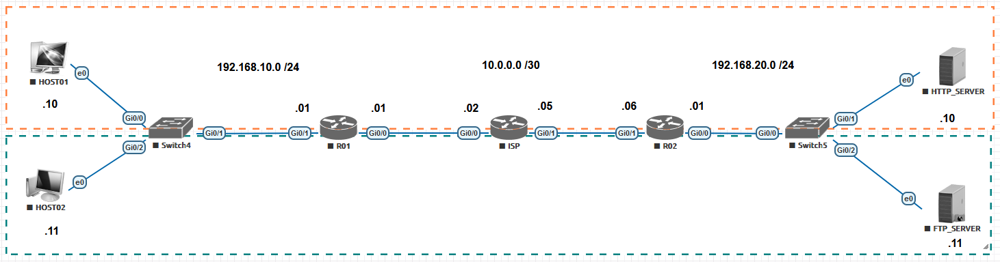
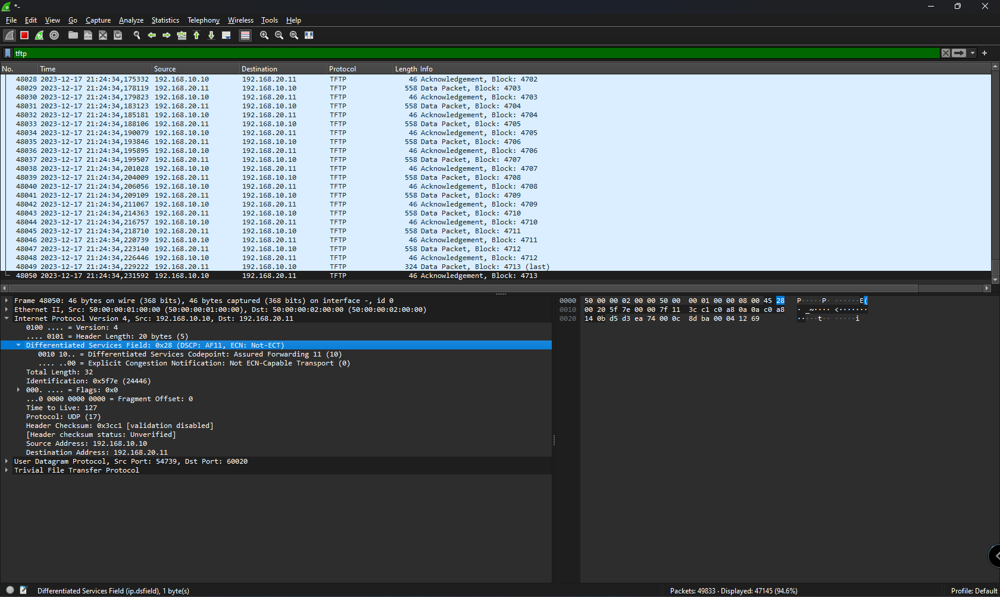

# 12 - EXEMPLO PRÁTICO DE QoS 03
 
Sei que parece um pouco repetitivo, mas agora vou adicionar as classes restantes: TFTP e ICMP. Então mais uma vez vou partir do mesmo cenário:   

Então agora vamos acessar o roteador R01 e completar o que falta por primeiro. Depois iremos partir para o roteador R02. Mais uma vez, lembre-se dos passos para implemntar QoS:   

1. Criar um **CLASS MAP** - Selecionar o tráfego importante
2. Criar uma **Policy MAP** - Definir o que fazer com o tráfego
3. Aplicara política em uma interface.

Então novamente vou começar criando as access-lists, tanto de ida e de volta,  para selecionar o tráfego interessante.   

|      |  COMANDOS                                                                             |
| :--: | ------------------------------------------------------------------------------------- | 
| 01   | R02(config)# ip access-list extended TFTP                                             |
| 02   | R02(config-ext-nacl)#permit udp 192.168.10.0 0.0.0.255 host 192.168.20.11 eq tftp     |
| 03   | R02(config-ext-nacl)#deny   udp any any eq tftp                                       |
| 04   | R02(config-ext-nacl)#permit ip any any                                                |
| 05   | R02(config-ext-nacl)#exit                                                             |

Agora vamos as **CLASS-MAP TFTP**.   

|      |  COMANDOS                                                                        |
| :--: | -------------------------------------------------------------------------------- | 
| 01   | R01(CONFIG)#class-map match-any TFTP                                             |
| 02   | R01(config-cmap)# match access-group name TFTP                                   |
| 03   | R01(config-cmap)# match dscp af31                                                |
| 04   | R01(config-cmap)# exit                                                           |

Vamos agora ao passo **2. Criar uma **Policy MAP** - Definir o que fazer com o tráfego**.   

|      |  COMANDOS                                                                        |
| :--: | -------------------------------------------------------------------------------- | 
| 01   | R01(config)#policy-map QoS                                                       |
| 02   | Router(config-pmap)# class TFTP                                                  |
| 03   | Router(config-pmap-c)# police cir percent 20                                     |
| 04   | Router(config-pmap-c)# conform-action transmit                                   |
| 05   | Router(config-pmap-c)# exceed-action drop                                        |
| 06   | Router(config-pmap-c)# violate-action drop                                       |
| 07   | Router(config-pmap-c)#  set dscp af11                                            |
| 08   | Router(config-pmap-c)# exit                                                      |

**OBS:** aqui eu não criei uma classe chamada TFTP-VOLTA pois o trafego TFTP utiliza portas altas aleatórias para o trafego de volta. Já para o de ida ele utiliza a porta **69**. Como atendeu o match de ida, na volta não há nada que esteja marcando o trafego para outra classe e, sendo assim, manterá marcação escolhida.

Perceba que agora somente eu adicionei mais uma classe a política **QoS** e não preciso fazer mais nada referente as interfaces pois essas políticas já estão aplicadas. Segue a captura do trafego **TFTP** no sentido de ida, **interface G0/0** e volta, **interface G0/1**
<table>
    <tr >
        <td width="50%"> </img> </td>
        <td width="50%"> </img> </td>
    </tr>
</table>

Deixo aqui dois arquivos. O primeiro contendo as configurações iniciais de roteaemneto chama de .zip) e outro com as configurações realizadas em R01 chamado .zip). Estes arquivos podem ser importados no EVE-NG. **OBS:** favor se atentar as interfaces pois devido a imagem utilizadas, elas sempre iniciam desligadas, mesmo salvando a configuração para estarem ligadas.   
Também deixei o arquivo  contendo todas as configurações de R01.   
