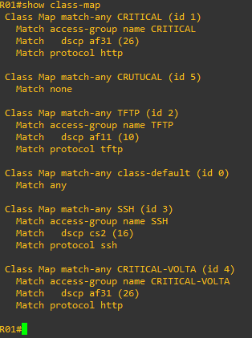

# 13 - EXEMPLO PRÁTICO DE QoS 04

Até aqui utilizamos o MQC (Modular QoS Cli) que nada mais é a interface de texto que acessamos os equipamentos. Então vale a pena reforçar uma última vez os passos para se criar e aplicar as políticas de QoS que são:   

1. Criar um **CLASS MAP** - Selecionar o tráfego importante
2. Criar uma **Policy MAP** - Definir o que fazer com o tráfego
3. Aplicara política em uma interface.

Deixo um link com mais informações sobre o **MQC**   

   

Então quando vamos dar um match em uma acl estamos utilizando acls para isso. Mas a cisco disponibiliza o recurso NBAR (Network Based Application Recognition, reconhecimento de aplicativos baseado em rede), que é o sistema de inspeção profunda e inteligente da CISCO. Agora podemos analisar o tráfego desde a cama 3 até a camada 7.   

Para acessarmos o NBAR através da cli, vamos realizar o seguintes passos:

1. Acessar nossa **CLASS MAP** criada nos exemplos anteriores
2. E dar um match a um protocolo. Aqui existe uma infinidade de protocolos que o IOS já reconhece. (Veja o exemplo.)

<table>
    <tr >
        <td width="40%"> </img> </td>
        <td width="40%"> </img> </td>
    </tr>
    <tr >
        <td width="40%"> </img> </td>
        <td width="40%"> </img> </td>
    </tr>
    <tr>
        <td width="40%"> </img> </td>
        <td width="40%"> </img> </td>
    </tr>
</table>

Então vamos partir do mesmo cenário:   

Agora, como já estamos mais acostumados com QoS, a única mudança que precisamos fazer aqui é no momento de dar um match. Como estou utilizando a lógica **OU (MATCH-ANY)**, podemos acrescentar mais um critério de match nas nossas access-lists. Então seguem a lista das alterações primeiramente em R01.   

|      |  COMANDOS                                                                             |
| :--: | ------------------------------------------------------------------------------------- | 
| 01   | R01(config)# class-map match-any CRITICAL                                             |
| 02   | R01(config-cmap)# match protocol http                                                 |
| 03   | R01(config-cmap)# exit                                                                |
| 04   | R01(config)#class-map match-any CRITICAL-VOLTA                                        |
| 05   | R01(config-cmap)# match protocol http                                                 |
| 06   | R01(config-cmap)# exit                                                                |
| 07   | R01(config)# class-map match-any TFTP                                                 |
| 08   | R01(config-cmap)# match protocol TFTP                                                 |
| 09   | R01(config-cmap)# exit                                                                |
| 10   | R01(config)# class-map match-any SSH                                                  |
| 11   | R01(config-cmap)# match protocol SSH                                                  |
| 12   | R01(config-cmap)# exit                                                                |

Agora vamos ver como ficaram nossas class-map em R01.   

   

Então temos que repetir o mesmo processo em R02.   

|      |  COMANDOS                                                                             |
| :--: | ------------------------------------------------------------------------------------- | 
| 01   | R02(config)# class-map match-any CRITICAL                                             |
| 02   | R02(config-cmap)# match protocol http                                                 |
| 03   | R02(config-cmap)# exit                                                                |
| 04   | R02(config)#class-map match-any CRITICAL-VOLTA                                        |
| 05   | R02(config-cmap)# match protocol http                                                 |
| 06   | R02(config-cmap)# exit                                                                |
| 07   | R02(config)# class-map match-any TFTP                                                 |
| 08   | R02(config-cmap)# match protocol TFTP                                                 |
| 09   | R02(config-cmap)# exit                                                                |
| 10   | R02(config)# class-map match-any SSH                                                  |
| 11   | R02(config-cmap)# match protocol SSH                                                  |
| 12   | R02(config-cmap)# exit                                                                |

Deixo aqui dois arquivos. O primeiro contendo as configurações iniciais de roteamento chama de .zip) e outro com as configurações realizadas em R01 chamado .zip). Estes arquivos podem ser importados no EVE-NG. **OBS:** favor se atentar as interfaces pois devido a imagem utilizadas, elas sempre iniciam desligadas, mesmo salvando a configuração para estarem ligadas.   
Também deixei os arquivos  e  contendo todas as configurações de R01 R02 respectivamente.   
