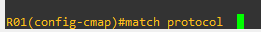
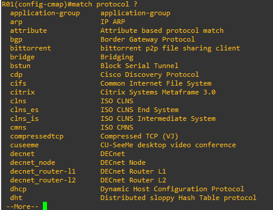
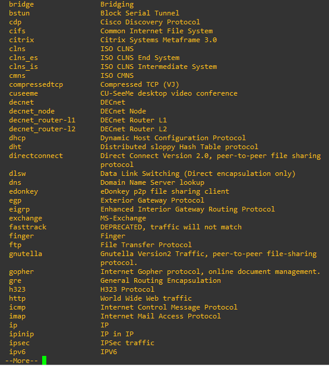
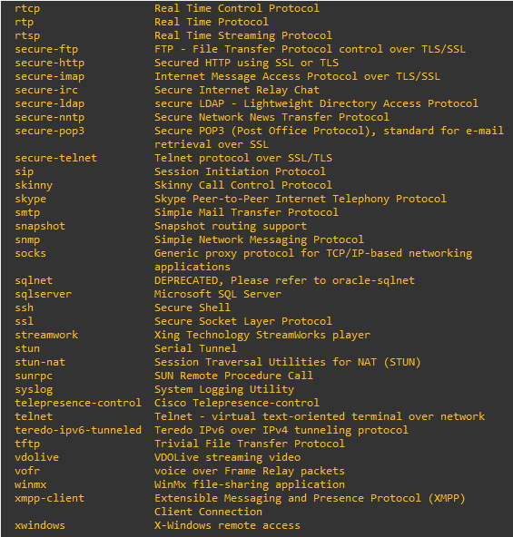
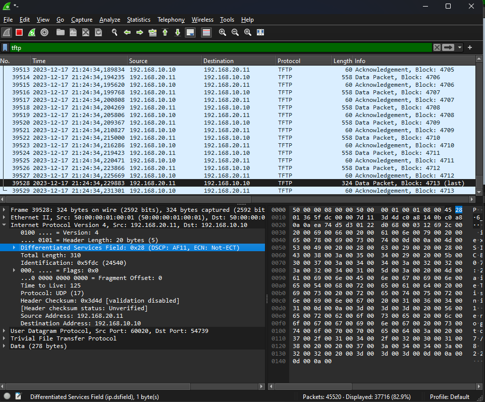

# 13 - EXEMPLO PRÁTICO DE QoS 04

Até aqui utlizamos o MQC (Modular QoS Cli) que nada mais é a interface de texto que acessessamos os equipamentos. Então vale a pena reforçar uam última vez os passos para se criar e aplicar as políticas de QoS que são:   

1. Criar um **CLASS MAP** - Selecionar o tráfego importante
2. Criar uma **Policy MAP** - Definir o que fazer com o tráfego
3. Aplicara política em uma interface.

Deixo um link com mais informações sobre o **MQC**   

   

Então quando vamos dar um match em uma acl estamos utilizando acls para isso. Mas a cisco disponibiliza o recurso NBAR (Network Based Application Recognition, reconhecimento de aplicativos baseado em rede), que é o sistema de inspeção profunda e inteligente da CISCO. Agora podemos analisar o tráfego desde a cama 3 até a camada 7.   

Para acessarmos o NBAR através da cli, vamos realizar o seguintes passos:

1. Acessar nossa **CLASS MAP** criada nos exemplos anteriores
2. E dar um match a um protocolo. Aqui existe uma infinidade de protocolos que o IOS já reconhece. (Veja o exemplo.)

<table>
    <tr >
        <td width="40%"> </img> </td>
        <td width="40%"> </img> </td>
    </tr>
    <tr >
        <td width="40%"> </img> </td>
        <td width="40%"> </img> </td>
    </tr>
    <tr>
        <td width="40%"> </img> </td>
        <td width="40%"> </img> </td>
    </tr>
</table>

 
Sei que parece um pouco repetitivo, mas agora vou adicionar as classes restantes: TFTP e ICMP. Então mais uma vez vou partir do mesmo cenário:   

Então agora vamos acessar o roteador R01 e completar o que falta por primeiro. Depois iremos partir para o roteador R02. Mais uma vez, lembre-se dos passos para implemntar QoS:   

1. Criar um **CLASS MAP** - Selecionar o tráfego importante
2. Criar uma **Policy MAP** - Definir o que fazer com o tráfego
3. Aplicara política em uma interface.

Então novamente vou começar criando as access-lists, tanto de ida e de volta,  para selecionar o tráfego interessante. Também vou aproveitar e criar uma acl para o tráfego SSH  

|      |  COMANDOS                                                                             |
| :--: | ------------------------------------------------------------------------------------- | 
| 01   | R01(config)# ip access-list extended TFTP                                             |
| 02   | R01(config-ext-nacl)#permit udp 192.168.10.0 0.0.0.255 host 192.168.20.11 eq tftp     |
| 03   | R01(config-ext-nacl)#deny   udp any any eq tftp                                       |
| 04   | R01(config-ext-nacl)#permit ip any any                                                |
| 05   | R01(config-ext-nacl)#exit                                                             |
| 06   | R01(config)# ip access-list extended SSH                                              |
| 07   | R01(confug-ext-nacl)# permit tcp 192.168.10.0 0.0.0.255 192.168.20.0 0.0.0.255 eq 22  |
| 08   | R01(config-ext-nacl)# exit                                                            |

Agora vamos criar as class-maps **CLASS-MAP TFTP**  e **CLASS-MAP SSH**.   

|      |  COMANDOS                                                                        |
| :--: | -------------------------------------------------------------------------------- | 
| 01   | R01(CONFIG)#class-map match-any TFTP                                             |
| 02   | R01(config-cmap)# match access-group name TFTP                                   |
| 03   | R01(config-cmap)# match dscp af31                                                |
| 04   | R01(config-cmap)# exit                                                           |
| 05   | R01(config)#class-map match-any SSH                                              |
| 06   | R01(config-cmap)# match access-group name SSH                                    |
| 07   | R01(config-cmap)# match dscp cs2                                                 |
| 08   | R01(config-cmap)# exit

Vamos agora ao passo **2. Criar uma **Policy MAP** - Definir o que fazer com o tráfego**.   

|      |  COMANDOS                                                                        |
| :--: | -------------------------------------------------------------------------------- | 
| 01   | R01(config)#policy-map QoS                                                       |
| 02   | R01(config-pmap)# class TFTP                                                     |
| 03   | R01(config-pmap-c)# police cir percent 20                                        |
| 04   | R01(config-pmap-c)# conform-action transmit                                      |
| 05   | R01(config-pmap-c)# exceed-action drop                                           |
| 06   | R01(config-pmap-c)# violate-action drop                                          |
| 07   | R01(config-pmap-c)#  set dscp af11                                               |
| 08   | R01(config-pmap-c)# exit                                                         |
| 09   | R01(config-pmap-c)# class SSH                                                    |
| 10   | R01(config-pmap-c)# police cir percent 10                                        |
| 11   | R01(config-pmap-c)# conform-action transmit                                      |
| 12   | R01(config-pmap-c)# exceed-action drop                                           |
| 13   | R01(config-pmap-c)# violate-action drop                                          |
| 14   | R01(config-pmap-c)# set dscp cs2                                                 |
| 15   | R01(config-pmap-c)# exit                                                         |

**OBS:** aqui eu não criei uma classe chamada TFTP-VOLTA e nem SSH-VOLTA pois o trafego TFTP utiliza portas altas aleatórias para o trafego de volta. Já para o de ida ele utiliza a porta **69**. Como atendeu o match de ida, na volta não há nada que esteja marcando o trafego para outra classe e, sendo assim, manterá marcação escolhida. O mesmo ocorre para o tráfego ssh, que utiliza a porta 22 no servidor e porta aleatórias no client.   

Perceba que agora somente eu adicionei mais uma classe a política **QoS** e não preciso fazer mais nada referente as interfaces pois essas políticas já estão aplicadas. Segue a captura do trafego **TFTP** no sentido de ida, **interface G0/0** e volta, **interface G0/1**
<table>
    <tr>
        <td width="50%" align="center"> Captura tráfego TFTP IDA</td>
        <td width="50%" align="center"> Captura tráfego TFTP VOLTA</td>
    </tr>
    <tr >
        <td width="50%"> </img> </td>
        <td width="50%"> </img> </td>
    </tr>
</table>

Perceba que agora terminamos de configurar o roteador R01 e ainda falta terminar o roteador R02. Então vamos seguir os mesmos 3 passos faltantes.  

|      |  COMANDOS                                                                             |
| :--: | ------------------------------------------------------------------------------------- | 
| 01   | R01(config)# ip access-list extended TFTP                                             |
| 02   | R01(config-ext-nacl)#permit udp 192.168.10.0 0.0.0.255 host 192.168.20.11 eq tftp     |
| 03   | R01(config-ext-nacl)#deny   udp any any eq tftp                                       |
| 04   | R01(config-ext-nacl)#permit ip any any                                                |
| 05   | R01(config-ext-nacl)#exit                                                             |
| 06   | R01(config)# ip access-list extended SSH                                              |
| 07   | R01(confug-ext-nacl)# permit tcp 192.168.10.0 0.0.0.255 192.168.20.0 0.0.0.255 eq 22  |
| 08   | R01(config-ext-nacl)# exit                                                            |

Agora vamos criar as class-maps **CLASS-MAP TFTP**  e **CLASS-MAP SSH**.   

|      |  COMANDOS                                                                        |
| :--: | -------------------------------------------------------------------------------- | 
| 01   | R01(CONFIG)#class-map match-any TFTP                                             |
| 02   | R01(config-cmap)# match access-group name TFTP                                   |
| 03   | R01(config-cmap)# match dscp af31                                                |
| 04   | R01(config-cmap)# exit                                                           |
| 05   | R01(config)#class-map match-any SSH                                              |
| 06   | R01(config-cmap)# match access-group name SSH                                    |
| 07   | R01(config-cmap)# match dscp cs2                                                 |
| 08   | R01(config-cmap)# exit

Vamos agora ao passo **2. Criar uma **Policy MAP** - Definir o que fazer com o tráfego**. É aqui que as coisas vão ficar diferentes pois em R01 eu escolhi o modelo de **Policer** e em R02 vamos utilizar o modelo de **SHAPPER**   

|      |  COMANDOS                                                                        |
| :--: | -------------------------------------------------------------------------------- | 
| 01   | R01(config)#policy-map QoS                                                       |
| 02   | R01(config-pmap)# class TFTP                                                     |
| 03   | R01(config-pmap-c)# set dscp af11                                                |
| 04   | R01(config-pmap-c)# shape average 2000000                                        |
| 05   | R01(config-pmap-c)# exit                                                         |
| 06   | R01(config-pmap-c)# class SSH                                                    |
| 07   | R01(config-pmap-c)# set dscp cs2                                                 |
| 08   | R01(config-pmap-c)# shape average 1000000                                        |
| 09   | R01(config-pmap-c)# exit                                                         |

Deixo aqui dois arquivos. O primeiro contendo as configurações iniciais de roteaemneto chama de .zip) e outro com as configurações realizadas em R01 chamado .zip). Estes arquivos podem ser importados no EVE-NG. **OBS:** favor se atentar as interfaces pois devido a imagem utilizadas, elas sempre iniciam desligadas, mesmo salvando a configuração para estarem ligadas.   
Também deixei os arquivos  e  contendo todas as configurações de R01 R02 respectivamente.   
