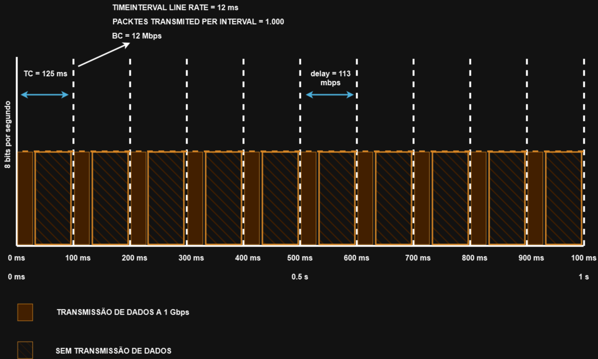

# 14 - POLICING X SHAPPING

Agora preciso fazer uma pausa para falar um pouco mais dessas duas técnicas de QoS: **Policing** e **Shapping**. Elas são duas técnicas parecidas mas que trabalham um pouco diferente. No **Policing** definimos uma taxa para monitoramento e o que passar dessa taxa é descartado ou remarcado. Já no **Shapping** o que passa dessa taxa é enfileirado e a transmissão para, e começa a transmitir desse buffer, depois retorna a transmissão e por ai adiante. 

   
   

**OBS:** A recomendação de uso para o uso do shapping **é na interface de saída**.   

Para isso são utilizados alguns algoritmos e alguns tipo de filas para se utilizar essas duas técnicas.   

## MARKDOWN

Como dito anteriormente, o policer fica monitorando uma taxa de transmissão e quando essa taxa é excedida ele ou descarta ou trafego ou remarca com uma prioridade menor.  
Por exemplo, um tráfego excedente que está marcado com o valo **AFx1** deve ser rebaixado com o valor **AFx2** ou mesmo **AFx3**, baixando a prioridade em 2 classes.   
Depois de remarcar / rebaixar a prioridade do tráfego, os mecanismos que evitam o congestionamento, como um DSCP - baseado no WRED (Weighted Random Early Detection), devem ser configurados para descartar mais agressivamente tráfegos marcados com **AFx3** do que **AFx2**. E o **AFx2** deve ser mais descartado do que **AFx1** e menos que o **AFx3**   

## TOKEN BUCKET ALGORITHMS

Os Policers e os Shappers são baseados em algoritmos de **token buccket**. Então vou citar alguns termos para demonstrar como esse tipo de algoritmo funciona: 
- **Commited Information Rate (CIR)**: essa é a taxa monitorada, definida no controle de tráfego. É medida em bits por segundo.
- **Commited Time Interval (TC)**: O intervalo de tempo, em milissegundos (ms) dividido pela rajada / pico de tráfego (BC). **TC** pode ser calculado pela fórmula: **TC = (BC[bits]) / CIR[bps] x 1000**
- **Cmmited Burst Size (BC)**: o tamanho máximo do CIR token bucket, medido em bytes, e o máximo montante de tráfego que pode ser calculado através da fórmula **BC = CIR x (TC / 1000)**
- **TOKEN**: um único token representa **1 byte ou 8 bits**

**OBS:**   
- **TC** é o número de segmentos que será dividido em um segundo
- **BC** é o número de bits permitidos para serem enviados por TC
- **CIR** é a taxa que quer manter

   

Esse gráfico representa uma interface de 100 mbits no período de 1 segundo. Não existe uma forma de dizer para a interface "transmita 50 mbits agora", por exemplo. Então como é feito o controle de tráfego pela taxa estipulada ? Simples: começa a enviar o tráfego e para a transmissão. Espera alguns segundos e ai retorna o tráfego, e isso ai sendo enfileirado. Então, para obtermos os **50mbps** na interface, o tráfego em 15 segundos é dividido por **8**, o que nos retorna **125ms**, ou seja, a cada 125 ms envia um pouco e para, espera 125 ms e depois envia de novo. No total isso serão 50 mbps. Se existir mais tráfego que o contratado, no exemplo 50 mbps, ou ele é descartado ou é armazenado em um buffer e enviado "atrasado".   

**TOKEN BUCKET:** um balde de tokens é um "espaço" que acumula os tokens até que o número máximo de tokens é atingido (como o BC quando utiliza um único bucket). Esses tokens são adicionados dentro de um bucket com uma taxa fixa (CIR). Cada pacote é checado para deixá-lo em conformidade com a taxa estipulada com o tamanho do pacote. Por exemplo, se o tamanho do pacote é de 1.500 bytes, ele retira 12.000 bits (1.500 x 8) do bucket para enviar ao pacote, o mecanismo de condicionante de tráfego pode tomar as seguintes ações:
- **TRAFFIC SHAPPING**: armazena os pacotes em um buffer até tokens suficientes em um bucket
- **TRAFFIC POLICING**: descarta os pacotes
- **TRAFFIC POLICING**: remarca (Mark Down) os pacotes

É recomendado que o valor de BC seja **maior ou igual ao tamanho do do maior pacote IP no fluxo do tráfego**. De outra forma, nunca existiram tokens suficientes no bucket para os pacotes maiores e, eles sempre vão ultrapassar a taxa limite pré-definida.   
- Se o bucket ficar completamente cheio, os novos tokens serão descartados. Os tokens descartados não ficam disponíveis para os novos pacotes que surgirem.
- Para os algoritmos **single bucket tokens**, a taxa de tráfego medida pode estar de acordo ou exceder a taxa de tráfego definida.   

   

- Podem ser utilizados mais de 1 bucket

Para entendermos melhor como esse algoritmo funciona, imagine que uma interface de 1 Gbps está configurada com um policer com uma taxa CIR definida para 120 Mbps e BC para 12 Mb.   
O valor de TC não pode ser explicitado diretamente no IOS, mas pode se calculado:   
- **TC = (BC[bits] / CIR[bps]) * 1.000**
- **TC = (12 Mb / 120 Mbps) * 1.000**
- **Tc = (12.000.000 bits / 120.000.000 bps) * 1.000**
- **TC = 100 ms**

Uma vez que o valor de TC é descoberto, o número de TCs por segundo podem ser calculados:   

- **TCs por segundo = 1.000 / TC**
- **TCs por segundo = 1.000 ms / 100 ms = 10 TCs**

## CÁLCULO DE CIR

Para calcular uma CIR de 10.000, podemos utilizar a seguinte fórmula: 
- **CIR = PACOTES POR SEGUNDO x PACOTES EM bits**
- **CIR = 10.000 PACOTES POR SEGUNDO x 12.000 bits = 120.000.000 bps**
- **CIR = 120 Mbps**

Para calcular o intervalo de tempo que levaria para 1.000 pacotes serem enviados na interface (em linha), a seguinte fórmula é utilizada:

- **TIME INTERVAL AT LINE RATE = (BC[bits] / INTERFACE SPEEED [bps]) x 1.000**
- **TIME INTERVAL AT LINE RATE = (12 Mb / 1 Gbps) x 1.000**
- **TIME INTERVAL AT LINE RATE = (12.000.000 bits / 1.000.000.000 bps) x 1.000**
- **TIME INTERVAL AT LINE RATE = 12 ms**

Então, como no exemplo anterior de uma interface de 1 Gbps a 1.500 bytes cada pacote, ou 12 mb sendo enviados a cada segundo, a interface envia e depois para, depois envia e para, até terminar de enviar tudo.   

   

Os valores recomendados para o TC vão de 8ms á 125ms. Os valores de 8ms a 10ms são utilizados para tráfegos com menos delay, como voz, por exemplo. Valores maiores que 125 ms não são recomendados pois ai o atraso é muito grande.   
**OBS:**   
Vamos supor que em uma interface de 100 mbps quiséssemos estabelecer uma taxa de 50 mbps. Então poderíamos enviar o tráfego por 500ms e depois não enviar e esperar outro pacote ?   
A resposta é não. Protocolos como voz e vídeo consideram isso como delay de 500ms, o que ultrapassa o limite suportado e, sendo assim, o pacote nunca seria enviado. Por isso o comportamento anterior é o correto, envia, para, envia, para, etc. até terminar de enviar tudo.