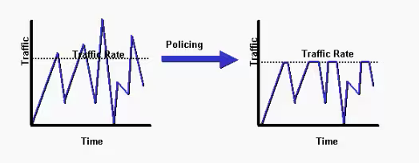

# 14 - POLICING X SHAPPING

Agora preciso fazer uma pausa para falar um pouco mais dessas duas técnicas de QoS: **Policing** e **Shapping**. Elas são duas técnicas parecidas mas que trabalham um pouco diferente. No **Policing** definimos uma taxa para monitaramento e o que passar dessa taxa é descartado ou remarcado. Já no **Shapping** o que passa dessa taxa é enfileirado e a transmissão para, e começa a transmitir desse buffer, depois retorna a transmissão e por ai adiante. 

   
   

**OBS:** A recomendação de uso para o uso do shapping **é na interface de saída**.   

Para isso são utilizados alguns algorítmos e alguns tipo de filas para se utilizar essas duas técnicas.   

## MARKDOWN

Como dito anteriormente, o policer fica monitorando uma taxa de transmissão e quando essa taxa é excedida ele ou descrta ou trafego ou remarca com uma prioridade menor.  
Por exemplo, um tráfego excedente que está marcado com o valo **AFx1** deve ser rebaixado com o valor **AFx2** ou mesmo **AFx3**, baixando a prioridade em 2 classes.   
Depois de remarcar / rebaixar a prioridade do tráfego, os mecanismos que evitam o congestionamento, como um DSCP - baseado no WRED (Weighted Random Early Detection), devem ser configurados para descartar mais agressivamente tráfegos marcados com **AFx3** do que **AFx2**. E o **AFx2** deve ser mais descartado do que **AFx1** e menos que o **AFx3**   

## TOKEN BUCKET ALGORITHMS

Os Policers e os Shappers são baseados em algorítmos de **token buccket**. Então vou citar alguns termos para demonstrar como esse tipo de algorítmo funciona: 
- **Commited Information Rate (CIR)**: essa é a taxa monitorada, definida no controle de tráfego. É medida em bits por segundo.
- **Commited Time Interval (TC)**: O intervalo de tempo, em milessegundos (ms) dividido pela rajada / pico de tráfego (BC). **TC** pode ser calculado pela fórmula: **TC = (BC[bits]) / CIR[bps] x 1000**
- **Cmmited Burst Size (BC)**: o tamanho máximo do CIR token bucket, medido em bytes, e o máximo montante de tráfego que pode ser cálculado atráves da fórmula **BC = CIR x (TC / 1000)**
- **TOKEN**: um único token representa **1 byte ou 8 bits**

**OBS:**   
- **TC** é o número de segmentos que será dividido em um segundo
- **BC** é o número de bits permitidos para serem enviados por TC
- **CIR** é a taxa que quer manter

   

Esse gráfico representa uma interface de 100 mbits no período de 1 segundo. Não existe uma forma de dizer para a interface "transmita 50 mbits agora", por exemplo. Então como é feito o controle de tráfeo pela tax estipulada ? Simples: começa a enviar o tráfego e para a transmissão. Espera alguns segundos e ai retorna o tráfego, e isso ai sendo enfileirado. Então, para obtermos os **50mbps** na interface, o tráfego em 15 segundos é dividido por **8**, o que nos retorna **125ms**, ou seja, a cada 125 ms envia um pouco e para, espera 125 ms e depois envia de novo. No total isso serão 50 mbps. Se existir mais tráfego que o contratado, no exemplo 50 mbps, ou ele é descartado ou é armazenado em um buffer e enviado "atrasado".   

**TOKEN BUCKET:** um balde de tokens é um "espaço" que acumula os tokens até que o número máximo de tokens é atingido (como o BC quando utiliza um único bucket). Esses tokens são adicionados dentro de um buckt com uma taxa fixa (CIR). Cada pacote é checado para deixá-lo em conformidade com a taxa estipulad com o tamanho do pacote. Por exemplo, se o tamanho do pacote é de 1.500 bytes, ele retira 12.000 bits (1.500 x 8) do buckte para enviar ao pacote, o mecanismo de condicionante de tráfego pode tomar as seguintes ações:
- **TRAFFIC SHAPPING**: armazena os pacotes em um buffer até tokes suficientes em um bucket
- **TRAFFIC POLICING**: descarta os pacotes
- **TRAFFIC POLICING**: remarca (Mark Down) os pacotes

É recomendado que o valor de BC seja **maior ou igual ao tamanho do do maior pacote IP no fluxo do tráfego**. De outra forma, nunca existiram tokens suficientes no bucket para os pacotes maiores e, eles sempre vão utrapassar a taxa limite pré-definida.   
- Se o bucket ficar completamente cheio, os novos tokens serão descartados. Os tokens descartados não ficam disponíveis para os novos pacotes que surgirem.
- Para os algorítmos **single bucket tokens**, a taxa de tráfego medida pode estar de acordo ou exceder a taxa de tráfego definida.   