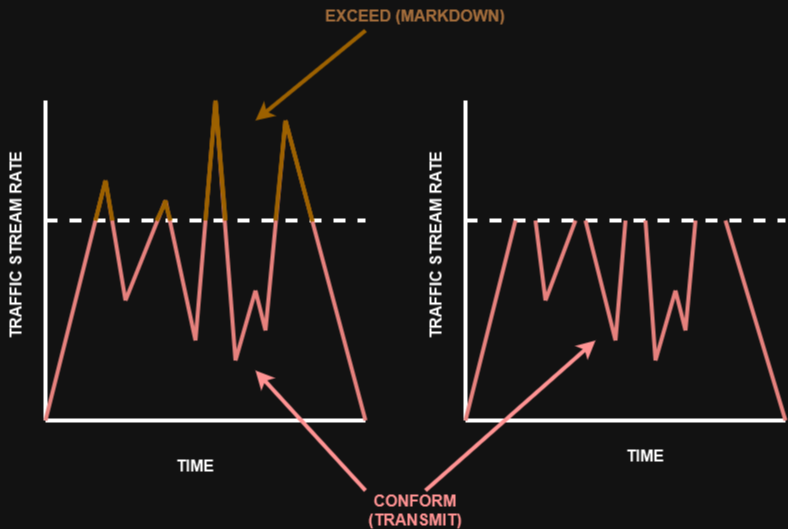
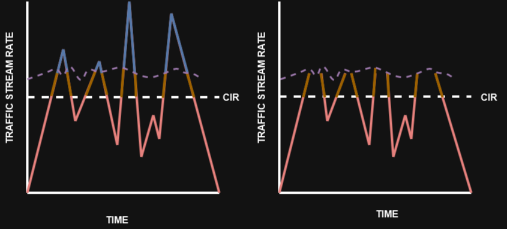

# 15 - Single Rate Two-Color Marker / Policers

Existem diferentes algorítmos de policing, incluindo o Single Rate Two-Color Marker / Policer, Single Rate Three-Color Marker / Policer (SRTCM). O Single Rate Two-Color Marker model é baseado no algorítmo Single Token Bucket Algorithm. Para esse tipo de policer, o tráfego pode estar de acordo com exceder o CIR. O Marking Down ou descarte pode ser aplicado em cada um dos casos.   

   

- O tráfego acima da linha pontilhada no lado esquerdo representa o tráfego excedente ao **CIR** e sofre **Mark Down**
- O tráfego acima da linha pontilhada no lado direito representa o tráfego excedente ao **CIR e que foi descartado**

O Single-Rate Three Color Policer é baseado na **RFC 3637.**   
Esse tipo de policer usa dois token buckets, a aí o tráfego pode ser classificado como em conformidade, excedente ou violando o CIR. As acções de Mark Down ou Descarte podem ser aplicadas em cada um dos 3 estados.   
O primeiro token bucket opera muito parecido com o sistema Single-Rate Two Color, com pequenas diferenças.   
- Se existirem tokens sobrando no bucket nos períodos de pouca ou nenhuma atividade, ao invés de descartar o excesso, o algorítmo coloca esses tokens em um segundo bucket para ser utilizado nos picos de tráfego que ultrapassem o CIR. 
- Os token que são armazenados nesse segundo bucket são chamados de **excess burst (Be)** e, o Be é o número máximo de bits que pode exceder o valor de BC.

O tráfego pode ser classificado em 3 cores ou estados:   

   

- **CONFORM:** o tráfego abaixo de BC é classificado como em conformidade e fica em vermelho. Ele é normalmente transmitido e pode ser remarcado.
- **EXCEED:** o tráfego acima de BC e abaixo de BE é marcado como excedente e é laranja. Ele pode ser descartado ou sofrer Mark Down e transmitido.
- **VIOLATE:** o tráfego acima de BE é classificado como violação e é azul. Ele normalmente é descartado e opcionalmente pode sofrer Mark Down e ser transmitido.
- A seção abaixo da linha pontilhadano gráfico da esquerda representa o tráfego em conformidade com o CIR, a seção logo acime representa o tráfego excedente que sofreu Mark Down  e a seção do topo representa o tráfego que violou a taxa e também sofreu Mark Down
- A taxa excedente do tráfego e violador pode variar por conta dos tokens "derramados" do BC Bucket dentro do Be
- Já no gráfico da direita, a seção logo acima da linha pontilhada representa o tráfego que excedeu o CIR e sofreu Mark Down e acima dessa seção é o tráfegi que o violou o CIR e foi DESCARTADO.
- Na figura anterior, a seção que está abaixo da linha pontilhada representa o tráfegp que está em conformidade com a CIR; a seção que está logo acima (laranja) representa o tráfego excedente e que sofreu Mark Down; e a seção do topo (em azul); representa o tráfego que viola a CIR e que também sofre Mark Down.
- O tráfego que passa na primeira linha pontilhada é o tráfego do segundo bucket

O Single-rate Three Color Marker / Policer usa os seguintes parâmetros para medir o fluxo de tráfego: 
> - **COMMITED INFORMATION RATE (CIR):** a taxa monitorada
> - **COMMITED BURST SIZE (BC):** o tamanho máximo de toke bucket de CIR, medido  em bytes, chamado também de **COMMITED BURST SIZE (BC)** que está na **rfc 2697**
> - **EXCESS BURST SIZE (Be):** o tamanho máximo que excede o token bucket, medido em bytes. Também chamado de **EXCESS BURST SIZE** que está na **rfc 2697**
> - **BC BUCKET TOKEN COUNT (TC):** o número de tokens dentro do bucket BC. Não confundir com o intervalo de tempo comprometido (commited time interval TC)
> - **Be BUCKET TOKEN COUNT (Te):** o número de tokens no bucket Be
> - **Incoming Packet Length (B):** o tamanho do pacote entrant, em bits.