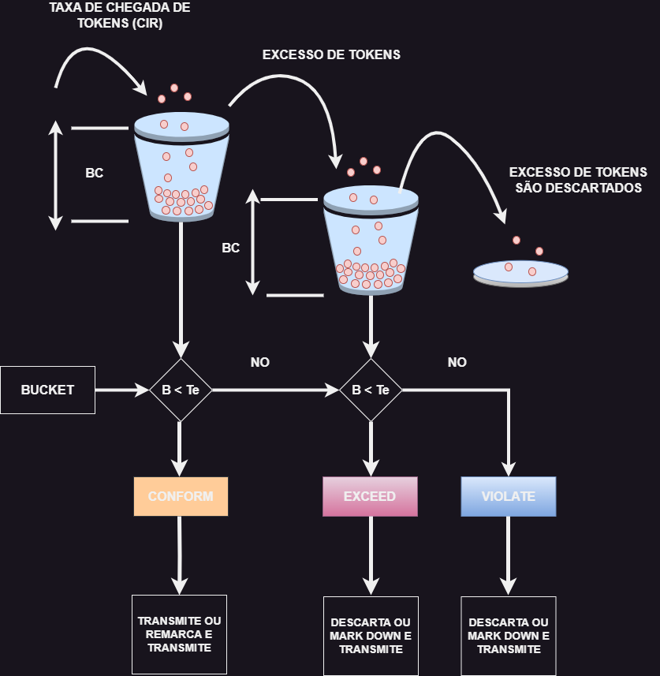
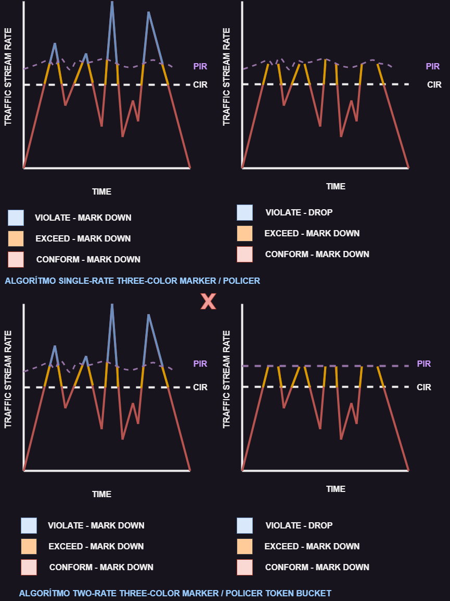

# 16 - Single Rate Three-Color Marker

   

- O alggorítmo single-rate three-color policers two bucket causa menos retransmissões TCP e é mais eficiente para utilização de banda
- É o policer ideal para ser utilizado com as classes AF (AFx1, AFx2, AFx3)
- Utilizar o policer three-color só faz sentido se as ações forem diferentes para cada cor
- Se as ações para duas ou mais cores forem iguais, por exemplo, o tráfego conforme e o excedente ambos transmitem sem serem remarcados, o algorítmo single-rate two color é mais recomendado para facilitar as coisas.

## TWO RATE THREE-COLOR MARKERS / POLICERS

- Ele é baseado na rfc 2698 e é similar ao single-rate three-color policer
- A diferença é que o single-rate three-color policer confiam nos excessos de toens do bucket BC, o que adiciona um certo nível de variabilidade e imprevisibilidade mo fluxo do tráfego
- O algorítmo two-rate three-color marker / policer resolve esse problema utilizando 2 taxas distintas
> - **A CIR**
> - **THE PEAK INFORMATION RATE (RIR)**
- O algorítmo two-rate three-color marker / policer permite que uma taxa de excesso baseada em **PIR** tome duas ações diferentes para o tráfego excedente em diferentes valores de rajadas. Por exemplo, o tráfego violado pode ser descartado quando chega em uma taxa pré-estabelecida, e isso é uma coisa que não e possível com o algorítmo single-rate three-color policer.

