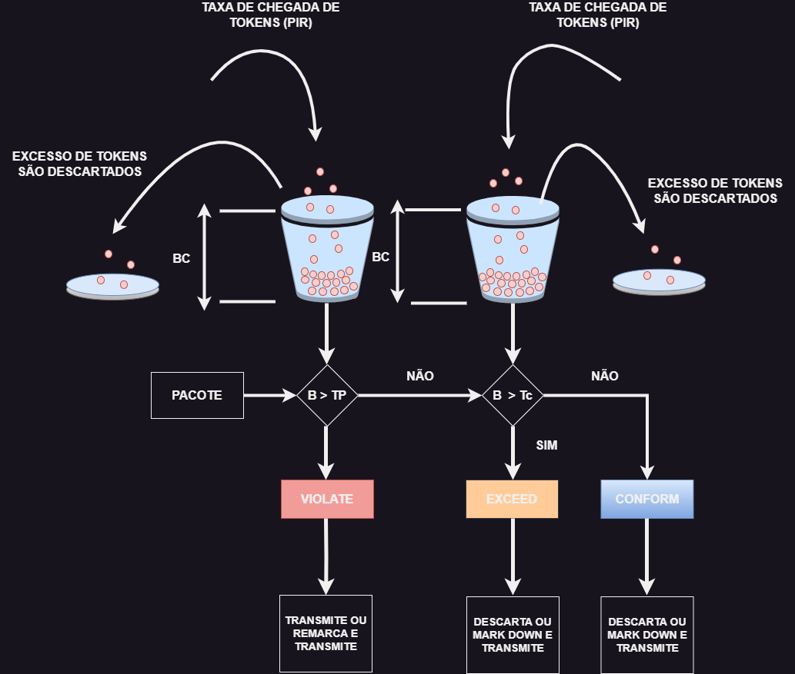

# 17 - Parâmetros do Two Rate Three-Color Marker  Policer

O Two-rate utiliza os seguintes parâmetros para medir o fluxo do tráfego:
- **COMMITED INFORMATION RATE (CIR):** A taxa monitorada
- **PEAK INFORMATION RATE (PIR):** A taxa máximo de tráfego permitido. O PIR de ser igual ou maior que o CIR
- **PEAK BURST SIZE (Be):** O tamanho máximo de PIR do token bucket, medido em bytes. Também chamado de **PBS** e está na rfc 2698. Deve ser igual ou maior que **BC**
- **COMMITED BURST SIZE (BC):** O número de tokens dentro do bucket **BC**. Não confundir com **TC (Commited Time Interval)**
- **BP BUCKET TOKEN COUNT (TP):** o número de tokens no bucket BP
- **INCOMING PACKET LENGTH (B):** o tamanho do pacote de entrada, em bits
- O algoritmo two-rate three color policer também utiliza dois token buckets
- Ao invés de transferir os tokens não utilizados do bucket **BC** para o bucket **Be**, o policer tem dois buckets separados que são preenchidos com duas taxas diferentes de tokens

   

- O bucket Be é preenchido com os Tokens PIR, e o bucket BC é preenchido com os tokens CIR. Nesse modelo, BE representa o pico máximo de tráfego que pode ser enviado durante um intervalo de um sub-segundo.
- A lógica varia ainda mais, pois a verificação inicial é para ver se o tráfego está dentro do PIR. Só então o trafego é comparado com o CIR. Em outras palavras, uma condição de violação e a primeira a ser checada, depois a condição exceed e, por fim, a condição conform, ou seja, utiliza a lógica reversa de algoritmo single-rate three-color policer.