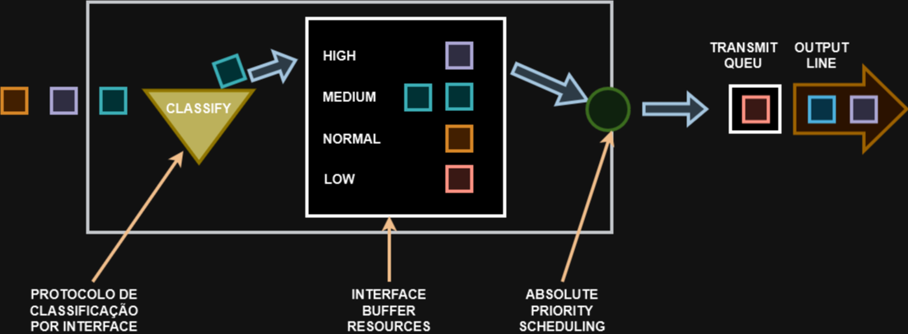

# 19 - FIFO, PRIORITY QUEUING  E CUSTOM  QUEUING (CQ)

## FIFO (FIRST IN, FIRST OUT)

O primeiro que chega é o primeiro que sai. Se você não configurar nada, é esse algoritmo que irá ser utilizado.   

   

## PRIORITY QUEUING (PQ)

As filas são criadas através de prioridades definidas para diferentes tipos de tráfego.

   

Enquanto tiver tráfego na fila de alta prioridade, as outras não mudam nada até acabar o tráfego na fila de High.   
Isso pode gerar um fenômeno chamado de starvation, ou seja, dependendo como são configuradas as prioridades, pode ser que a fila High monopolize o tráfego das outras dilas e as demais prioridades ficam um tempo muito grande sem enviar nada.

## CUSTOM QUEUING (CQ)

São filas criadas com base em necessidades específicas do usuário / aplicativo. São filas personalizadas.   

.png)   