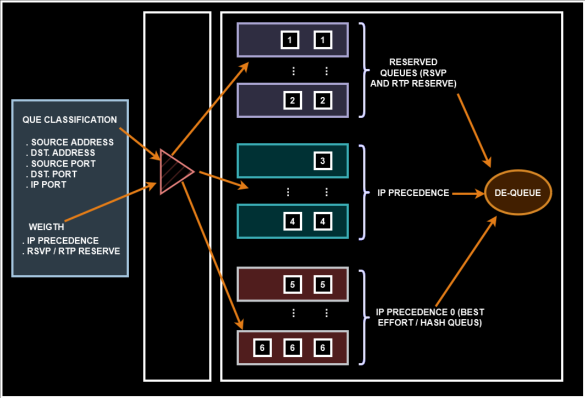
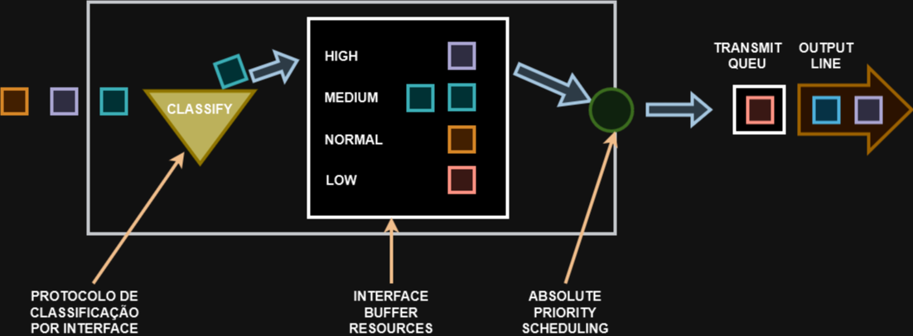

# 20 - WEIGTHED-FAIR QUEIUING (WFQ), ROUND ROBIN (RR) e WEIGTHED ROUND ROBIN (WRR)

## WEIGTHED-FAIR QUEIUING (WFQ)

Divide o tráfego em filas no que é especificado e fornece o peso determinado para cada fila.   
existem filas reservadas para tráfegos de voz e vídeo, por exemplo que já possuem privacidade mais alta.   
Ou seja, criam as filas por usuário e depois faz a distribuição "justa" do tráfego.   

   

## ROUND ROBIN (RR)

As filas são criadas através de prioridades definidas para diferentes tipos de tráfego.

   

Enquanto tiver tráfego na fila de alta prioridade, as outras não mudam nada até acabar o tráfego na fila de High.   
Isso pode gerar um fenômeno chamado de starvation, ou seja, dependendo como são configuradas as prioridades, pode ser que a fila High monopolize o tráfego das outras dilas e as demais prioridades ficam um tempo muito grande sem enviar nada.

## WEIGTHED ROUND ROBIN (WRR)

São filas criadas com base em necessidades específicas do usuário / aplicativo. São filas personalizadas.   

.png)   