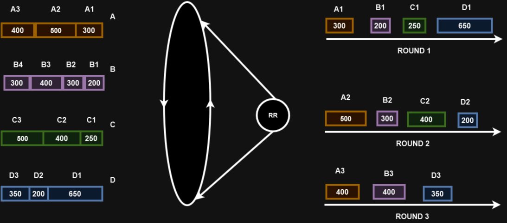
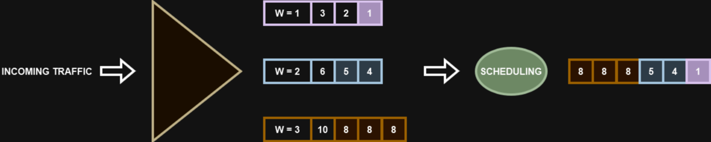

# 20 - WEIGTHED-FAIR QUEIUING (WFQ), ROUND ROBIN (RR) e WEIGTHED ROUND ROBIN (WRR)

## WEIGTHED-FAIR QUEIUING (WFQ)

Divide o tráfego em filas no que é especificado e fornece o peso determinado para cada fila.   
existem filas reservadas para tráfegos de voz e vídeo, por exemplo que já possuem privacidade mais alta.   
Ou seja, criam as filas por usuário e depois faz a distribuição "justa" do tráfego.   

   

## ROUND ROBIN (RR)

Cada fila recebe uma parcela igual da largura de banda. Ele atende os pacotes de forma circular conforme vão chegando; Pode gerar jitter.

   

## WEIGTHED ROUND ROBIN (WRR)

É bem parecido com o Round Robin porém são colocados pesos nas filas. Filas com peso maior tem prioridades maior e recebem mais largura de banda.   

   