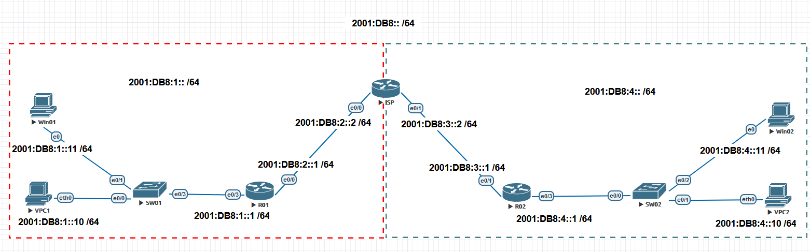
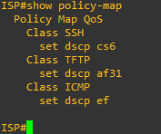

# 23 - Exemplo Prático QoS - IPv6 e Filas

Até aqui eu demonstrei como marcar, escolher a técnica de QoS (Policer ou Shapper) e como dar prioridade ou mesmo limitar a banda de um fluxo de dados. Mas como mostrado na teoria, podemos escolher também em que tipo de fila que vamos colocar os tráfegos. Aqui vou utilizar o seguinte cenário:   

   

Nesse exemplo vou estar utilizado IPv6 na faixa 2001:DB8:: /64 que é a faixa reservada para documentações (essa faixa de endereços não e deve ser utilizada na prática). Então vou escolher 3 tipos de fluxos de dados: SSH, TFTP e ICP. Também estarei utilizando a marcação pelo NBAR. As configurações de QoS serão aplicadas no roteador **ISP** tanto na interface **E0/0, no sentido de input,** quanto na interface **E0/1**, no sentido de **output**.   

Então vamos analisar mais de perto a interface E0/0 como o comando: **show interface 0/0**. Observem a saída:   

   

Notem que nada foi feito quanto ao tipo de fila e a interface é automaticamente colocada no algoritmo FIFO. Então primeiro vamos configurar o QoS como feito até agora e depois vamos alterar esse comportamento.   

01. Escolher o tráfego interessante

| ROTEADOR ISP | COMANDOS                                   |
| ------------ | ------------------------------------------ |
| 01           | ISP(config)#class-map match-all TFTP       |
| 02           | ISP(config-cmap)# match protocol tftp      |
| 03           | ISP(config)#class-map match-all ICMP       |
| 04           | ISP(config-cmap)# match protocol ipv6-icmp |
| 05           | ISP(config)#class-map match-all SSH        |
| 06           | ISP(config-cmap)# match protocol ssh       |

02. Escolher a política a ser aplicada a cada tráfego interessante.

| ROTEADOR ISP | COMANDOS                                   |
| ------------ | ------------------------------------------ |
| 01           | ISP(config)#policy-map QoS                 |
| 02           | ISP(config-pmap)#class SSH                 |
| 03           | ISP(config-pmap-c)# set dscp cs6           |
| 04           | ISP(config-pmap)#class TFTP                |
| 05           | ISP(config-pmap-c)# set dscp af31          |
| 06           | ISP(config-pmap)#class ICMP                |
| 07           | ISP(config-pmap-c)# set dscp ef            |

03. Aplicar a política a interface e0/0

| ROTEADOR ISP | COMANDOS                                   |
| ------------ | ------------------------------------------ |
| 01           | ISP(config)# int e0/0                      |
| 02           | ISP(config-if)#service-policy input QoS    |

Então vamos analisar como ficaram nossas configurações até agora.    

<table>
    <tr >
        <td width="33%"> </img> </td>
        <td width="33%"> </img> </td>
        <td width="33%"> </img> </td>
    </tr>
</table>

Antes de avançarmos vamos configurar as larguras de bandas para as interface **e0/0 e e0/1** pois as porcentagens de bandas reservadas para cada classe se baseia no comando **bandwith** aplicado na interface.   

| ROTEADOR ISP | COMANDOS                                   |
| ------------ | ------------------------------------------ |
| 01           | ISP(config)# int e0/0                      |
| 02           | ISP(config-if)#bandwidth 1000000           |
| 03           | ISP(config-if)# int e0/1                   |
| 04           | ISP(config-if)#bandwidth 1000000           |

Aqui configuramos as interfaces como 100Mbps.   

Como visto anteriormente, temos dois mecanismos de enfileiramento: **Congestion Management** e **Congestion Avoidance**. Então vamos tratar do primeiro.   

## Congestion Management

Agora aqui nesse momento temos as classes criadas e então queremos dar um tratamento diferenciado para cada fila, conforme o plano escolhido:   

> - SSH deverá ter 40% da banda
> - Tfp deverá ter 10% da banda
> - ICMP deverá ter 256 Kbps, e ser colocado na fila prioritária (LLC)
> - Configurar a class-default para usar WFQ

| ROTEADOR ISP | COMANDOS                                   |
| ------------ | ------------------------------------------ |
| 01           | ISP(config)# policy-map FILAS              |
| 02           | ISP(config-pmap)# class SSH                |
| 03           | ISP(config-pmap-c)#bandwidth percent 40    |
| 04           | ISP(config-pmap)# class TFTP               |
| 05           | ISP(config-pmap-c)#bandwidth percent 10    |
| 06           | ISP(config-pmap)# class ICMP               |
| 07           | ISP(config-pmap-c)#priority 256            |
| 08           | ISP(config-pmap)# class class-default      |
| 09           | ISP(config-pmap-c)#fair-queu               |

 **Considerações**

- Cabe dizer que aqui podemos escolher o WFQ – Weighted Fair Queueing (ou CBWFQ- Class Based Weighted Fair Queueing) 
- O CBWFQ associa um peso (a conta leva em consideração o IPP) para cada fluxo, e os fluxos com pesos menores são encaminhados primeiro. 
- Quando aplicamos o comando **bandwidth percent** na **policy** estamos reservando uma porcentagem com base no comando **bandwitdth que foi aplicado na interface**, e não na velocidade da porta.
- Se primeiro configuramos as classes com o comando bandwidth e depois mudamos o bandwidth na interface, as políticas não são atualizadas.
- Se não houver nenhuma configuração de bandwidth na interface, é considerado o valor real/físico.
- Podemos especificar o valor em Kbps (ao invés de percent) quando usamos a opção bandwidth, assim como fizemos com o comando priority.
- Além das opções priority e bandwidth ainda temos o comando bandwidth remain percent, que reserva a porcentagem especificada desconsiderando os valores já alocados para outras classes.
- Todas as classes configuradas com bandwidth precisam ser configuradas no mesmo padrão. Ou usamos todas com bandwidth Kbps, ou com bandwidth percent ou com bandwidth remaining percent. Mas podemos usar um classe com priority Kbps e outra com priority percent.
- Podemos ter mais de uma class configurada como LLC, mas os pacotes serão colocados em uma única fila prioritária.
- Quando a class-default não tem banda configurada ela recebe a banda não usada.
- Por padrão a class-default tem **1%** da banda.
- A soma das velocidades configuradas não pode exceder **100%**

- É importante destacar igualmente que a instrução **priority** ativa o Low Latency Queuing (LLQ), conferindo prioridade aos pacotes contidos nessa fila (sendo retirados da fila em software e inseridos na fila em hardware antes dos pacotes presentes nas demais classes)

Agora observe como ficaram as configurações e a fila na **interface e0/1**   

<table>
    <tr >
        <td width="50%"> </img> </td>
        <td width="50%"> </img> </td>
    </tr>
</table>