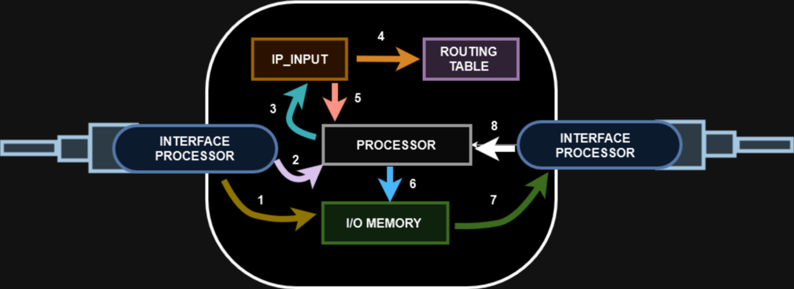

# 01 - Process and CEF (Switching)

Este tópico faz parte do item **Describe hardware and software switching mechanisms such as CEF, CAM, TCAM, FIB, RIB, and adjacency tables** do blueprint do exame.   

- O IP packet switching (ou encaminhamento de pacote IP) é o processo de recebimento de pacotes na Interface de entrada e depois determinar onde encaminhar (qual interface de saída) ou se deve descartar o pacote
- Normalmente em switches, o processo de encaminhamento é feito por hardware e, em roteadores é feito por software. As excessões aqui são os roteadores topo de linha que ai também fazem o encaminhyamento por hardware
- Existem 3 tipos: **Process Switching, Fast Switching e CISCO Express Forwarding (CEF)**.
**OBS:** o process switching não consegue lidar com uma grande quantidade de pacotes. O CEF foi desenvolvido pela CISCO para otimizar o processo e possibilitar os roteadores conseguirem um maior volume de pacotes.