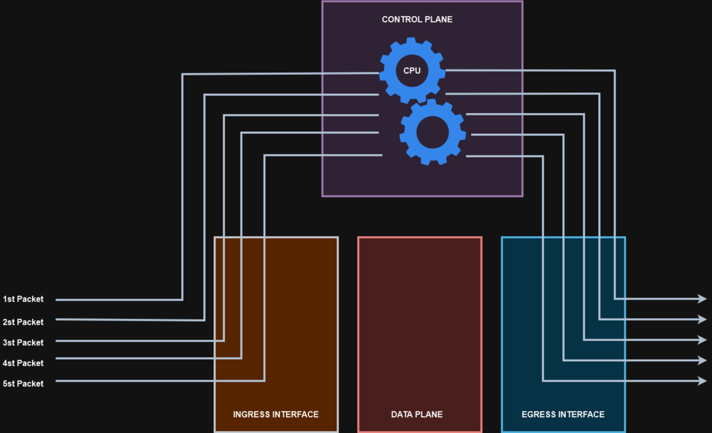
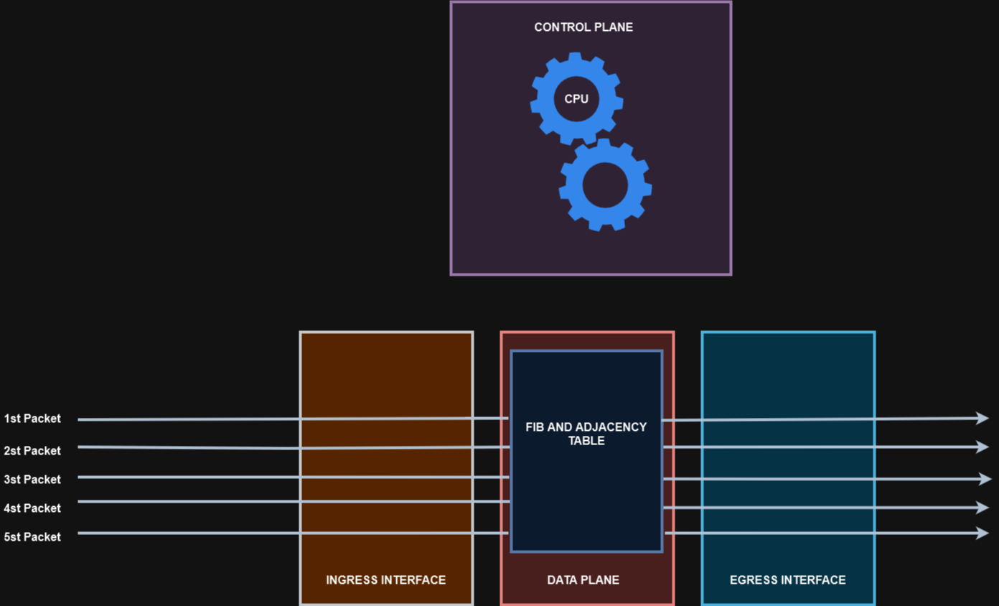

# 03 - MÉTODOS DE SWITCHING

Este tópico faz parte do item **Describe hardware and software switching mechanisms such as CEF, CAM, TCAM, FIB, RIB, and adjacency tables** do blueprint do exame.   

## Process Switching

   

**OBS:** os pacote entram pela interface, vão para o dataplane, depois são encaminhados ao control plane e ai retornam para o data plane para saírem pela interface de saída.   

Então quando o quadro chega na cpu, ele precisa ser desmontado, verificar o IP de destino e depois comparar com a tabela de roteamento e ai verificar se tem alguma saída. Ai depois se tiver uma saída, precisa remontar o quadro. Se for ethernet, tem que fazer um ARP, achar o MAC de origem / destino, termina o quadro e após envia ele.

## Fast Switching

   

Nesse processo, o primeiro pacote realiza o process switching. Logo após, o roteador monta o Fast Forward Cache. Essa é uma tabela que armazena o mac de origem mais o mac de destino e quando o pacote entra na interface, só é necessário realizar a pesquisa nesse cache e depois que achar a correspondência basta somente encaminhar.   
Então já fica aramazenado em cache por onde os pacotes devem sair e o processador não precisa mais "trabalhar" para isso.

## CEF (CISCO EXPRESS FORWARDING)

   