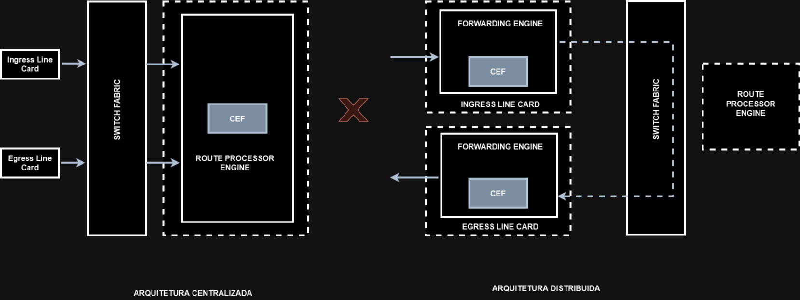

# 04 - Switching Distribuído e Centralizado

Este tópico faz parte do item **Describe hardware and software switching mechanisms such as CEF, CAM, TCAM, FIB, RIB, and adjacency tables** do blueprint do exame.   

Quando um processador de roteador (RP) está equipado com um "motor" de encaminhamento então ele pode tomar todas as decisões de encaminhamento sozinho. Isso é chamado de Arquitetura de encaminhamento centralizada.   
Na **Arquitetura Centralizada**, quando um pacote chega na interface de entrada, ele é transmitido para o motor de encaminhamento no processador de rotas (RP). O motor de encaminhamento analisa os cabeçalhos dos pacote e decide por qual interface de saída esse pacote vai sair e o coloca em uma única fila de saída.   
Se as line cards forem equipadas com o motor de encaminhamento, então ela pode tomar decisões de switching sem intervenção do RP, e isso é chamado de **Arquitetura Distribuida**.   
Em uma arquitetura distribuída, quando um pacote chega na placa de linha de entrada, ele é encaminhado para o motor de forwarding local. Então esse motor faz o lookup de pacotes e, se ele determinar que a saída é uma interface local, ele encaminha o pacote para a interface.   
Se for verificado que a interface de saída está em outra line card, o pacote é enviado através do switching fabric, diretamente para a line card de saída ignorando o RP.   

   

**OBS:** esses dois tipos de arquitetura estão presentes somente em equipamentos modulares.

Agora irei demonstrar um exemplo em uma placa supervisora 720 da Cisco.   

<table>
      <tr>
         <td> </img> </td>
         <td> </img> </td>
      </tr>
</table>

## CENTRALIZADA

   

1. O pacote entra na interface de entrada de uma placa de linha de uma fonte S e o Port ASIC o encaminha para a interface Fabric.
2. O cabeçalho do pacote (apenas e não o pacote completo) é encaminhado para o RP (processador de rota é uma combinação de processador de switch e processador de rota) onde a tabela CEF está presente.
3. O CEF centralizado (que reside no RP) processa o pacote. Processar o pacote significa que ele procura o FIB para o próximo salto e busca a reescrita (cabeçalho) L2, modifica o cabeçalho original e envia o cabeçalho atualizado para a interface Fabric da mesma placa de linha.
4. O pacote da malha de interface é então encaminhado para a malha de interface da placa de linha de saída usando os detalhes de reescrita Int + L2 de saída compartilhados pelo CEF na etapa 3.
5. O pacote é encaminhado da estrutura de interface da interface de saída para a porta de saída e liberado por fio em direção ao Destino D.

## DISTRIBUIDA

   

1. O pacote entra na interface de entrada de uma placa de linha de uma fonte S e o Port ASIC o encaminha para o mecanismo de replicação da interface Fabric.
2. O cabeçalho do pacote (apenas e não o pacote completo) não é encaminhado para o RP, mas para o processador da placa de linha (onde reside uma cópia do CEF). 
3. dCEF (que reside no processador da placa de linha) processa o pacote. Processar o pacote significa que ele procura o FIB para o próximo salto e busca a reescrita (cabeçalho) L2, modifica o cabeçalho original e envia o cabeçalho atualizado para o mecanismo de replicação da interface Fabric da mesma placa de linha.
4. O pacote do mecanismo de replicação da interface Fabric é então encaminhado para o mecanismo de replicação da interface Fabric da placa de linha de saída usando os detalhes de reescrita Int + L2 de saída compartilhados pelo dCEF na etapa 3.
5. O pacote é encaminhado do mecanismo de replicação da interface Fabric da interface de saída para a porta de saída e liberado na conexão para o Destino D.