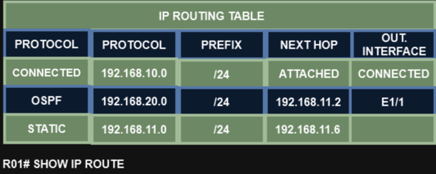

# 05 - Software CEF

O software CEF, também conhecido como **Forward Information Base**, consiste dos seguintes componentes:

- **Forward Information Base (FIB):** A FIB é constituída diretamente da tabela de roteamento e consiste no endereço IP do próximo salto para cada destino na rede. Quando uma rota ou uma mudança na topologia ocorre, a tabela de roteamento IP é atualizada e essas mudanças são refletidas na FIB. O CEF utiliza a FIB para tomar decisões de encaminhamento de prefixos IP.
- **Adjacence Table:** também como **Adjacency Information Base (AIB)**, possui o endereço IP diretamente conectado do próximo salto com o correspondente conectado. A tabela de adjacência é populada com os dados de ARP ou de outras tabelas de protocolos de camada 2.   
Após o recebimento de um pacote IP, a FIB é checada para validar as entradas.   
- Se uma entrada estiver faltando, ela é uma entrada coletada pela CEF, o que quer dizer que o pacote deve ir para o CPU porque a CEF é incapaz de tratar o pacote.
- As entradas válidas na FIB continuam processando e checando a tabela de adjacência para cada destino de endereço IP de cada pacote.
- As entradas faltantes invocam o processo ARP. Quando o ARP termina, ele completa a entrada faltante na CEF.

   

<table>
      <tr>            
         <td width=50%></img></td>               
         <td width=50%></img></td>
      </tr>
      <tr>
          <td width=50%></img></td>
          <td width=50%></img></td>
      </tr>
</table>