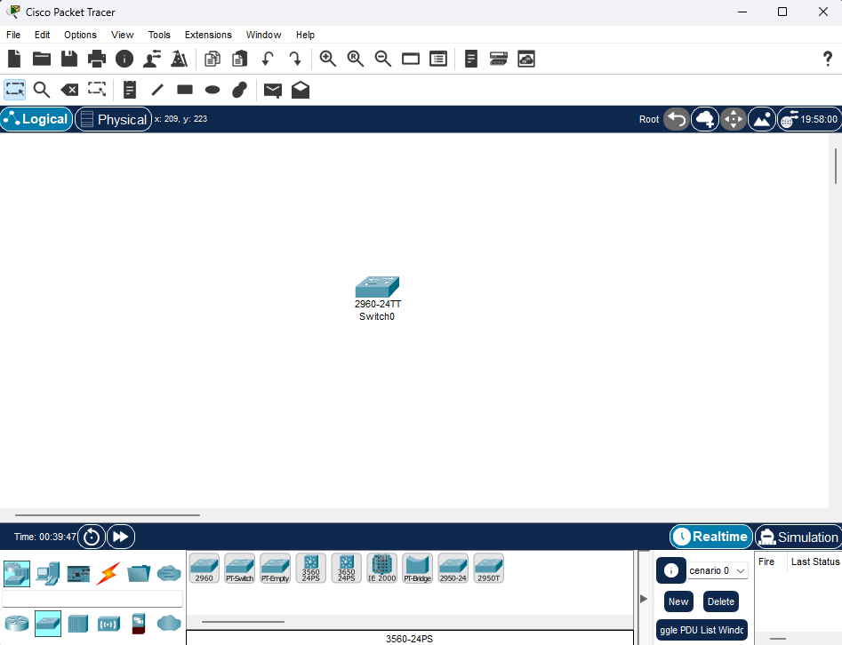
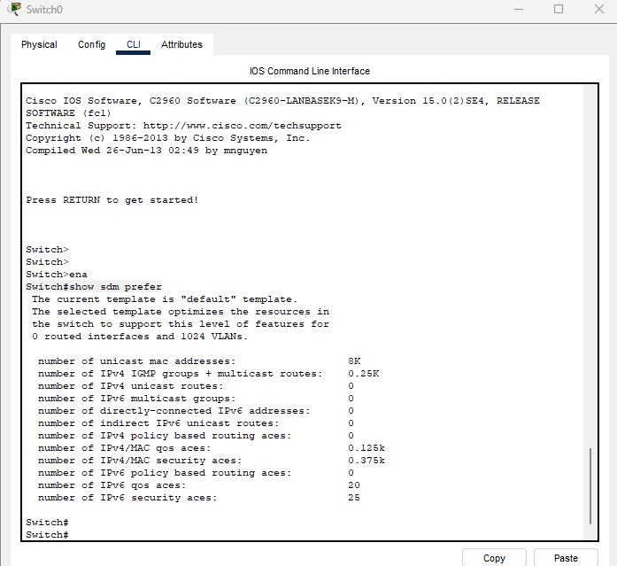
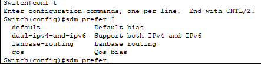
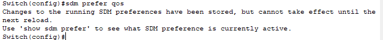
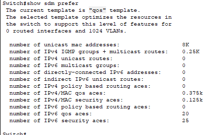

# 06 - Arquitetura de Switching e SDM Templates

O processador de rotas (RP) é responsável por aprender a topologia da rede e construir a rooute table (RIB).   
Uma falha no RP pode ocasionar em um reset nos protocolos de roteamento e adjacências. Durante a falha, é preferível "esconder" essa falha e permitir que o roteador continue encaminhando pacotes utilizando a CEF e suas entradas do que causar o descarte temporário de pacotes.   
O **statful switchover (sso)** é um recurso de redundância que permite um roteador CISCO com dois RPs sincronizarem a configuração do control plane. O processo de espelhar as informações entre os RFs é chamado de **checkpointing**. Os roteadores com o sso habilitado sempre fazem o checkpoint das line cards e dos estados dos protocolos de camada 2. Durante o switchover o RP que está em standby assume o controle imediatamente.

## SDM Templates

O número de endereços MAC que um switch necessita, comparado com o número de rotas que ele suporta depende do local onde ele está na rede. A memória para as tabelas **TCAM** são estaticamente alocadas durante o processo de boot do switch. Quando uma seção do hardware está cheia, todo o processamento excedente é enviado para a CPU. Isso impacta negativamente a performance do switch.   
Os indices de alocação entre várias tabelas TCAM são armazenadas e podem ser modificadas com o **SDM (Switching Database Manager templates)**. O template sdm pode ser configurado em switches da linha catalyst 9.000 com o comando **sdm prefer {vlan | advanced}**. O switch precisa ser reiniciado com o comando **reload**.

### Exemplo prático de SDM Templates

Agora vou demonstrar um exemplo utilizando o Cisco Packet Tracer. Esse exemplo é simples, mas serve para demonstrar o funcionamento dos SDM Templates. Então vou utilizar somente 1 switch catlyst 2960 no nosso exemplo.   

   

Então vamos acessar o equipamento e mostrar o template que já vem habilitado por padrão que é o **default**. Para isso vamos digitar o comando **Switch#show sdm prefer**   

   

Podemos notar que o template é default e nele podemos observar que ele suporta 8.000 endereços mac address para unicast, suporta 20 aces IPv6, 25 aces de segurança IPv6 e assim por diante. Mas vamos supor que queremos otimizar esse switch para o uso de QoS. Então teremos que trocar esse template para um que se adeque a essa necessidade. Então vamos entrar em modo de configuração e exibir os templates suportados nesse switch e no packet tracer  

   

Então vamos configurar o **template QoS**.   

   

Percebam a mensagem logo após o comando. Precisamos salvar a configuração e reiniciar o switch para que ele realize os ajustes nos templates. Então vamos ver as diferenças como ficou agora.

   

Agora percebam que ao executar o comando **show sdm prefer** agora o nome do template vem como **QoS**. Pode parecer que somente foi alterado o nome do template mas nesse ponto preciso ressaltar que aqui o Cisco Packet tracer é um pouco limitado nesses comandos, mas passa a ideia geral.