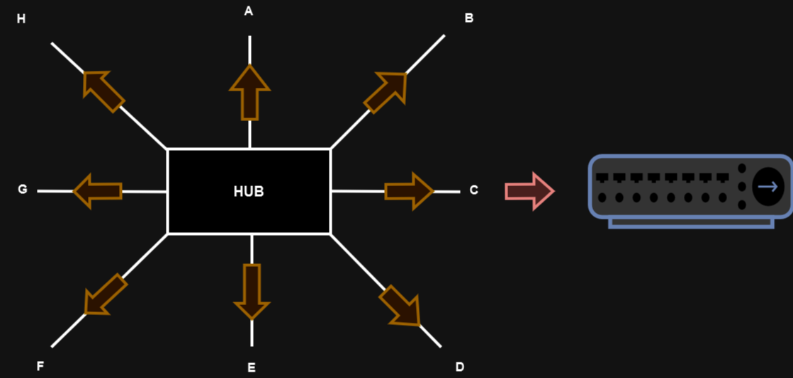
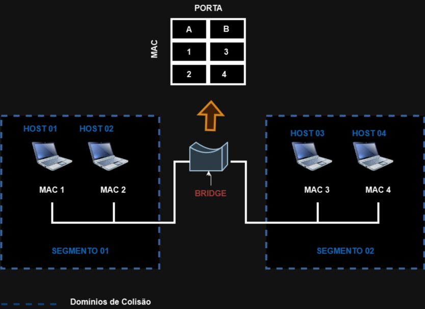
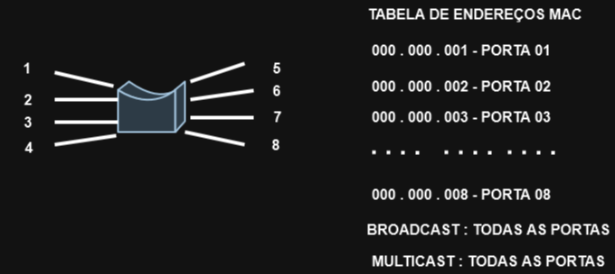
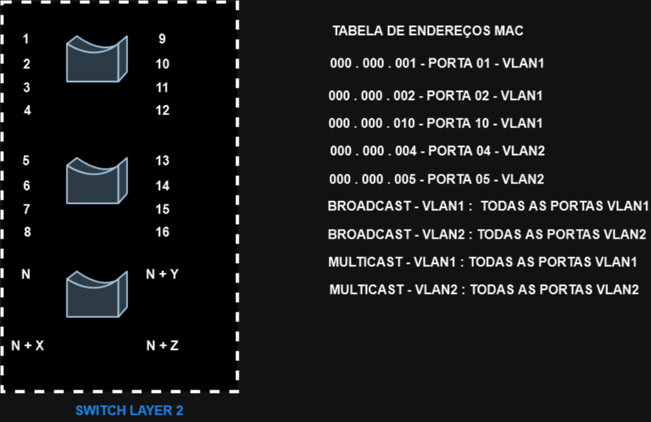
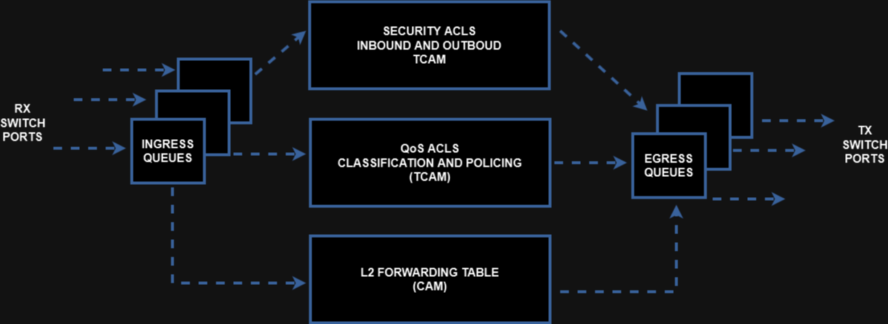

# 07 - MAC Address Table e TCAM

Então aqui é importante relembrar que no início surgiram os computadores e suas aplicações. Ai veio a necessidade de se aproveitar melhor os recursos, ou seja, compartilham recursos e aplicações entre os equipamentos. Tudo era feito de forma isolada.   
Então foi inventado o HUB, que é o pai das redes.   

   

E o que era um hub ? O HUB era uma caixa com um circuito interno e na sua frente ficavam as portas ethernet (RJ45 fêmea). Ele não possuía nenhum tipo de software de controle de tráfego, simplesmente recebida algum tráfego em uma das portas e depois repassava o mesmo tráfego nas demais.   
Mas todo o tráfego ocorria através de cabos de cobre. Esses cabos possuem 4 pares de cabos trançados internamente onde a comunicação era feita por 1 par inicialmente. Ou seja, um cabo do par transmite (tx) e o outro par recebe (rx). Isso era chamado de **half-duplex**.
Mas com isso vieram os primeiros problemas. Primeiro não existia privacidade. Se o computador A quer falar com o B, mas na rede existem mais nós, todo mundo recebia a mesma "conversa". E, como a "conversa" era feita por 1 par de cabos de cobre, quando 1 fala, o outro tinha que ficar quieto escutando.  
Mas como inicialmente o hub era só uma grande extensão, não tinha como o computador A saber quando o computador B estava transmitindo e vice - versa. Então, quando dois nós resolviam conversar ao mesmo tempo, ocorriam as colisões. Por isto que o Hub é considerado como um único **domínio de colisão**.   
Mas a colisão pode também ocorrer não somente no mesmo hub, pode ser que existam um ou mais hubs interligados e isso vai aumentar a probabilidade de colisões porém aumenta o tempo de recuperação.  </rb>
Para resolver esse tipo de problema, foi implementado o algoritmo **CSMA/CD (Carrier Sense / Colision Detection)**. Então esse algoritmo verifica a portadora com múltiplo acesso e identifica a colisão. Ai quem "produziu" a colisão tem que esperar um tempo aleatório para depois poder voltar e enviar. Mas ainda existia o problema de enviar o tráfego para todo mundo.   
A primeira evolução que veio para o hub foram as **Bridges**. Ele é uma "caixa" com somente 2 portas ethernets, baseada em software, que foi desenvolvido justamente para "quebrar" um **domínio de colisão em dois** e com isso diminuir o número de colisões que ocorrem dentro da rede.   

   

Então agora a bridge consegue ler quais os endereços mac estão em cada porta e com isso ele monta uma tabela associando um endereço mac a uma porta, de onde foi originado o tráfego. Essa é a **tabela de endereços MAC.**   
Agora os computadores só conseguem falar dentro do mesmo segmento. Exemplo: o host 4 quer falar com o host 3. Primeiro se consulta a tabela mac e ai, se os dois hosts estão no mesmo segmento, o tráfego é encaminhado. Se ele estiver em outro segmento, se não existir outro caminho, o tráfego é descartado. Com isso você diminui em 50% as chances de colisão.   
Com o passar do tempo, os fabricantes pensaram assim: "Por que somente duas portas nas bridges ?". Ai nasceram as bridges multiportas, ou os **switches**. Porém eles não tinham ainda o conceito de vlans.   
A grande vantagem / evolução agora é que os switches utilizam asics, ou seja, agora ele grava a tabela mac em um chip específico e faz encaminhamento por hardware que é muito mais rápido.

   

Então, quando um quadro chega agora em uma porta, ele consulta a tabela MAC. Se ele não conhece o destino, ou seja, agora ele faz o processo de **flooding**, ou seja, ele encaminha o quadro para todas as portas menos para a que começou o processo.   
Se o host com o MAC de origem existir, ele atualiza a tabela MAC e anota o MAC + a porta. Com isso agora consegue enviar o tráfego.   
Se o pacote que entra estiver com o endereço MAC de destino presente na tabela AC, o pacote é enviado diretamente, ou seja, a comunicação é feita de forma **unicast**.   
Após isso, o mercado percebeu que poderia evoluir um pouco mais as bridges multiportas e adicionou o conceito de **Vlans.** Esse é um tipo de virtualização onde são criadas as lans virtuais dentro da mesma caixa. Ou seja, dentro de 1 switch, agora pode existir vários switches virtuais dentro da mesma caixa.   

   

Por padrão, os endereços MAC ficam na tabela por 300s ou 5 minutos. Se não houver mais comunicação nessa porta, o endereço MAC é apagado da tabela. Esse tempo é conhecido por **aging time**. Ele pode ser configurado.   

   

