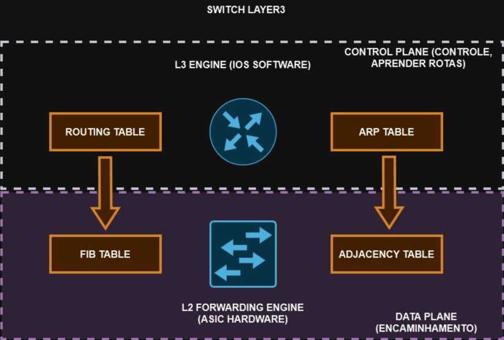

# 08 - FIB (Forwarding Information Base) x RIB (Routing Information Base)

Em equipamentos CISCO, existe uma técnica de encaminhamento / switching dos pacotes que já vem habilitada por padrão, que é o **CEF (CISCO EXPRESS FORWARDING)**   
Essa técnica permite encaminhar pacotes (em camada 3) através de hardware Asics que diminuem a carga na CPU. Com isso, o processo de roteamento pode deixar a cargo do processador tarefas como criptografia, QoS, etc.   
Apesar de ser proprietário da CISCO, os outros fabricantes também possuem sua implementação de CEF.   

   

O CEF "divide" o switch em dois pedaços: " 1 - L3 Engine e 2 - L3 Forwarding Engine".   
A L3 Engine é feita através de software e é responsável por criar a RIB (Routing Information Base) e ARP Tables (MAC Destination).   
Através dessas duas tabelas, são geradas outras duas : " 1 - FIB Table (Forwarding Information Table) e 2 - Adjacency Table ". Essa parte é feita por hardware.   
Quando um pacote entra no switch ao invés de realizar a consulta de encaminhamento na CPU, agora a consulta é feita direto em ASICS nas tabelas FIBe de Adjacência para acelerar o processo de encaminhamento. Se tiver ACL ou mesmo QoS, a consulta passa por essas duas tabelas mais a tabela TCAM na tabela CAM (Content Address Memory) e só pode haver 2 resultados: 0 ou 1. ( 0 = não conhece o MAC; 1 = conhece o MAC). Então ele recebe um endereço mac de destino e dai vai comparar com a tabela CAM. Se não conhece o endereço (0) ele faz o processo de **flooding** para descobrir o endereço MAC de destino. Se ele conhece (1), ele encaminha direto o quadro.   
Já a **TCAM (Ternary Content Address Memmory)** possue 3 estados. Vamos supor que seja uma ACL. A ACL pode ser: 1 - PERMIT, 2 - DENY e 3 - TANTO FAZ. No estado 1 - PERMIT, ele encaminha o quadro. No estado 2 -DENY, ele bloqueia e no estado 3 - TANTO FAZ, passa o quadro (encaminha direto ou faz o flooding).   
Então CEF divide o switch em dois planos diferentes: **CONTROL PLANE e DATA PLANE**.   
O **control plane** é onde fica a RIB responsável por aprender as rotas (protocolos deinâmicos (RIP, OSPF, BGP, etc)); rotas estátiscas e rotas diretamente conectadas. Ele também possui a tabela MAC para poder saber quem são os vizinhos. Ou seja, o control plane é responsável por aprender as rotas e vizinhos.   
Já o **data plane** monta a **FIB TABLE e ADJACENCY TABLE** a partir das outras duas tabelas anteriores. Em switches Layer 3 isso é feito em hardware, que é mais rápido. Já em roteadores é feito por software que é bem mais lento. Então o **DATA PLANE é responsável pelo encaminhamento.**   
Alguns comandos interessantes: 
> - **show IP route --> mostra o conteúdo da RIB**
> - **show ARP --> mostra o conteúdo da ARP Table**
> - **show ip CEF --> mostra o conteúdo da FIB**
> - **show adjacency --> mostra o conteúdo da adjacency table**
> - **show adjacency detail --> mostra detalhes da adjacência**
> - **show ip CEF detail --> mostra detalhes da tabela CEF**

   

Então quando um pacote entra, ele vai fazer a consulta direto na FIB para verificar uma rota, depois consulta os vizinhos na tabela de adjacência, reescreve o pacote e encaminha.   
Quando o pacote entra, porém ele ainda não tem todas as informações sobre ele, por exemplo ele não tem o endereço MAC de destino ou mesmo recebe um pacote com TTL expirado, ele precisa enviar para o Layer 3 Engine para a CPU tomar uma ação. Isso é uma **adjacency punt**   
As adjacências podem ter alguns estados. Esses estados são mostrados no comando: **show ip cef**   
Esses estados são:   
> - **RECIVE:** é uma rede que o switch conhece, consegue resolver
> - **ATTACHED:** é uma rede que está diretamente conectada mas que pertence a um vizinho. Precisa do ARP para ser resolvido.
> - **GLEAN:** durante o processo de ARP, pode ser que entre um pacote a consulta porém o processo ARP ainda não terminou. Informações incompletas. Essa é uma entrada **GLEAN**. Nesse estado não é possível encaminhar tráfego. Descarta os pacotes até resolver a adjacência
> - **NULL ADJACENCY:** interface nula. Descarta pacotes.
> - **DROP ADJACENCY:** descarta pacotes pois existe algum problema com o pacote
> - **DISCARD ADJACENCY:** descarta pacotes por conta de ACLS
> - **PUNT ADJACENCY:** casos especiais que o CEF não consegue tratar e o switch envia para o layer 3 engine

