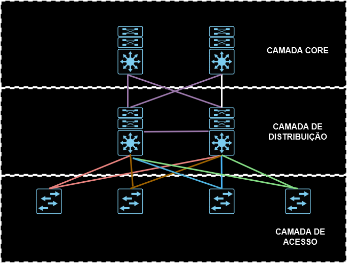
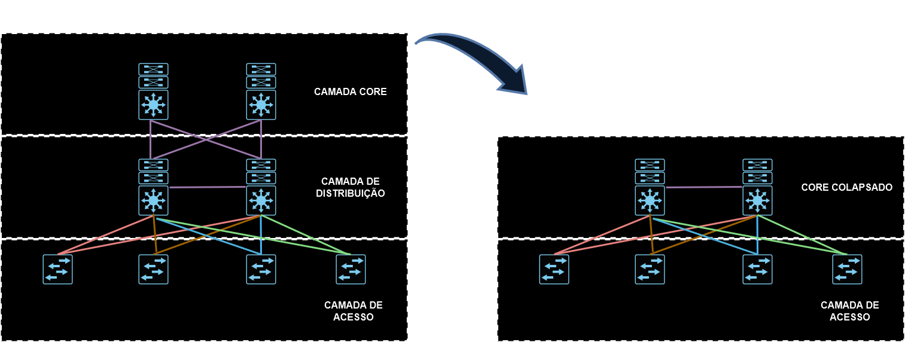
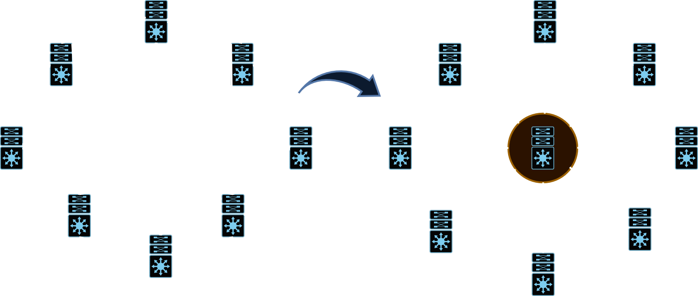

# 01 - Modelo Hierárquico em três Camadas

Esse é um tipo de design baseado em 3 camadas que são: **acesso, distribuição e core (ou backbone)**   

   

Esse é um modelo teórico de design de LAN que pode ser seguido ou não. As boas práticas recomendam que quando se for implantar uma nova rede Lan que se siga esse tipo de modelo ou partes dele, pois nem sempre é possível se implantar um projeto desses seguindo 100% seja, ou por verba, ou mesmo tamanho da lan.   
Mas e porquê existe esse modelo ? Ele foi inventado para permitir a escalabilidade (crescimento) e a disponibilidade pois ele traz redundância nas camadas.   

   

**OBS:** nesse modelo é possível que a camada core e a camada de distribuição fiquem juntas em uma única camada. Ai essa camada recebe o nome de ***core colapsado.***   

Vamos supor que estamos em uma sala (Small Office / Home Office). Nesse tipo de situação é comum que se receba um único aparelho da operadora que desempenha o papel de roteador, switch, wi-fi, etc. (esse cenário é muito comum). Então vamos imaginar que dentro desse mesmo espaço comece a ter mais pessoas que possuem mais necessidades de uso de rede e Internet. Então esse espaço se torna um branch-office. Com isso, o design da LAN precisa crescer e, nesse momento agora passa-se a ter a camada de acesso e a core colapsada. Depois de um certo tempo esse espaço cresceu bastante e mais equipamentos e pessoas vão estar nessa rede. Então agora faz-se necessário se ter as 3 camadas: *camada de acesso, camada de distribuição e camada core (núcleo).* Foi desse tipo de necessidade que surgiu esse modelo de camadas.   
**OBS:** Empresas que possuem a camada core em separado são empresas grandes que possuem muitas vezes vários prédios.   

## Camada de acesso

É nessa camada onde são conectados os clientes seja via cabo UTP ligado direto ao switch ou mesmo conectado vi wi-fi em access points.   

* É a borda da rede
* Conexão dos clientes
* Tecnologias como Gigabit Ethernet, 802.11n e 802.11ac wireless
* Vlans
* QoS (Qualit of Service - na maioria das vezes é voltado para a visão do administrador e vai atuar quando houver um congestionamento no tráfego da camada de acesso para as camadas superiores) e QoE (Quality of Expirience - é voltado para a visão do usuário, qual a experiência em que ele teve ao abrir um aplicativo, um sistema, etc)
* Recursos de segurança como Port Security, BPDU Guard, 802.1 x, DAI, DHCP Snooping.
* POE - alimenta dispositivos através de cabo UTP e não cabo de energia.
* Normalmente essa camada é Layer 2 (modelo OSI)

## Camada de distribuição

Essa camada é o limite entre a camada de acesso (l2) e a camada core (l3). É nessa camada que se configuram alguns itens mais avançados. Ela serve de gateway para a camada de acesso, pode ter um servidor DHCP configurado, se existirem servidores de DHCP específicos na camada core, essa camada funciona como um agent relay; é nela que se aplicam ACLS, protocolos de proteção de primeiro salto (HSRP, VRRP, GLBP), spanning three, sumarização de redes, etc.   

* Agregação dos vários switches de acesso
* Limite entre os domínios L2 da camada de acesso e L3 do core
* Protege a camada 2 contra a propagação de erros de L2 utilizando o STP
* Serve como ponto de agregação das diversas redes IPs das diversas distribuições conectadas em pares para garantir redundância. OBS: Existem casos em que se utiliza 1 switch apenas. Camada Core Colapsada oe mesmo 1 switch modular com 2 placas supervisoras e fontes de energia.
* Os switches são conectados via links L2 e L3
* Os switches não precisam estar no mesmo prédio para economizar conexões

## Camada Core

   

* Reduz Complexidade
* A camada central é o backbone e o ponto de agregação para várias redes
* Fornece escalabilidade, alta disponibilidade e convergência rápida para a rede
* O core pode fornecer conectividade de alta velocidade para grandes empresas com várias redes de campus distribuídas em todo o mundo e também pode fornecer interconectividade entre a camada de acesso do campus ao usuário final / endpoint e outros blocos de rede, como o data center, a nuvem privada, a nuvem pública, WAN, borda da Internet e serviços de rede.
* Interfaces de altíssima velocidade: 10G, 40G, 100G, 400G