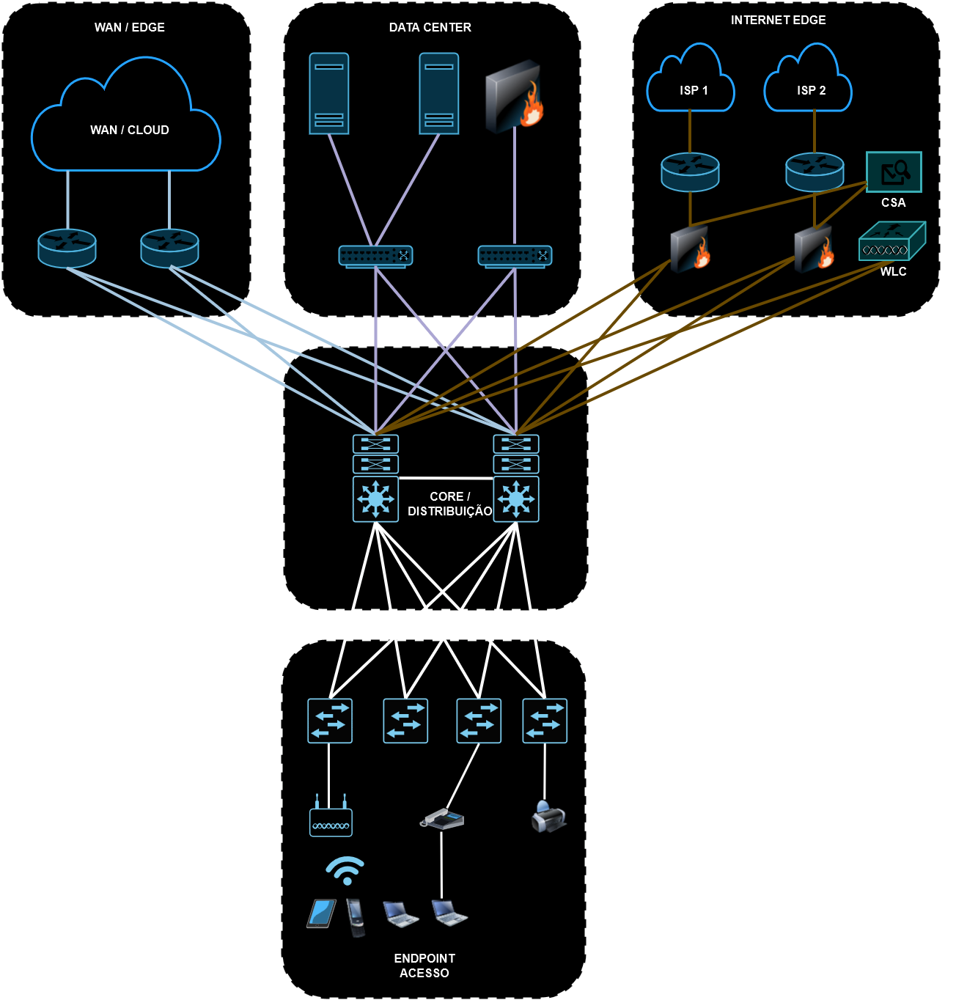
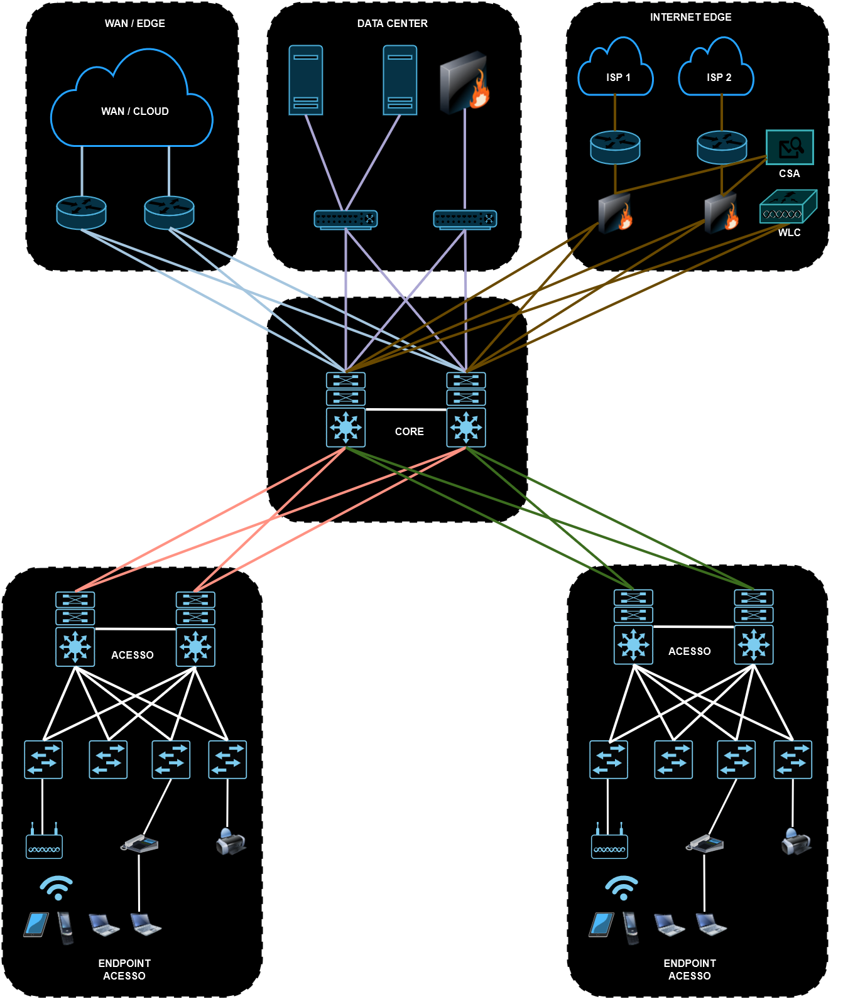

# 02 - Modelo Hierárquico Duas camadas X Três Camadas 

Empresas grandes que possuem vários prédios são chamadas de redes CAMPUS. Esses tipos de redes podem serUniversidades ou como a Microsoft ou mesmo GooGlePlex.   
Normalmente são prédios que precisam ser interligados com links de alta velocidade a uma distância de 1 km a 5 km e que se encontram dentro do mesmo domínio.   
Nesse tipo de cenário é comum que se utilize o modelo de 3 camadas (camada de acesso, camada de distribuição e camada core).   
**OBS:** em Data Center se utiliza o design Spine and Leafe já em empresas menores, o modelo adotado, **O CORO  COLAPSADO** onde existe a camada de acesso e a camada de distribuição / core atuando como uma única camada.   

## Modelo de 2 camadas (CORE COLAPSADO)

   

Nesse modelo, a camada core / distribuição serve para ligar wan / cloud, Datacenter, Internet (ISP1 + ISP2), serviços de rede. Normalmente são dois switches que recebem essas entradas / saídas. Olhando pelo desenho, são "as conexões superiores."   

Já nos endpoints ou clientes são ligados a switches de acesso e, estes switches core / distribuição são as "conexões inferiores" do desenho.   
Esses dois switches core / distribuição podem ser distribuídos por um switches modular com duas supervisoras e duas fontes, por exemplo.  
As boas práticas recomendam que todas as conexões de acesso (switches de acesso - conexões inferiores) sejam sempre conectados de forma redundante, ou seja, cada switch de acesso tem uma porta ligada em cada switch de cama core / distribuição. Nas "conexões superiores" a mesma recomendação é mantida. Os switches core / distribuição também devem ser ligados de forma redundante, ou seja, eles possuem duas conexões (fibra ou cabos) interligados entre si.   
Isso faz com que existam caminhos "alternativos" para o fluxo de dados. Para a proteção contra loops de camada 2 é utilizado o STP (Spanning Threee Protocol).   

## Modelo de 3 camadas

   

