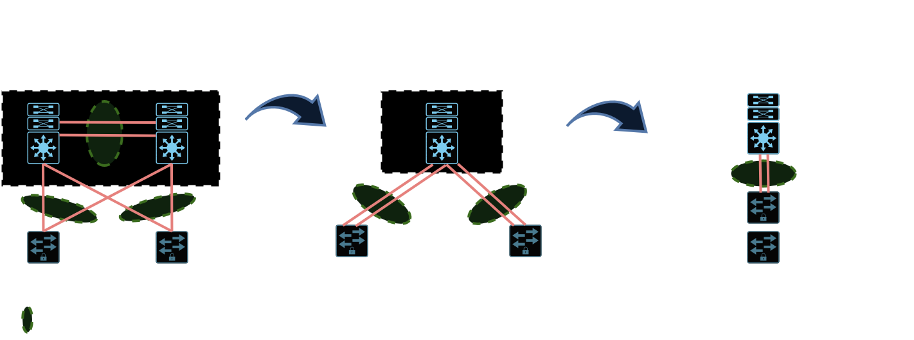

# 03 - Camada de Acesso Layer 2 x Layer 3

   

Quando optamos pela topologia **1**, o link entre os switches de distribuição pode ser um link layer 3, uma vez que cada switch de acesso concentra somente uma vlan.   
Agora na topologia **2**, as vlans estão "repetidas" ou espalhadas nos switches de acesso. Ai o link entre os switches de distribuição necessariamente tem que ser layer 2. Nessa topologia é utilizado o protocolo 802.1Q e as portas em que as vlans passam precisam ser portas tronco, que comportam a passagem de várias vlans nessa mesma porta.   
A melhor opção de escolha é a topologia **1** pois fica mais fácil de lidar com os protocolos de proteção de primeiro salto (FHRRP).   

Quando se usa a topologia **A**, os links de acesso são em layer 2. Nessa topologia o gateway da rede são os switches de distribuição.   
Já na topologia **B**, os links de acesso são todos layer 3. Agora o gateway da rede passa a ser os switches de acesso.   
As acls, roteamento de vlan e outras opções que se colocavam nos switches de distribuição agora são instaladas nos switches de acesso.   
Na topologia **B**, somente os clientes estão em layer 2. Com isso algumas coisas mudam:  
* Não precisa mais de protocolo de redundância de primeiro salto.
* Não precisa mais de spanning Three. Ele só age agora nas portas layer 2 que estão conectadas diretamente nos clientes.
* Melhor utilização de Uplink.
* Troubleshooting facilitado.
* Convergência mais rápida. Protocolo de camada 3 (OSPF ou EIGRP)
* Se for utilizar tecnologia SDN, que na cisco é o **DNA CENTER**, a recomendação é que o acesso seja ***layer 3, o SD-ACCESS***.

**OBS:** quando se utiliza **ACESSO, DISTRIBUIÇÂO e CORE** em layer 3, o protocolo de roteamento utilizado de preferência é o **IS-ISS**. Nesse tipo de cenário totalmente layer 3, não é possível mais estender os domínios de layer 2. Ai é obrigatório o uso de **VXLANS**.   

Além dessas abordagens existem mais outras duas abordagens que simplificam mais ainda o design: **VSS e STACKWISE**.   

   

Aqui temos mais duas opções. A primeira é utilizar a tecnologia VSS onde os switches de distribuição se conversam entre placas supervisoras e "virtualmente" funcionam como se fosse um único switch de distribuição. Ai é que vem o melhor aproveitamento dos links pois agora, como os switches de acesso "enxergam" os switches de distribuição como um só todos os links ficam ativos.   
Já a segunda opção funciona da mesma maneira. A diferença agora é que vamos ter uma "única caixa" nos switches de distribuição pois agora eles são empilháveis e respondem a um único IP que fica nas controladoras. Para o **stackwise**, é necessário se utilizar cabos especiais.   
Esse tipo de abordagem gera uma simplificação para o spanning three.   