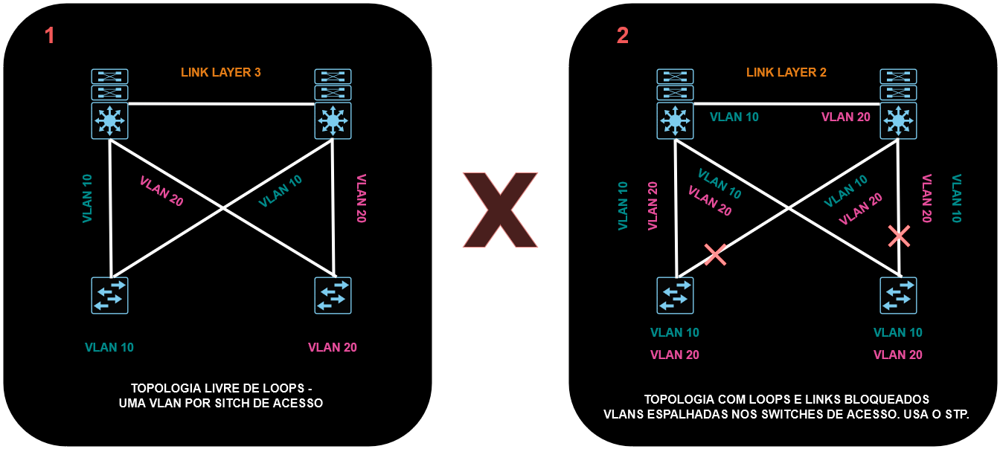
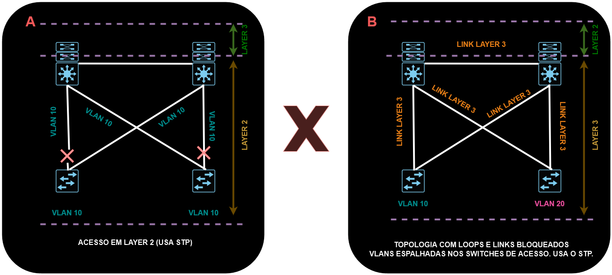

# 03 - Camada de Acesso Layer 2 x Layer 3

   

Quando optamos pela topologia **1**, o link entre os switches de distribuição pode ser um link layer 3, uma vez que cada switch de acesso concentra somente uma vlan.   
Agora na topologia **2**, as vlans estão "repetidas" ou espalhadas nos switches de acesso. Ai o link entre os switches de distribuição necessariamente tem que ser layer 2. Nessa topologia é utilizado o protocolo 802.1Q e as portas em que as vlans passam precisam ser portas tronco, que comportam a passagem de várias vlans nessa mesma porta.   
A melhor opção de escolha é a topologia **1** pois fica mais fácil de lidar com os protocolos de proteção de primeiro salto (FHRRP).   

Quando se usa a topologia **A**, os links de acesso são em layer 2. Nessa topologia o gateway da rede são os switches de distribuição.   
Já na topologia **B**, os links de acesso são todos layer 3. Agora o gateway da rede passa a ser os switches de acesso.   