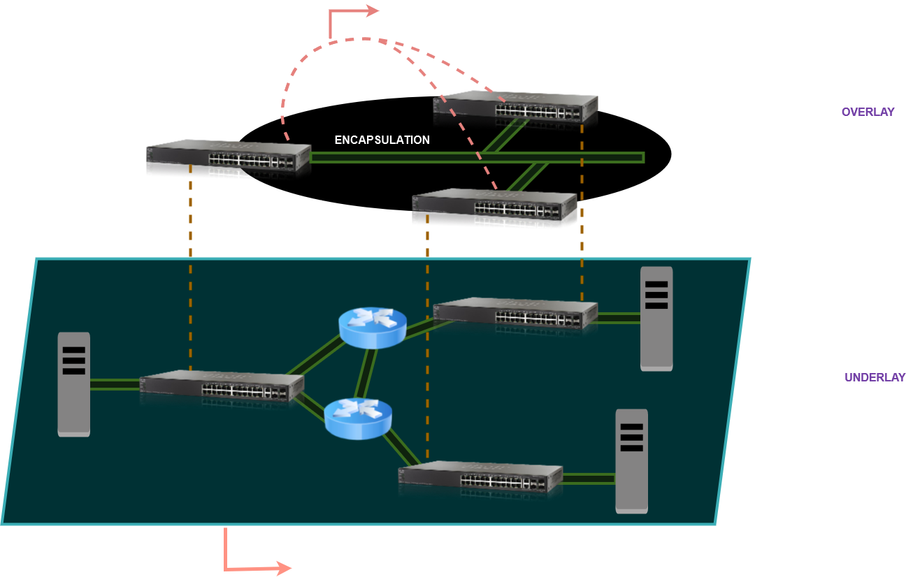
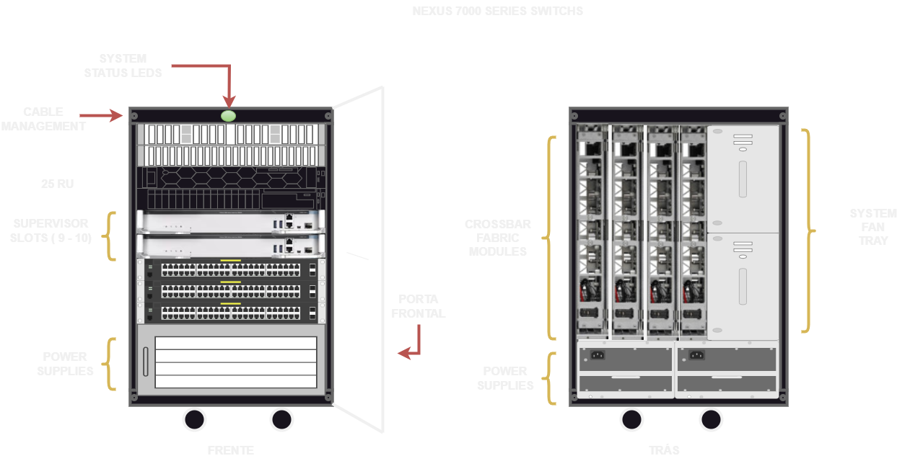

# 04 - Fabric Capacity Planning

Aqui vale lembrar um pouco sobre as camadas **Underlay e Overlay.** Toda a camada física da rede é chamada de Underlay e nessa camada que temos os acessos em **layer 2.**   
Porém para se transformar o transporte de layer 2 para layer 3 é adicionada uma camada virtual sobre a camada física, chamada de **Overlay.**   
Na CISCO, esse é o conceito de **SD-WAN (Software Defined Netwaork)**. Ele é criado através de controladoras chamadas **DNA CENTER** que se tornam o cérebro da rede. Mas para a camada Underlay poder conversar com o Overlay, são criados túneis virtuais chamados **VxLANS** e, ai sim, todo tráfego é baseado em layer 3.   

   

Mas e o que é uma rede **FABRIC ?** Uma rede Fabric é a malha de conexões entre os dispositivos de acesso como switches, por exemplo, e os roteadores que transportam os dados para o seu destino "Fabric" podem ser os cabos físicos que compõem essas conexões, mas geralmente se refere a uma rede virtualizada e automatizada de conexões de sobreposição sobre a topologia física.   
Então o Fabric Capacit Palanning é a quantidade de dispositivos e largura de banda que a rede irá dispor / necessitar. Ou seja, quanto de largura de banda é necessário disponibilizar para a quantidade de dispositivos presentes na rede. (ou um pouco mais para futuros crescimentos)

   

***Switch Bw CAPACITY=*** **[Inter-Slot Capacity * Number Of I/O Slots] + [ (Number of SE Modules * Inter Slot Switching Capacity) /2 ]**

Exemplo:   

Sw Bw Capacity = [550 Gbps * 16] + [(2 * 550 Gbps) / 2]   
Sw Bw Capacity = 8800 Gbps + 550 Gbps   
Sw Bw Capacity = 9350 Gbps   
  
Full Duples Switch Bw Capacity = 9350 * 2 = ***18,7 Tbps***   

Essa é a fórmula para se calcular a capacidade máxima de um switch. Mas o que se utiliza na prática é ir no site do fabricante. Lá ele mostra todas as características e capacidades dos switches.   

Deixo aqui um artigo do site da Cisco com exemplos de arquitetura que utilizam os switches Cisco Nexus para complementar os estudos. 

[Introduction to Nexus Data Center Infrastructure and Architecture](https://www.ciscopress.com/articles/article.asp?p=2762085&seqNum=2)