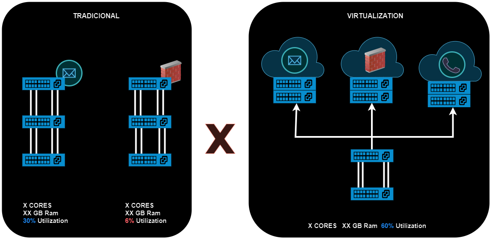

# 01 - VIRTUALIZAÇÂO E HYPERVISORS

Este item faz parte do Bluprint do CCNP ENCORE 350-401 - 2.1 Describe device virtualization technologies   

   

Em ambientes tradicionais, quando se precisa de um serviço tipo banco de dados, e-mail, firewall, etc. é necessário se comprar o hardware, dimensionar o mesmo, fazer a cotação, esperar chegar e depois que tudo está em mãos é necessário instalar o sistema operacional e os devidos serviços que são necessários. Todo esse processo pode levar dias ou semanas.   
Como mostrado no exemplo, nem sempre todo o hardware é utilizado sobrando "hardware" que poderia estar sendo utilizado. E, mesmo depois de tudo pronto e rodando em produção, um alteração desse cenário as vezes é complicado ou demorada.   
Imagine que você queira adicionar um hd ou memória no servidor. Então tem que parar o mesmo, o que resulta em downtime da rede, realizar a adição do hardware e depois testar e, somente depois, liberar a utilização em produção. Ou em casos piores, se o hardware queima, ai é necessário a troca do servidor inteiro o que significa ter que refazer o processo inteiro novamente. Ou seja, complicado e demorado.   
Com isso surgiu a tecnologia de **Virtualização**. É ela que permite que diversas aplicações e sistemas operacionais rodem em uma mesma máquina. Ou seja, percebendo esse "desperdício" de utilização do hardware, agora é instalado um **Hypervisor (VMM - Virtual Machine Monitor)** e com isso consegue-se instalar diversas **máquinas virtuais (vms)**. Então imagine que no exemplo anterior tínhamos um servidor de firewall que somente utilizava **6%** da capacidade total desse hardware. Ao invés de irmos comprando um servidor físico para cada serviço que precisamos, agora instalamos o hypervisor nesse mesmo hardware e dentro deste para o firewall , outra para servidor de e-mail, outra para servidor de voz, e etc. Com isso aproveitamos melhor o nosso hardware.   
Também agora temos a questão de podermos fazer um backup completo dessas máquinas. Então quando precisamos subir uma outra vm, o processo é mais rápido e simplificado pois dependendo como é feito, não precisamos mais refazer todo o processo completo.   
Existem várias opções fornecidas no mercado como o Vmware que oferece o ESXI com a plataforma de virtualização Vsphere, o KVM (kernel-based Virtual MAchine) que é de código aberto e integrado ao Linux. Também existem o Xem, Microsoft Hyper-v, e etc.   
E dos Hypervisors, existem os do **Tipo 01 e Tipo 02**.