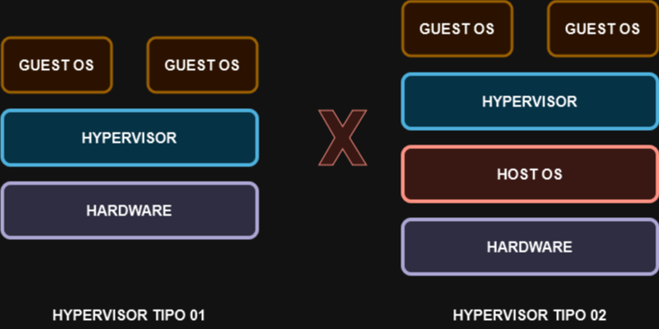

# 02 - HYPERVISOR TIPO 01

Esse é o tipo de Hypervisor que é conhecido por **nativo ou bare metal** pois ele é instalado diretamente no hardware sem ter a necessidade de um SO instalado.   
Ele é mais comum em data centers ou em outros ambientes baseados em servidor.   

   
