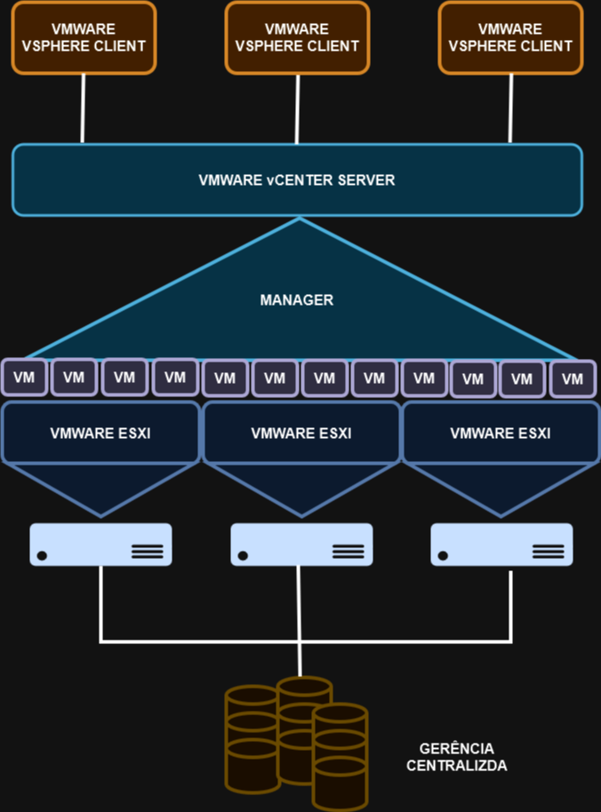
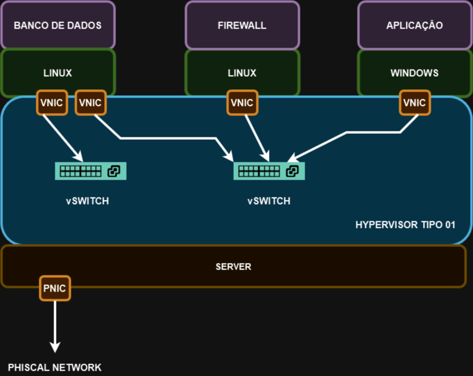

# 02 - HYPERVISOR TIPO 01

Esse é o tipo de Hypervisor que é conhecido por **nativo ou bare metal** pois ele é instalado diretamente no hardware sem ter a necessidade de um SO instalado.   
Ele é mais comum em data centers ou em outros ambientes baseados em servidor.   

   

Exemplos de Hypervisors: Vmware Vsphere, MS Hyper-v, Kvm, etc.   
Então agora aqui passamos a ter algumas características diferentes que trazem alguns benefícios:
- **desempenho:** agora como o hypervisor é instalado diretamente no hardware, ele não depende mais de um SO para acessar um driver e depois acessar o hardware. Agora o acesso é direto ao hardware, ou seja, as vms são executadas em velocidade de hardware.
- **segurança:** como agora o hypervisor é instalado direto no hardware, ele não fica mais vulnerável a alguma falha de um SO. POr exemplo: vamos imaginar um hypervisor do tipo 2 onde o SO é infectado por algum vírus. Como o Hypervisor é instalado sobre o SO, o vírus pode ocasionar uma parada no SO ou mesmo infectar as vms e os SOs. Já no Hypervisor do tipo 01 isso não acontece.
- **escalabilidade:** os hypervisors tipo 01 são mais otimizados e aproveitam melhor o uso do hardware. Eles também suportam melhor a criação de grandes clusters de failover.
- **capacidade de gerenciamento:** os hypervisors tipo 01 oferecem um console de gerenciamento. Isso faz que através de um único ponto central seja possível gerenciar várias VMS e servidores físicos ao mesmo tempo.Existem recursos que, por exemplo, permitem migrar uma vm ligada em produção de um hardware para outro sem precisar deligar a Vm par reduzir o downtime da rede / host. Essa é uma grande vantagem pois com a centralização da gerência agora é possível se tomar acões em massa.   

   

**Desvantagens:**
- **Custo:** agora temos hardware dedicado para o hypervisor e é qualquer tipo de hardware que serve pois temos que analisar as especificações do fabricante e os requisitos de negócio para implementar o Hypervisor. São hardwares mais caros.
- **Complexidade:** agora a complexidade é maior e é necessário ter uma maior especialização para se trabalhar com esse tipo de hypervisor. Por exemplo, agora na parte de rede não são mais somente as placas de rede que ficam presentes. Existem os **vswitches ou switches virtuais** com bem mais características e opções a se configurar.   

   

Agora o armazenamento pode ser feito em Storages com redes SAN.