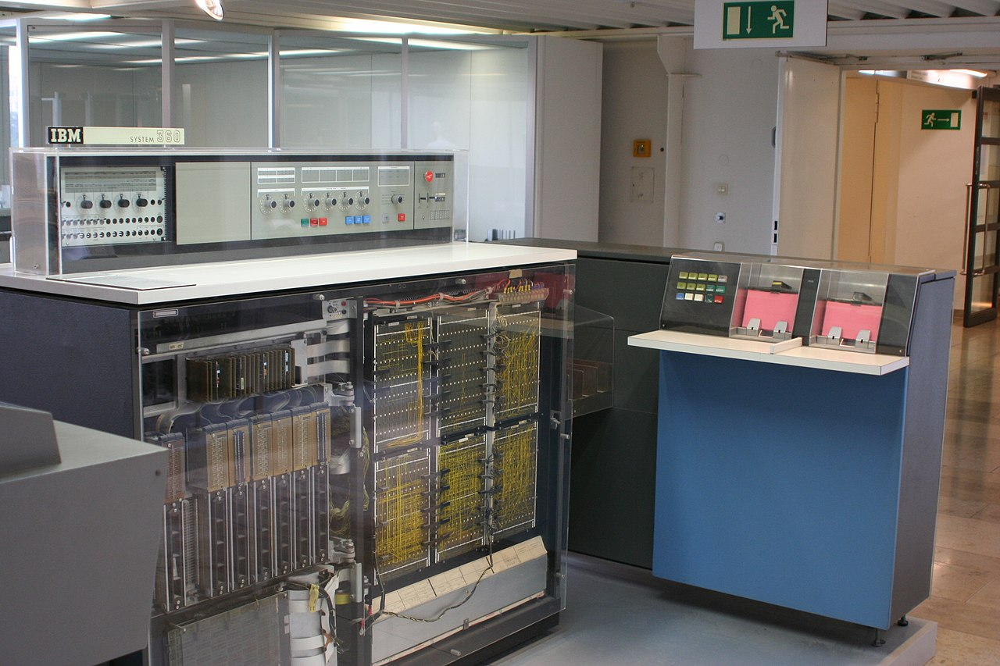

# 01 - O que são Maquinas Virtuais (VM - Virtual Machines)

Este item faz parte do Bluprint do CCNP ENCORE 350-401 - 2.1.b Virtual machine   

Atualmente ouvimos muito falar no termo Máquinas Virtuais ou Virtual Machines (VMs) em inglês e, podemos ter a impressão de que isso é um termo novo. Mas esse termo foi inventado na década de 1960 pela empresa IBM. Naquela época não existiam os computadores pessoais (Personal Computers - PCs) do jeito que a gente conhece hoje em dia. Os computadoras eram chamdos de MainFrames e eram enormes. Ocupavam salas e salas. Eles funcionavam com um único arquivo batch (em lotes) onde todas as instruções eram escritas dentro desse arquivo.   
Na época existia o IBM mainframes System/360 porém como ele funcionava com um único arquivo em lotes, isso gerava um enorme problema. Toda vez que alguém precisava dar uma instrução para o mainframe ele tinha que fazer sozinho e de uma única vez. Não tinha como várias pessoas trabalharem juntos ao mesmo tempo.
Agora deixo algumas imagens ilustrativas do IBM Mainframe System/360

<table>
      <tr>
           <td width="50%"><figure><figcaption style="font-size: 60%; font-weight: bold;">Imagem sem especificação de autoria</figcaption></figure></img></td>
           <td width="50%"></img></td>
      </tr>
       <tr>
           <td width="50%"></img></td>
           <td width="50%"></img></td>
      </tr>
</table>

Então com esse problema em mãos foi desenvolvido o sistema de VMs (Virtual MAchines) onde era feita uma abstração do hardware, ou seja agora um programa de controle (CP) emulava o hardware físico em pequenos espaços separados dentro do sistema operacional do MainFraime. Ou seja, o sistema de controle pega uma parte do hardware (Processador, Hd, Memória, etc) e divide através de software em outros hardwares emulando vários comutadores dentre um só MainFraime. Com esse tipo de tecnologia, era possível que uma ou mais pessoas pudessem trabalhar no mesmo hardware ao mesmo tempo.   

# Vantagens

- É uma ótima opção para se realizar testes
- Podemos utilizar vários sistemas operacionais sobre o mesmo hardware
- Diminuição de custos com hardware
- Facilidade no gerenciamento, migração e replicação de ambientes 
- Maior disponibilidade uma vez que alguma falha de software irá afetar somente uma VM, a VM que esta executando a aplicação
- Testes de diversos sistemas operacionais sem precisar particionar o hd uma vez que o hd virtual agora é um arquivo
- Segurança. Uma vez que cada ambiente é isolado do outro, se ocorrer uma infecção em uma das vms, ela irá ficar contida dentro dessa vm sem afetar as demais.

# Desvantagens

- Gerenciamento: apesar de existir produtos capazes de gerenciarem os ambientes virtuais, eles precisam ser monitorados, configurados e salvos.
- Desempenho. Uma vez que se instala um software em cima de um sistema operacional, isso gera um concorrência de tarefas e pode comprometer o desempenho do sistema todo dependendo do número de máquinas virtuais criadas.
- Enorme utilização de Memória real já que agora temos que atender os requisitos das máquinas virtuais e das aplicações que irão rodar dentro delas

Deixo um link da própria Cisco com a descrição dela do que são máquinas virtuais. [VIRTUAl_MACHINES](https://www.cisco.com/c/en/us/solutions/computing/what-is-a-virtual-machine.html)  