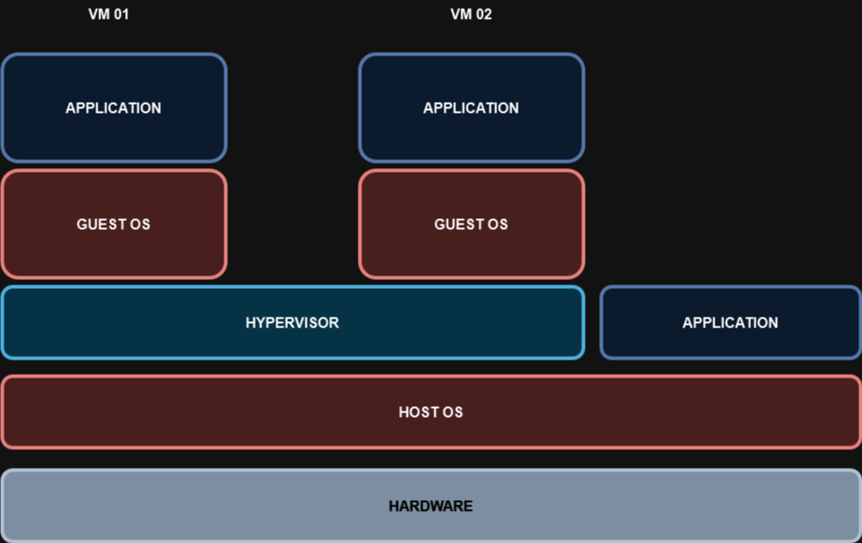

# 03 - HYPERVISOR TIPO 02

Esse é o tipo de hypervisor que é conhecido como **hosted hypervisor**. Ele necessita de um computador com um sistema operacional (SO) completo já instalado e funcionando, ou seja, ele é instalado dentro de um sistema operacional.   
Ele é o tipo que é utilizado para testes de algumas vms, testes de alguns recursos e etc., mas ele é o menos escalável pois, como ele é instalado dentro de um so completo, ele compartilha recursos do próprio sistema operacional. Isso quer dizer que se alguma tarefa, por exemplo, uma renderização de vídeo, estiver ocupando muito CPU, esse recurso ficará em concorrência com a vm por muitas vezes deixando tudo mais lento.   

   

Alguns exemplos de Hypervisor Yipo 02 são: Oracle Virtualbox (grátis), Virtualbox OSE (livre), Vmware Workstation, Vmware Player (Grátis), QEMU (livre), Microsoft Virtual PC, etc.   
Agora aqui vale fazer algumas observações quanto a rede desse tipo de hypervisor. A primeira é que ele possuem um servidor DHCP interno que normalmente já vem habilitado e ativo. Então vale depois procurar essa configuração e deixar configurado conforme a necessidade de uso.   
Também vale a pena ressaltar que existem 3 tipos de "estado" que podemos deixar configurada as placas de rede: **Host-only, NAT e Bridge.**
- **Host - Only:** esse tipo de rede é utilizado para isolar o ambiente virtualizado do ambiente real. Então qualquer endereço que a VM possa ter configurado, nunca irá enxergar o IP da placa de rede física, mesmo que as duas estejam configuradas no mesmo range de endereços IP.
- **NAT:** basicamente é o mesmo processo de quando temos uma rede privada IPv4 e queremos sair para a Internet. Ou seja, o host possui um endereço IPv4 privado e quando chega no roteador é traduzido para um endereço válido roteável. Aqui no Hypervisor, o pensamento é o mesmo. As máquinas hosts podem receber IP do servidor DHCP interno do Hypervisor ou pode receber o IP de forma manual porém de uma faixa diferente da rede "real" e depois, a placa de rede virtual faz a tradução desse range para um IP que consigar "conversar" com a Internet. Esse tipo de rede é mais utilizado quando queremos que os hosts consigam sair para a Internet mas o SO não consiga "enxergar" os hosts virtuais.
- **Bridge:** em tradução livre, Bridge pode ser traduzido como ponte e, esse é o comportamento desse tipo de rede. Aqui os hosts virtuais conseguem atingir a placa de rede física. Então com isso, os hosts virtuais conseguem sair para a Internet e também falar com as máquinas hosts físicas da rede.