# 01 - Vmware ESXI

Antes de iniciarmos, é preciso salientar que o ESXI na verdade faz parte de um conjunto de aplicativos. Como assim ? Bom, a solução completa se chama Vmware vSphere e ela possui o sistema operacional ESXI, que é hypervisor que vamos abordar aqui, e o vCenter; que é o gerenciador do ESXI. Esse conjunto é a solução de virtualização de servidores x86 para datacenter da empresa **VMWARE**.    
Aqui a instalação segue a de um software comum. Devemos iniciar o computador e dar o boot através da mídia de instalação. Feito isso, é só seguir as etapas de instalação.   

<table>
       <tr>
            <td width="50%">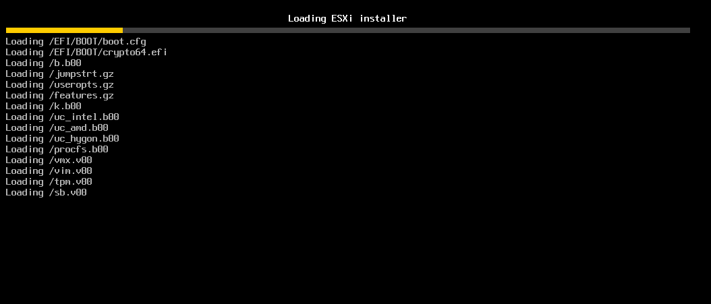</img></td>
            <td width="50%">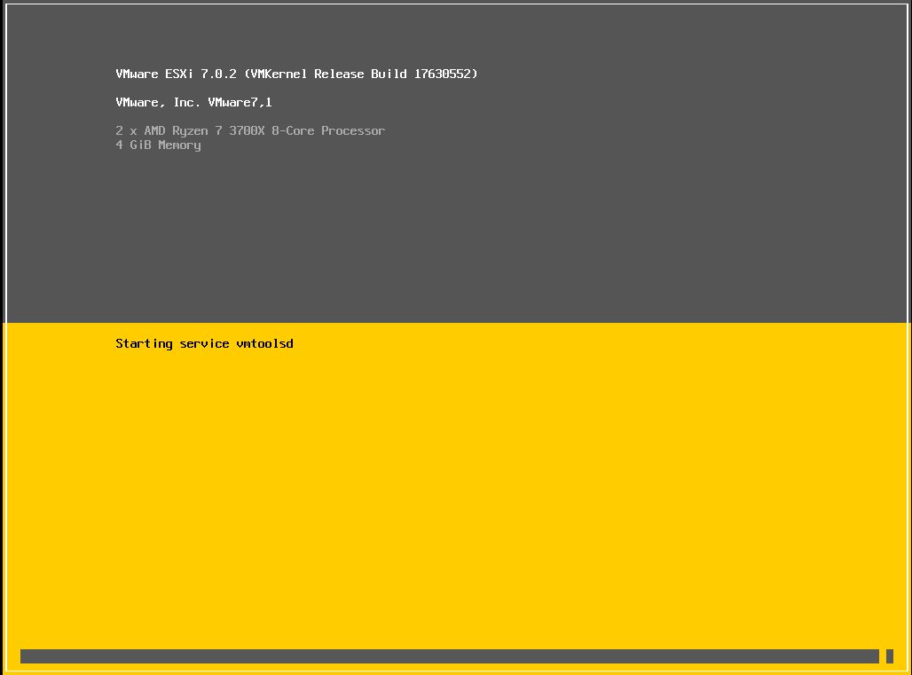</img></td> 
       </tr>
       <tr>
            <td width="50%">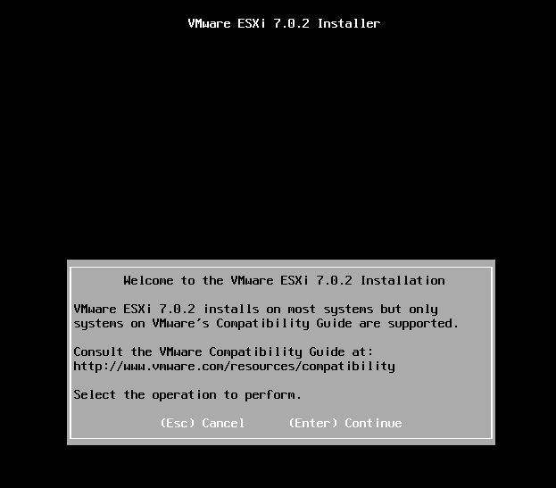</img></td>
            <td width="50%">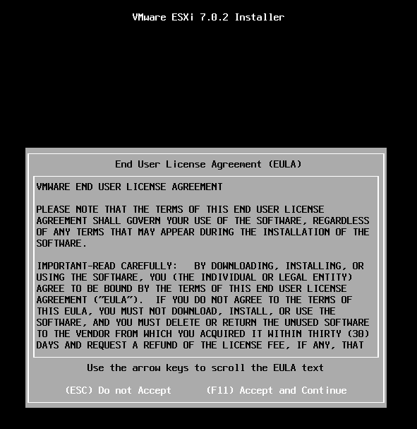</img></td> 
       </tr>
       <tr>
            <td width="50%">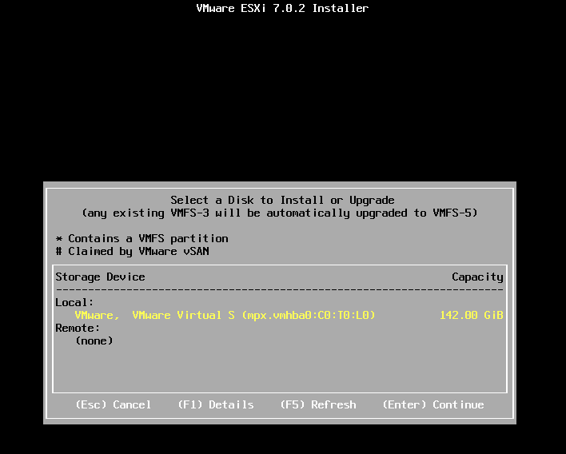</img></td>
            <td width="50%">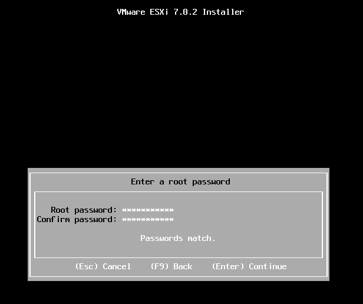</img></td> 
       </tr>
       <tr>
            <td width="50%">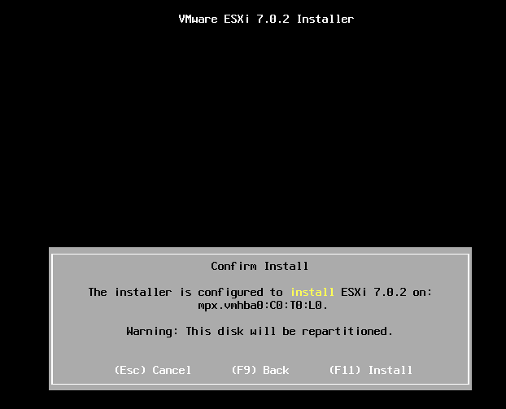</img></td>
            <td width="50%">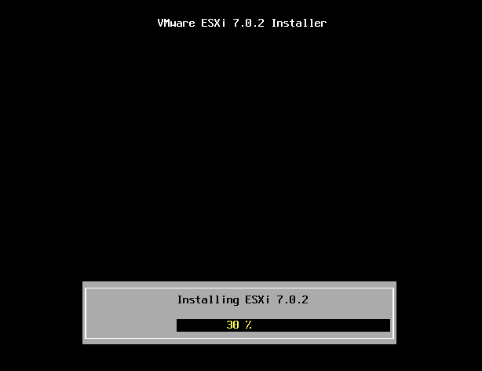</img></td> 
       </tr>
       <tr>
            <td width="50%">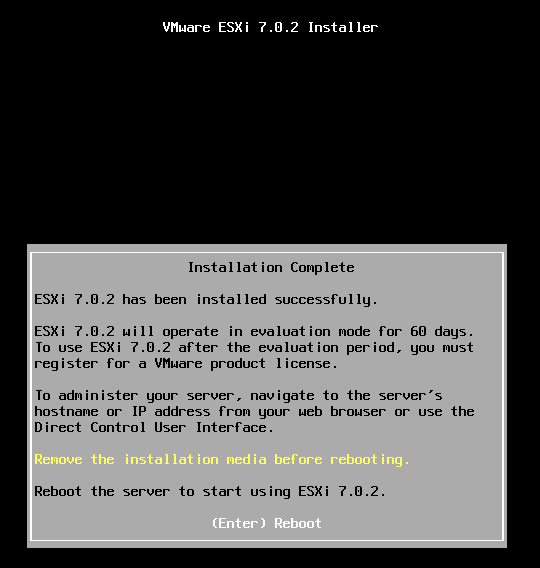</img></td>
            <td width="50%">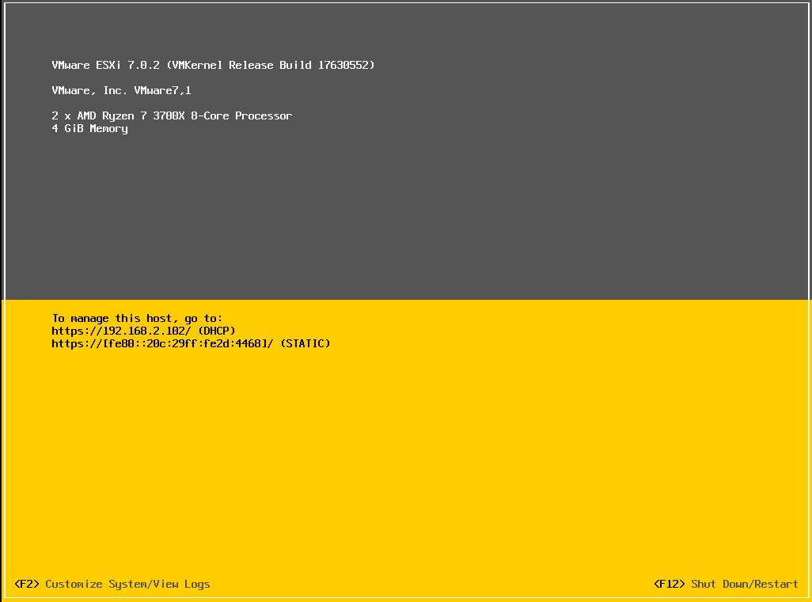</img></td> 
       </tr>
</table>

Bom, como podemos ver na última imagem, o ESXI já pegou um endereço de IP que foi fornecido através de um servidor DHCP. Então cabe aqui ressaltar que essa é a parte de rede que vamos utilizar para administrar o Hypervisor. Nesse momento, vou pressionar **F2 (Customize System/View Logs)** para analisarmos as opções. Veja, aqui estou mostrando somente um exemplo da instalação de Hypervisor do tipo 1 e portanto o enfoque será somente na parte das configurações de rede.   

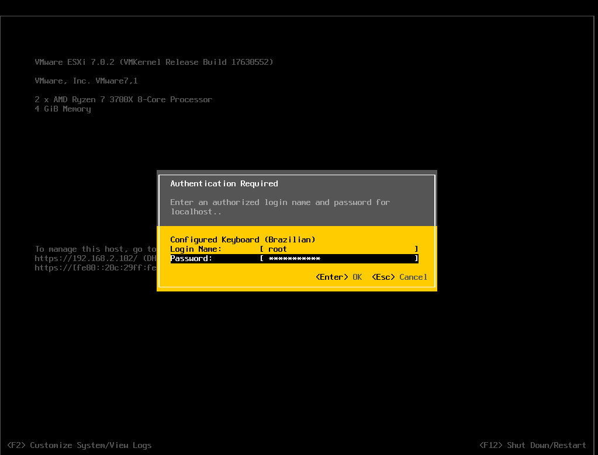   

Como podemos ver, ele funciona como um Sistema Operacional completo, com usuários cadastrados. Então para podermos realizar as devidas alterações / configurações, precisamos fornecer o usuário administrador com sua respectiva senha. Feito isso, vamos navegar entre as diversas opções que aparecem no menu até chegarmos em: **"Configure Management Network"   

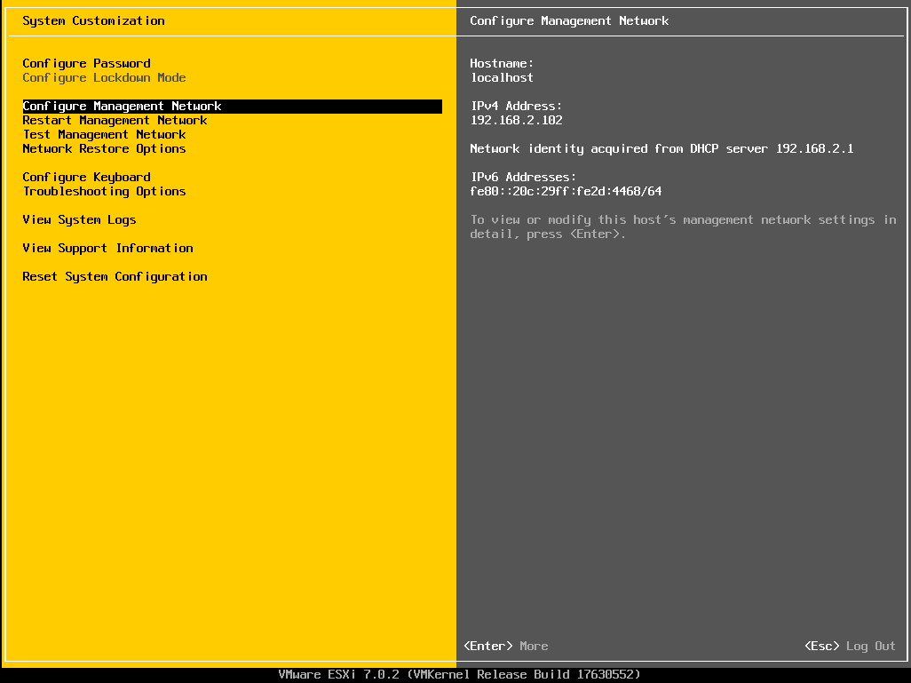   

Aqui iremos configurar as opções da Interface de Gerência do Hypervisor. Podemos escolher configurar o endereço IPv4 / IPv6 manualmente ou via DHCP, colocar a interface em uma Vlan e configurar a parte do DNS para que os outros hosts possam encontrar o ESXI através do nome FQDN.

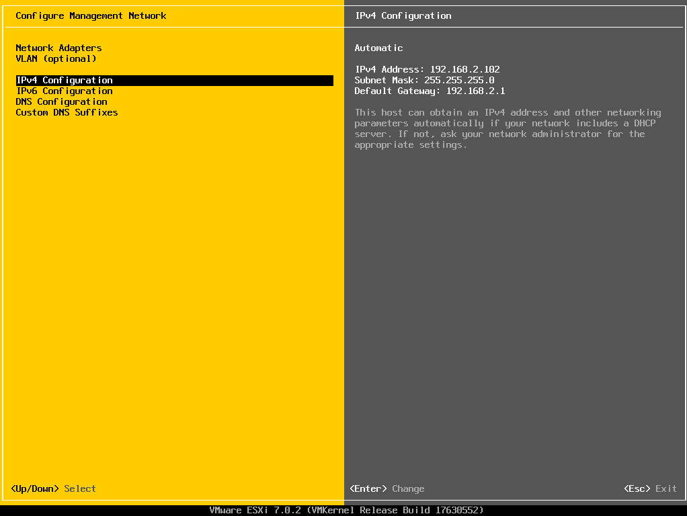   

Para acessarmos o ESXI propriamente dito, agora precisamos ir em outro terminal, abrir o navegador e digitar o endereço de rede fornecido pelo DHCP, como no exemplo.   
**OBS:** aqui estou deixando na configuração padrão a rede gerência por se tratar de um mero exemplo mas, o recomendado quando se for utilizar um tipo de Hypervisors desses o recomendado é se utilizar um IP Fixo.

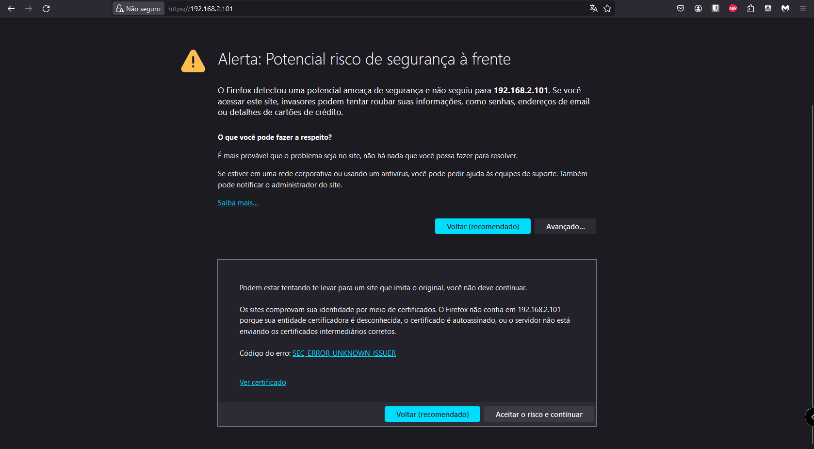   

Como não configuramos nada, o navegador irá tentar realizar um acesso via HTTPS seguro, porém como não temos nenhum certificado configurado para esse tipo de acesso, vamos clicar em **aceitar o risco e continuar** para prosseguirmos.   

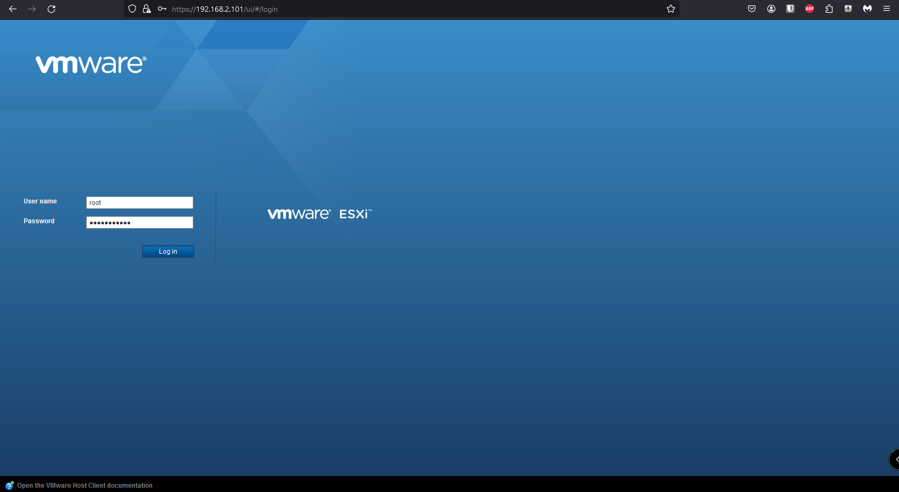   

Novamente aqui devemos informar o usuário administrador e a senha. Notem que são dois acessos diferentes. Aqui vamos ter o acesso de utilização do Hypervisor. Aqui podemos criar as VMs, discos virtuais e configurar a rede das VMs, que é diferente da rede gerência.   

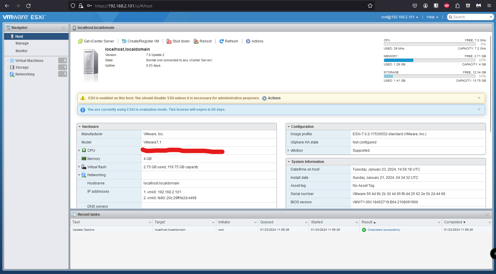   

Vamos clicar na guia **NETWORKING** para podermos analisar as opções que irão aparecer.

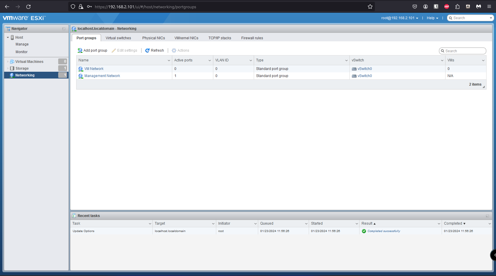   

Aqui temos as seguintes opções:

> - **Port Groups**
> - **Virtual Switches**
> - **Physical Nics**
> - **VMKernel NICS**
> - **TCP/IP STACKS**
> - **Firewall Rules**

**OBS:** como boa prática a ser seguida, você nunca deve misturar o tráfego de redes lan que utilizam o protocolo Ethernet com o tráfego de redes de Storages que utilizam o protocolo iscsi dentro do mesmo switch. Isso pode gerar problemas e deixar o tráfego muito lento. Então utilize switchs separados para cada tipo de tráfego.

## Port GROUPS

Podemos pensar que um Port Group é como se fosse uma porta virtual com um conjunto específico de configurações aplicadas sobre ela. Eles são responsáveis por conectar as máquinas virtuais aos vSwitches.  
Para os port groups funcionarem, é necessário que eles tenham portas de uplink, que representam as conexões entre as placas de rede físicas e os vSwitches do host ESXi. Dessa forma, os port groups são associados a uma VLAN específica, e o tráfego flui através das NICs físicas.  
**OBS:** É possível associar mais de uma placa de rede física a um vSwitch para fornecer redundância de uplink.   
É possível observar que nas configurações podemos especificar em qual vswitch o port group está associado, configurar a parte de segurança, realizar um nic teaming e até mesmo realizar um traffic shapping.   

<table>
       <tr>
            <td width="50%"></img></td>
            <td width="50%"></img></td> 
       </tr>
       <tr>
            <td width="50%"></img></td>
            <td width="50%"></img></td> 
       </tr>
</table>

## VIRTUAL SWITCHES

Pode-se afirmar que essa é um elemento fundamental para parte de redes no ESXI. Ele atua como um switch físico de camada 2 mas que opera na camada de software. É ele quem fornece a conectividade das máquinas virtuais entre si e, delas para as redes externas.   
Os vSwitches contêm port groups, que são conjuntos de portas de rede virtual com configurações específicas. Cada VM é associada a um port group, determinando assim as configurações de rede aplicadas a ela.   
Eles podem ter uplinks, que são as conexões físicas às placas de rede no host ESXi. Esses uplinks conectam o vSwitch à rede física externa.   
Os vSwitches suportam VLANs (Virtual LANs), permitindo a segmentação do tráfego de rede e a criação de redes virtuais independentes.Eles também têm configurações que incluem políticas de segurança, configurações de tráfego, VLANs e outras opções que afetam como o tráfego é gerenciado e distribuído.
**OBS:** mais a frente vou falar um pouco mais sobre os **vswitches** em um capítulo específico.   

<table>
       <tr>
            <td width="50%">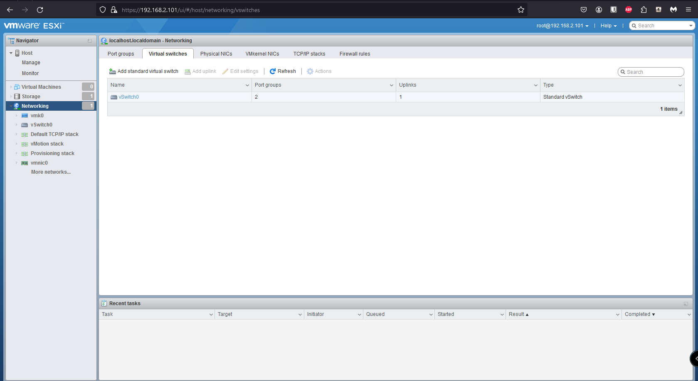</img></td>
            <td width="50%">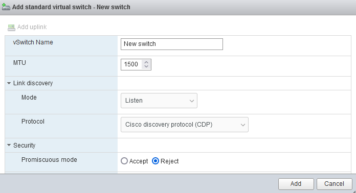</img></td> 
       </tr>
       <tr>
            <td width="50%">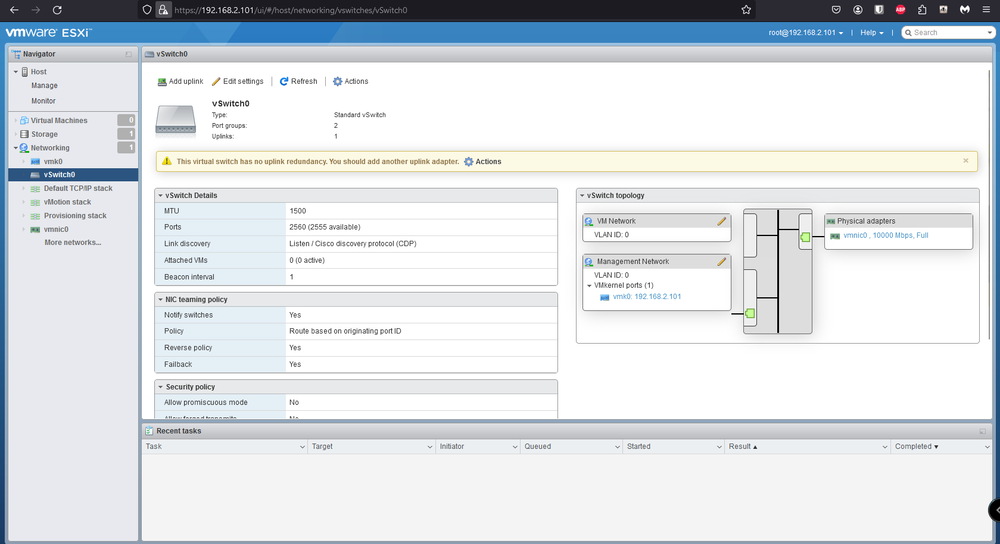</img></td>
            <td width="50%">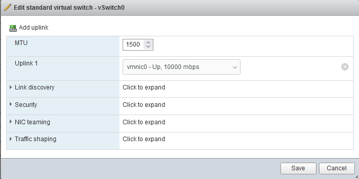</img></td> 
       </tr>
</table>

## Physical Nics

São as placas de rede físicas. Essas NICs são responsáveis por estabelecer a conectividade física entre o servidor e a rede externa. No contexto da virtualização, como no ambiente VMware vSphere e ESXi, as Physical NICs desempenham um papel fundamental na comunicação entre as máquinas virtuais e a rede física.   
Cada Physical NIC está associada a uma porta física no servidor e se conecta diretamente à infraestrutura de rede física. No âmbito de software, as NICs físicas são usadas para criar adaptadores virtuais, conhecidos como vmnics (Virtual Machine NICs). Esses vmnics são associados aos switchs virtuais (vSwitches) no host ESXi.   
As Physical NICs são usadas como uplinks para conectar o vSwitch (Switch Virtual) ao ambiente de rede física. Elas servem como ponte entre o mundo virtual (onde as máquinas virtuais operam) e o mundo físico (a rede externa). Pode-se configurar várias Physical NICs em um host ESXi para fornecer redundância. Se uma NIC falhar, o tráfego pode ser automaticamente direcionado para as NICs funcionais, garantindo maior disponibilidade.   
As Physical NICs podem ser configuradas para suportar VLANs, permitindo a segmentação do tráfego de rede em redes virtuais separadas.   
Ao configurar port groups em vSwitches, as Physical NICs são associadas a esses grupos para direcionar o tráfego de rede das máquinas virtuais para a rede física.   

<table>
       <tr>
            <td width="50%"></img></td>
            <td width="50%"></img></td> 
       </tr>
</table>

## VMKernel NICS

As VMkernel NICs (Network Interface Cards) são interfaces de rede virtuais específicas no ambiente VMware vSphere e ESXi que são usadas para comunicação do kernel e operações de gerenciamento no host ESXi. Diferentemente das NICs virtuais associadas a máquinas virtuais (vmnics), as VMkernel NICs são dedicadas a funções específicas relacionadas à infraestrutura do host ESXi. Aqui estão alguns pontos-chave sobre as VMkernel NICs:

> - **Comunicação de Kernel:** As VMkernel NICs são usadas para a comunicação entre o kernel do host ESXi e outros dispositivos, como outros hosts ESXi, dispositivos de armazenamento e sistemas de gerenciamento.
> - **vMotion e Migração de Armazenamento:** As VMkernel NICs são essenciais para recursos como vMotion e Storage vMotion, que permitem a migração de máquinas virtuais entre hosts ESXi e movimentação de armazenamento sem interrupção do serviço.
> - **Gestão e Acesso ao Host:** As VMkernel NICs fornecem conectividade para operações de gerenciamento, como acesso ao vCenter Server, SSH (Secure Shell), e outros serviços de gerenciamento do host.
> - **iSCSI e NFS:** Em configurações que utilizam protocolos de armazenamento de rede, como iSCSI (Internet Small Computer System Interface) ou NFS (Network File System), as VMkernel NICs são usadas para a comunicação com dispositivos de armazenamento remotos.
> - **vSphere Fault Tolerance (FT):** No caso do recurso de Fault Tolerance do vSphere, as VMkernel NICs são usadas para a comunicação entre as instâncias primária e secundária de uma máquina virtual para garantir alta disponibilidade.
> - **Configuração de Redundância:** Assim como com outras interfaces de rede, você pode configurar redundância nas VMkernel NICs para garantir a disponibilidade e o failover em caso de falha de uma NIC.
> - **Separadas das VM Networks:** As VMkernel NICs operam em uma camada diferente daquelas associadas às VMs. Elas são dedicadas a operações de sistema e gerenciamento, enquanto as NICs virtuais (vmnics) associadas a port groups são usadas para o tráfego de máquinas virtuais.

<table>
       <tr>
            <td width="33%"></img></td>
            <td width="33%"></img></td>
            <td width="33%"></img></td> 
       </tr>
</table>