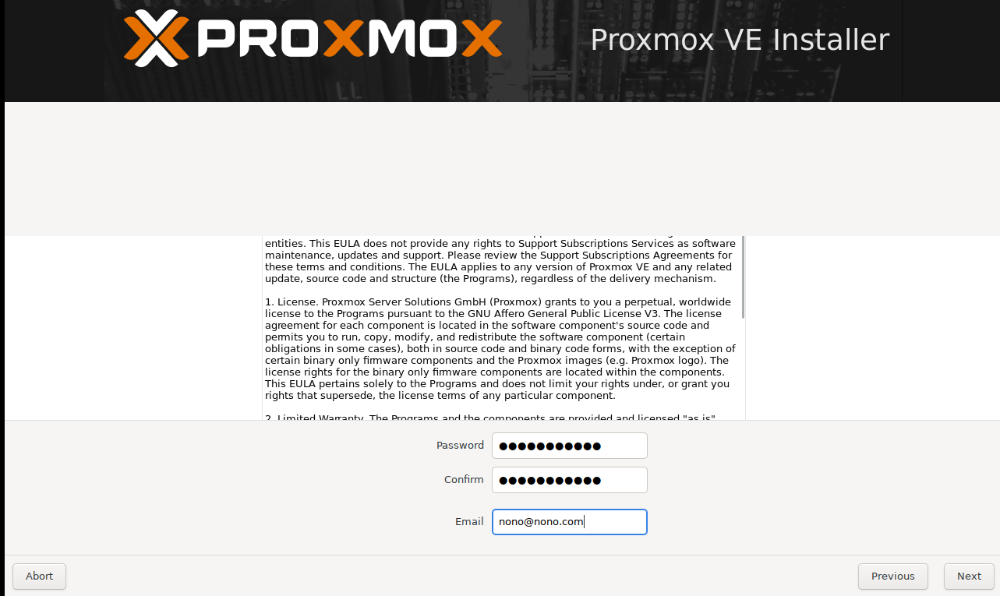

# 02 - Proxmox

Aqui, como nos outros fabricantes, devemos iniciar o computador dando boot pela mídia de instalação.   

<table>
       <tr>
            <td width="50%"></img></td>
            <td width="50%"></img></td> 
       </tr>
       <tr>
            <td width="50%"></img></td>
            <td width="50%"></img></td> 
       </tr>
       <tr>
            <td width="50%"></img></td>
            <td width="50%"></img></td> 
       </tr>
       <tr>
            <td width="50%"></img></td>
            <td width="50%"></img></td> 
       </tr>
       <tr>
            <td width="50%"></img></td>
            <td width="50%"></img></td> 
       </tr>
</table>

Bom, como podemos reparar na última, o PROXMOX já pegou um endereço de IP que foi fornecido através de um servidor DHCP. Então cabe aqui ressaltar que essa é a parte de rede que vamos utilizar para administrar o Hypervisor. Aqui podemos realizar o acesso diretamente pelo terminal físico e ai, o PROXMOX se comporta como uma distribuição linux já que de fato ele é um Debian com o Kernel do Ubuntu. Então se quisermos acessar o terminal de administração do Hypervisor, devemos ir em outro terminal, abrir o navegador e digitar endereço de ip + a porta que ele mostra na última imagem.  

