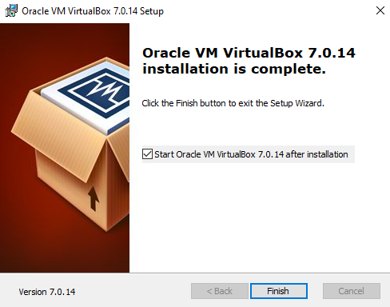

# 01 - VirtualBox em Windows

Agora vou demonstrar como realizar a instalação do VirtualBox no Windows. Ele é da empresa Oracle e pode ser obtido em : https://www.virtualbox.org/wiki/Downloads . Ele é bem parecido com o Vmware Player citado anteriormente.   

Então vamos analisar novamente como estão as nossas placas de rede no windows.   

   

Aqui podemos notar que temos 1 placa de rede física e mais duas virtuais, que foram criadas no exemplo anterior onde instalamos o Vmware Player. Então vou copiar o instalador do VirtaulBox do site e guardar em uma pasta no hd do sistema operacional host, o sistema físico.   

   

Agora é clicar no arquivo executável e seguir as instruções.   

<table>
     <tr>
         <td width="33%"></img></td>
         <td width="33%"></img></td>
    </tr>
    <tr>
        <td width="33%"></img></td>
        <td width="33%"></img></td>
    </tr>
    <tr>
        <td width="33%"></img></td>
        <td width="33%"></img></td>
    </tr>
</table>

Como podemos ver, a instalação deu uma mensagem de aviso que está faltando Python Core / win32api . Agora o virtualbox possui uma integração com a linguagem de programação python, porém como não temos esse programa instalado, então o hypervisor perde essas funcionalidades. Para resolvermos isso, precisamos instalar o python e logo após a win32api. Então vamos baixar o python em: https://www.python.org/downloads/ e vamos salvar o executável na mesma pasta que baixamos o virtualbox.    

Vamos executar o instalador quando começar a instalação, marcar a opção de adicionar o python ao path do sistema operacional.   

   

Bom aqui instalamos o python porém ainda não temos a api do python instalado. Vamos abrir o cmd e verificar a instalação do python.   

   

Até aqui a configuração do Vmware Player é muito semelhante a do windows porém, reparem na última tela. Ali tivemos que entrar em preferences e clicar em "download all components now". Isso é feito para baixar todos os drivers para todos os tipos de SO suportados pelo hypervisor.   

Esse é um conjunto de drivers do próprio hypervisor que permite as Máquinas Virtuais se comunicarem diretamente com o host e terem algumas melhorias como driver de vídeo. Com esse driver instalado é possível copiar algo para a memória do sistema operacional host e de dentro da máquina virtual regatar esse conteúdo com o comando "colar" do windows.   
Outro detalhe é que ao configurar o Vmware Player, ele vai exibir uma tela perguntado sobre a licença de uso do aplicativo. Aqui iremos escolher a opção: "for free non-comercial use"   

Nesse momento vamos voltar analisar as placas de rede do sistema operacional host através do comando **ip**.   

   

Percebam que nesse momento o Vmware criou duas placas de rede novas, a **vmnet1 e a vmnet8**. São essas as placas de rede vão permitir que as Máquinas Virtuais (VMs) possam interagir com o sistema operacional. Agora, para não ficar repetitivo, criei uma máquina virtual dentro do vmware player e vou analisar direto a parte de configuração das placas de rede.   

   

É aqui que podemos escolher como a placa de rede vai funcionar. Então temos as opções: 
> - **01 - Bridge:** aqui ela funciona como uma ponte. Ou marcamos a opção de replicar o endereço de IP da placa física ou, deixamos a placa obter um endereço automaticamente através do servidor DHCP da rede física. Essa opção é utilizada para as vms conseguirem sair para a Internet e conseguir "enxergar" as outras máquinas físicas da rede.
> - **02 - Nat:** esta opção serve para pegar o endereço de IP atribuído não roteável da VM e traduzir para um endereço de rede roteável, como os roteadores fazem com os endereços IPv4 das Lans. Essa opção normalmente é utilizada quando queremos que as Vms saiam para a Internet mas não enxerguem as máquinas físicas da rede real.
> - **03 - Host-only:** está opção serve para isolar a rede virtual da rede física. Então as vms se enxergam porém não conseguem sair para a Internet e nem conseguem conversar com as máquinas físicas da rede real.
