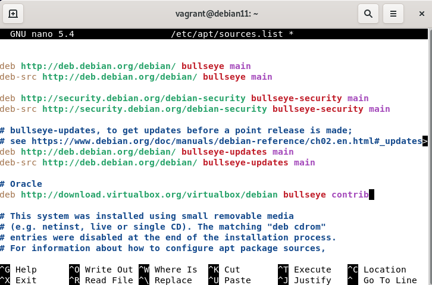
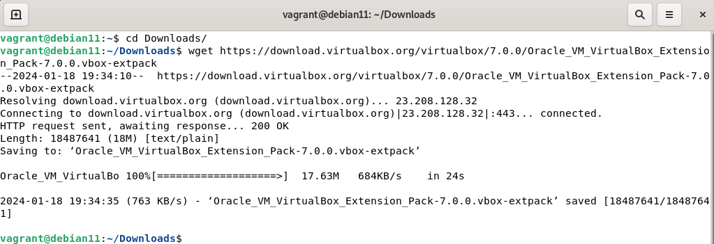

# 04 - VirtualBox em Linux

Agora vou demonstrar como realizar a instalação do virtualbox no Linux. Aqui eu escolhi a distribuição Debian 11, porém ela pode ser realizada em outras distribuições diferentes. Então fiquem atentos que algum comando ou outro poderá sofrer variações. Existem diversos tutoriais e uma ampla literatura disponível gratuitamente na Internet, e a intenção aqui é somente demonstrar graficamente um exemplo de uma instalação de um Hypervisor do tipo 2.   

   

Como podemos notar atráves do comando ip, agora temos quatro placas de rede físicas no sistema operacional, duas físicas **(eth0 e eth1)** e duas virtuais **(vmnet1 e a vmnet8)** criadas pelo Vmware Player. Mas antes de começarmos de fato a instalação do Hypervisor, precisamos resolver qualquer dependência que o software irá exigir. Então adicionar o repositório dos pacotes do virtualbox :

> - **Editar /etc/apt/sources.list e adicionar os componentes "contrib" e "non-free"**
> - **# Debian Oracle**
> - **deb http://download.virtualbox.org/virtualbox/debian buster contrib**

  

Feito isso precisamos baixar as chaves de criptografia dos repositórios. **OBS:** desde 2019 foi removido dos repositórios stable oficiais e só existe nos repositórios Unstable. Para contornar isso, então vamos baixar direto do fabricante, a oracle.    

> - **sudo wget -q https://www.virtualbox.org/download/oracle_vbox_2016.asc -O /etc/apt/trusted.gpg.d/virtualbox-key.asc**
> - **sudo wget -q https://www.virtualbox.org/download/oracle_vbox.asc -O /etc/apt/trusted.gpg.d/virtualbox-key-2.asc**
> - **sudo apt update**

   

Então vamos verificar as versões do VirtualBox disponíveis.   

> - **apt search virtualbox-**

   

Na data deste artigo temos duas versões disponíveis do VirtualBox, a 6.1 e a 7.0. Então precisamos instalar o aplicativo de fato e vamos utilizar o gerenciador de pacotes apt.   

> - **sudo apt install virtualbox-7.0**

Ao final da instalação, podemos ver que o grupo **vboxusers** é criado. então precisamos adicionar nosso usuário a esse grupo.

> - **sudo adduser seuusuario vboxusers**

   

Depois disso basta instalar o pacote de extensões. Então vamos baixar o pacote de extensões do site da oracle:

> - **wget https://download.virtualbox.org/virtualbox/7.0.0/Oracle_VM_VirtualBox_Extension_Pack-7.0.0.vbox-extpack**

   

Despois de copiado o arquivos, vamos instalá-lo. Para isso precisamos abrir o VirtualBox e ir no gerenciador de pacotes de extensão.   

<table>
     <tr>
         <td width="33%"></img></td>
         <td width="33%"></img></td>
    </tr>
    <tr>
        <td width="33%"></img></td>
        <td width="33%"></img></td>
    </tr>
    <tr>
        <td width="33%"></img></td>
        <td width="33%"></img></td>
    </tr>
</table>

Nesse momento vamos voltar analisar as placas de rede.   

   

É aqui que podemos escolher como a placa de rede vai funcionar. Então temos as opções: 
> - **01 - Bridge:** aqui ela funciona como uma ponte. Ou marcamos a opção de replicar o endereço de IP da placa física ou, deixamos a placa obter um endereço automaticamente através do servidor DHCP da rede física. Essa opção é utilizada para as vms conseguirem sair para a Internet e conseguir "enxergar" as outras máquinas físicas da rede.
> - **02 - Nat:** esta opção serve para pegar o endereço de IP atribuído não roteável da VM e traduzir para um endereço de rede roteável, como os roteadores fazem com os endereços IPv4 das Lans. Essa opção normalmente é utilizada quando queremos que as Vms saiam para a Internet mas não enxerguem as máquinas físicas da rede real.
> - **03 - Host-only:** está opção serve para isolar a rede virtual da rede física. Então as vms se enxergam porém não conseguem sair para a Internet e nem conseguem conversar com as máquinas físicas da rede real.
