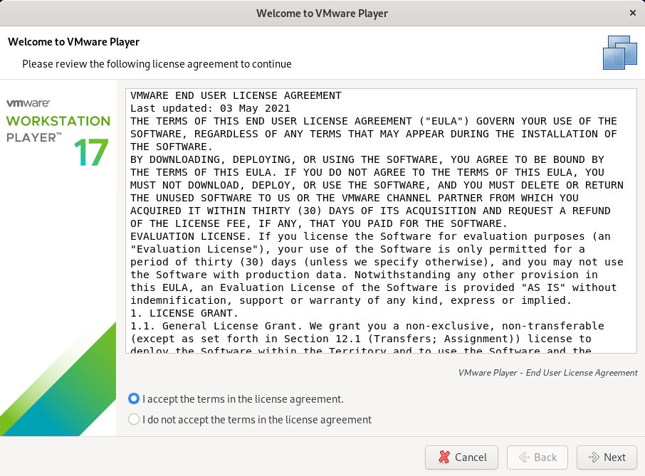
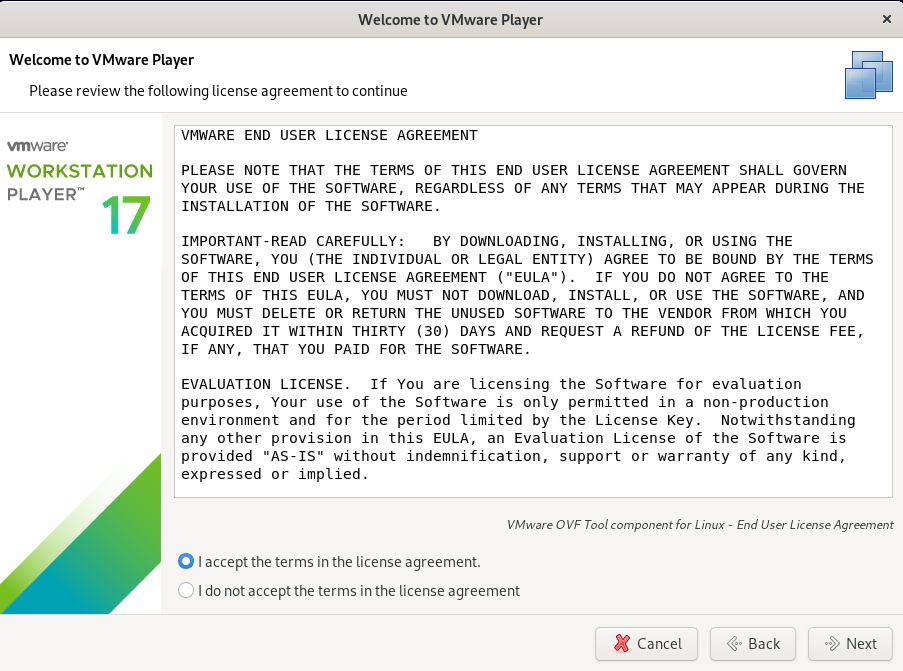
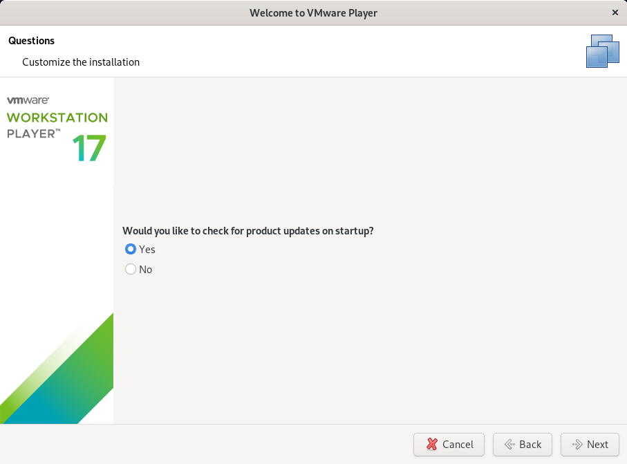
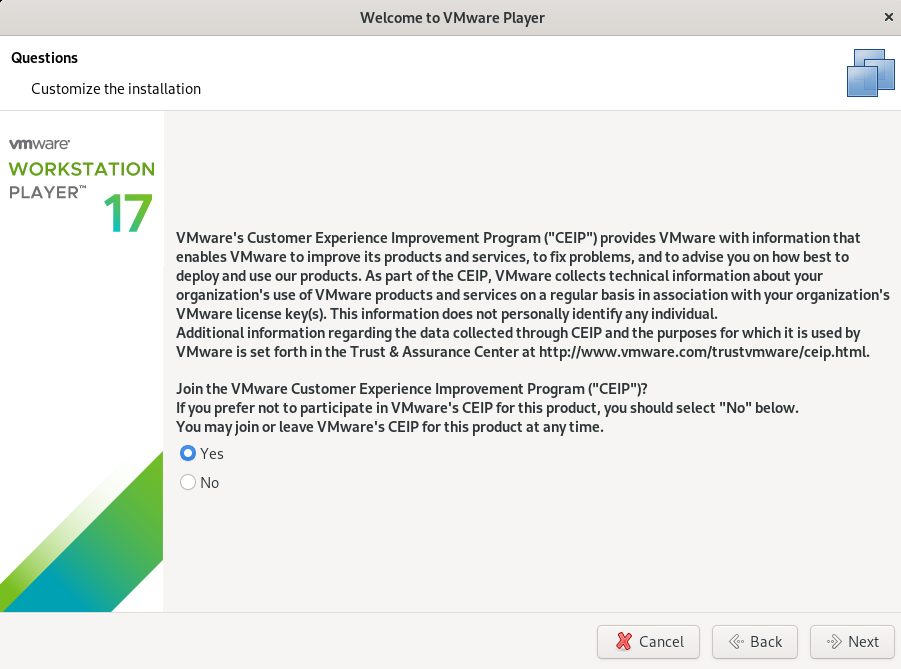
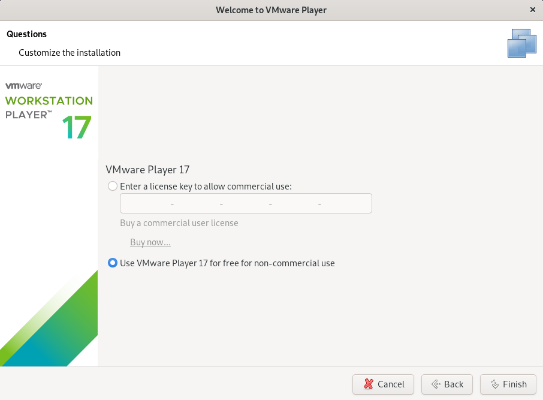
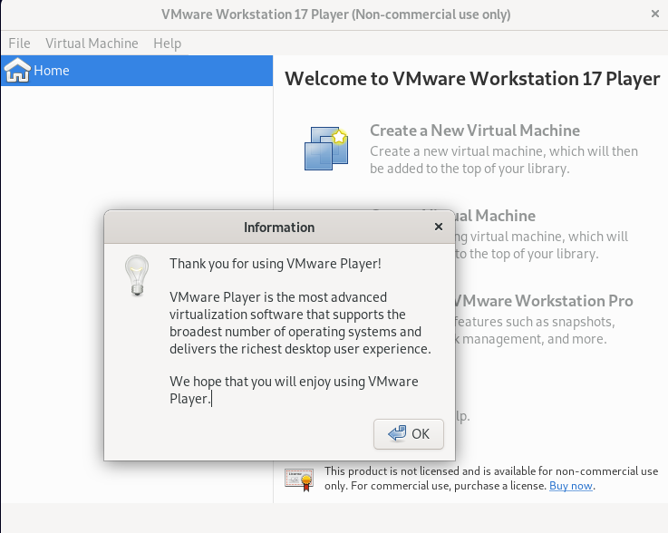
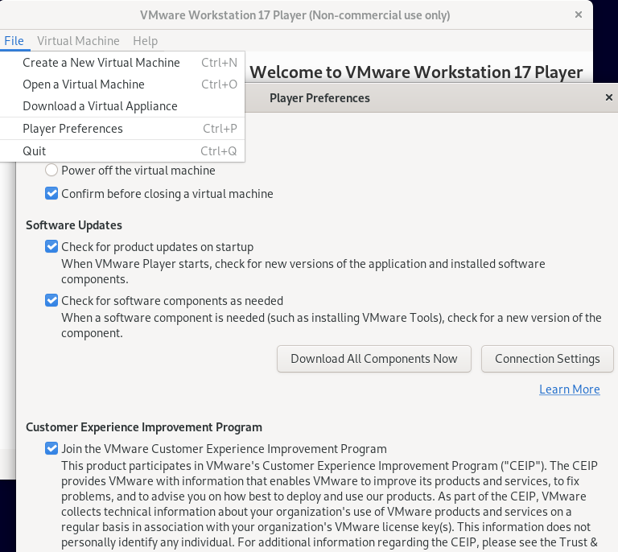
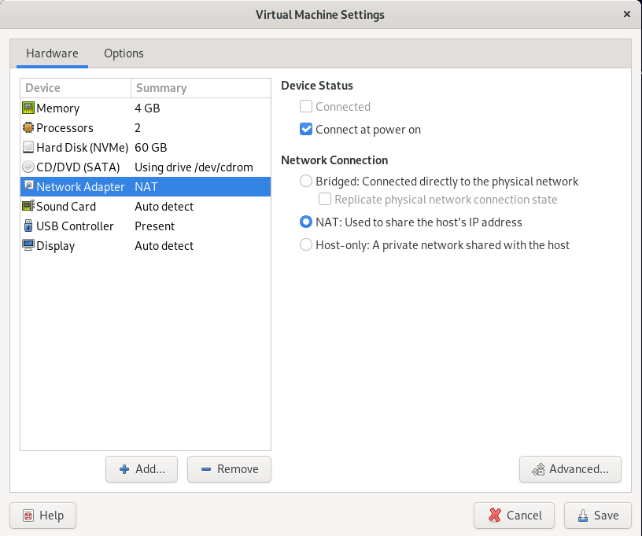

# 04 - VirtualBox em Linux

Agora vou demonstrar como realizar a instalação do virtualbox no Linux. Aqui eu escolhi a distribuição Debian 11, porém ela pode ser realizada em outras distribuições diferentes. Então fiquem atentos que algum comando ou outro poderá sofrer variações. Existem diversos tutoriais e uma ampla literatura disponível gratuitamente na Internet, e a intenção aqui é somente demonstrar graficamente um exemplo de uma instalação de um Hypervisor do tipo 2.   

   

Como podemos notar atráves do comando ip, agora temos quatro placas de rede físicas no sistema operacional, duas físicas **(eth0 e eth1)** e duas virtuais **(vmnet1 e a vmnet8)** criadas pelo Vmware Player. Mas antes de começarmos de fato a instalação do Hypervisor, precisamos resolver qualquer dependência que o software irá exigir. Então adicionar o repositório dos pacotes do virtualbox :

> - **Editar /etc/apt/sources.list e adicionar os componentes "contrib" e "non-free"**
> - **# Debian Unstable "Sid"**
> - **deb http://deb.debian.org/debian/ sid main contrib non-free**

  

Feito isso iremos atualizar a lista de pacotes do sistema.   

> - **sudo apt update**

   

Agora precisamos instalar o aplicativo de fato e vamos utilizar o gerenciador de pacotes apt.   

> - **sudo apt install virtualbox**

Depois disso basta instalar o pacote de extensões:

> - **sudo apt install virtualbox-ext-pack**

Agora vamos baixar o binário com o comando wget:

>  **wget -c https://softwareupdate.vmware.com/cds/vmw-desktop/player/17.5.0/22583795/linux/core/VMware-Player-17.5.0-22583795.x86_64.bundle.tar**

**OBS:** aqui estou baixando a versão 17.5 Verifique a versão mais recente em: https://softwareupdate.vmware.com/cds/vmw-desktop/player/ 

   

Efetuado o download, precisamos descompactar os binários.   

> **tar -xvf VMware-Player-17.5.0-22583795.x86_64.bundle.tar**

   

Depois de descompactado, vamos executar o script de instalação:

> sudo sh VMware-Player*

Agora é só abrir a aplicação e seguir as instruções.   

<table>
     <tr>
         <td width="33%"></img></td>
         <td width="33%"></img></td>
    </tr>
    <tr>
        <td width="33%"></img></td>
        <td width="33%"></img></td>
    </tr>
    <tr>
        <td width="33%"></img></td>
        <td width="33%"></img></td>
    </tr>
    <tr>
        <td width="33%"></img></td>
        <td width="33%"></img></td>
    </tr>
</table>

Até aqui a configuração do Vmware Player é muito semelhante a do windows porém, reparem na última tela. Ali tivemos que entrar em preferences e clicar em "download all components now". Isso é feito para baixar todos os drivers para todos os tipos de SO suportados pelo hypervisor.   

Esse é um conjunto de drivers do próprio hypervisor que permite as Máquinas Virtuais se comunicarem diretamente com o host e terem algumas melhorias como driver de vídeo. Com esse driver instalado é possível copiar algo para a memória do sistema operacional host e de dentro da máquina virtual regatar esse conteúdo com o comando "colar" do windows.   
Outro detalhe é que ao configurar o Vmware Player, ele vai exibir uma tela perguntado sobre a licença de uso do aplicativo. Aqui iremos escolher a opção: "for free non-comercial use"   

Nesse momento vamos voltar analisar as placas de rede do sistema operacional host através do comando **ip**.   

   

Percebam que nesse momento o Vmware criou duas placas de rede novas, a **vmnet1 e a vmnet8**. São essas as placas de rede vão permitir que as Máquinas Virtuais (VMs) possam interagir com o sistema operacional. Agora, para não ficar repetitivo, criei uma máquina virtual dentro do vmware player e vou analisar direto a parte de configuração das placas de rede.   

   

É aqui que podemos escolher como a placa de rede vai funcionar. Então temos as opções: 
> - **01 - Bridge:** aqui ela funciona como uma ponte. Ou marcamos a opção de replicar o endereço de IP da placa física ou, deixamos a placa obter um endereço automaticamente através do servidor DHCP da rede física. Essa opção é utilizada para as vms conseguirem sair para a Internet e conseguir "enxergar" as outras máquinas físicas da rede.
> - **02 - Nat:** esta opção serve para pegar o endereço de IP atribuído não roteável da VM e traduzir para um endereço de rede roteável, como os roteadores fazem com os endereços IPv4 das Lans. Essa opção normalmente é utilizada quando queremos que as Vms saiam para a Internet mas não enxerguem as máquinas físicas da rede real.
> - **03 - Host-only:** está opção serve para isolar a rede virtual da rede física. Então as vms se enxergam porém não conseguem sair para a Internet e nem conseguem conversar com as máquinas físicas da rede real.
